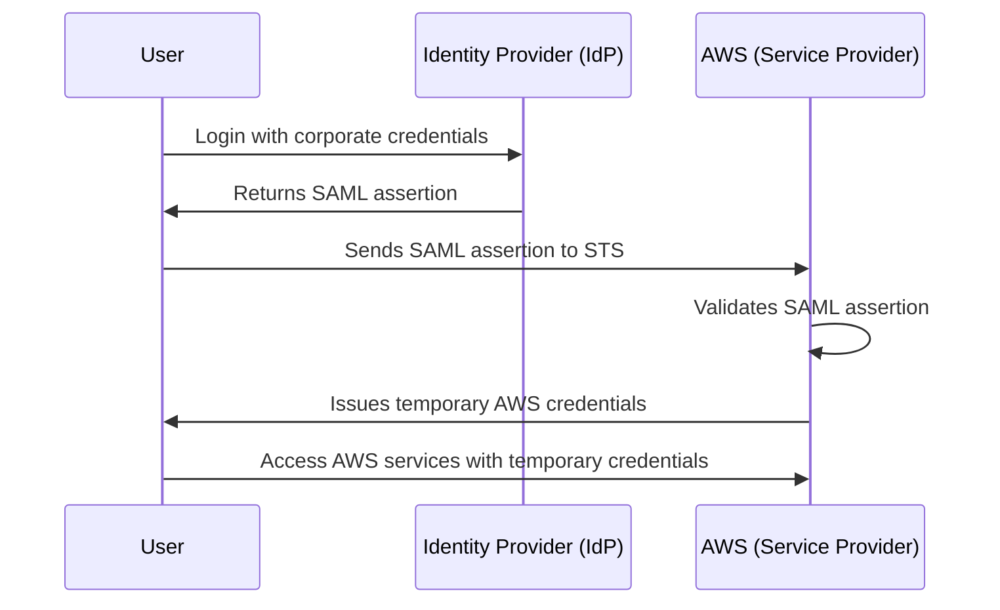

# 🔐 **SAML 2.0 Identity Federation with AWS**

SAML (Security Assertion Markup Language) 2.0 is an **open standard** for **identity federation**, enabling secure authentication and authorization between an **identity provider (IdP)** and a **service provider (SP)**.

AWS supports **SAML-based authentication** to allow **federated access** to AWS resources using existing **corporate directories, Single Sign-On (SSO) solutions, or third-party identity providers (IdPs)** like **Active Directory (AD), Okta, Microsoft Entra ID (Azure AD), or PingFederate**.

This guide covers:  
✔️ **How SAML works with AWS IAM**  
✔️ **Federated authentication flow**  
✔️ **Step-by-step setup**  
✔️ **Security best practices**

---

## 📖 **What is SAML 2.0?**

SAML 2.0 is an **XML-based authentication and authorization standard** that allows users to log in once (Single Sign-On - SSO) and gain access to multiple applications and services.

It uses a **trust relationship** between an **Identity Provider (IdP)** and a **Service Provider (SP)**.

**Key Components:**
🔹 **Identity Provider (IdP):** Manages user authentication and issues SAML assertions (e.g., Microsoft Entra ID, Okta).  
🔹 **Service Provider (SP):** AWS acts as the SP, consuming the SAML assertion from the IdP.  
🔹 **SAML Assertion:** XML document containing authentication & authorization details.  
🔹 **Roles and Policies:** AWS IAM roles grant access based on SAML attributes.

---

## 🔄 **SAML 2.0 Federation Flow in AWS**

The following diagram outlines the **federated authentication process**:



---

# 🛠️ **Step-by-Step Setup of SAML Federation in AWS**

## **1️⃣ Configure the Identity Provider (IdP)**

### **For Microsoft Entra ID (Azure AD)**

1. **Create an Enterprise Application** in **Azure AD**.
2. Set up **SAML-based SSO** and configure the following:
   - **Entity ID (AWS SAML Provider ARN)**
   - **Reply URL (AWS Sign-In URL)**
   - **Attribute Mapping (NameID, Role, RoleSessionName)**
3. **Download the SAML Metadata XML** from the IdP.

---

## **2️⃣ Configure AWS as the Service Provider (SP)**

### **A. Create an Identity Provider in AWS**

1. Open the **AWS IAM Console** → **Identity providers** → **Add provider**.
2. Select **SAML 2.0** as the provider type.
3. Upload the **SAML metadata XML** from the IdP.
4. Name the provider (e.g., `AzureAD-SAML`).

---

### **B. Create an IAM Role for SAML Federation**

1. **Open AWS IAM Console** → **Roles** → **Create role**.
2. **Select SAML 2.0 Federation** as the trusted entity.
3. Choose the SAML provider created earlier (`AzureAD-SAML`).
4. **Specify Attribute-Based Role Mapping:**
   - **SAML Subject** → Username.
   - **RoleSessionName** → User identifier.
   - **SAML:aud** → `https://signin.aws.amazon.com/saml`.
5. Attach policies granting **appropriate AWS permissions** (e.g., `AmazonS3ReadOnlyAccess`).
6. Copy the IAM Role ARN.

---

## **3️⃣ Configure the IdP with AWS Role Mapping**

- In **Azure AD/Okta**, update **SAML Attributes**:
  - **`https://aws.amazon.com/SAML/Attributes/Role`** → IAM Role ARN and SAML Provider ARN.
  - **`https://aws.amazon.com/SAML/Attributes/RoleSessionName`** → `{UserPrincipalName}`.

Example **SAML Attribute Mapping in Azure AD**:

| Attribute Name    | Value                                                                                                |
| ----------------- | ---------------------------------------------------------------------------------------------------- |
| `Role`            | `arn:aws:iam::123456789012:role/SAML-User-Role,arn:aws:iam::123456789012:saml-provider/AzureAD-SAML` |
| `RoleSessionName` | `{UserPrincipalName}`                                                                                |

---

# 🔑 **Authenticating Users via AWS Console or CLI**

## **A. Web Console Login**

1. Users **log in** to the corporate **SSO portal**.
2. They click **AWS Access**, which redirects to AWS.
3. AWS **validates the SAML assertion** and issues a session.
4. The user is **signed in to the AWS console**.

---

## **B. AWS CLI Authentication**

To authenticate via CLI:

1. Obtain the **SAML assertion**:

   ```bash
   aws sso login --profile my-profile
   ```

2. Exchange it for AWS credentials:

   ```bash
   aws sts assume-role-with-saml \
     --role-arn "arn:aws:iam::123456789012:role/SAML-User-Role" \
     --principal-arn "arn:aws:iam::123456789012:saml-provider/AzureAD-SAML" \
     --saml-assertion "BASE64_ENCODED_SAML_ASSERTION"
   ```

3. AWS STS returns **temporary credentials**:

   ```json
   {
     "Credentials": {
       "AccessKeyId": "ASIAEXAMPLE",
       "SecretAccessKey": "wJalrXUtnFEMI/K7MDENG/exampleKEY",
       "SessionToken": "FQoGZXIvYXdz...",
       "Expiration": "2024-10-30T12:00:00Z"
     }
   }
   ```

4. Set credentials for **CLI use**:
   ```bash
   export AWS_ACCESS_KEY_ID="ASIAEXAMPLE"
   export AWS_SECRET_ACCESS_KEY="wJalrXUtnFEMI/K7MDENG/exampleKEY"
   export AWS_SESSION_TOKEN="FQoGZXIvYXdz..."
   ```

---

# 🚀 **Best Practices for Securing SAML Federation**

✅ **Use MFA (Multi-Factor Authentication)** at the IdP level.  
✅ **Limit IAM role permissions** to **least privilege access**.  
✅ **Rotate IAM role session expiration** (default: 1 hour).  
✅ **Monitor SAML authentication logs** via **AWS CloudTrail**.  
✅ **Enable AWS IAM Access Analyzer** for policy validation.  
✅ **Use signed SAML requests** for additional security.

---

# 🏆 **Final Thoughts**

SAML 2.0 **Identity Federation with AWS** allows enterprises to use **existing identity providers** for **secure, centralized authentication** to AWS.

🔹 **Benefits of SAML-based Federation in AWS:**  
✔️ **No need to manage AWS IAM users manually**.  
✔️ **Seamless SSO experience across multiple AWS accounts**.  
✔️ **Enhanced security with centralized identity management**.  
✔️ **Easier compliance enforcement** using corporate directories.

**By implementing SAML federation, organizations can simplify access management while ensuring security and compliance in AWS environments.** 🚀
