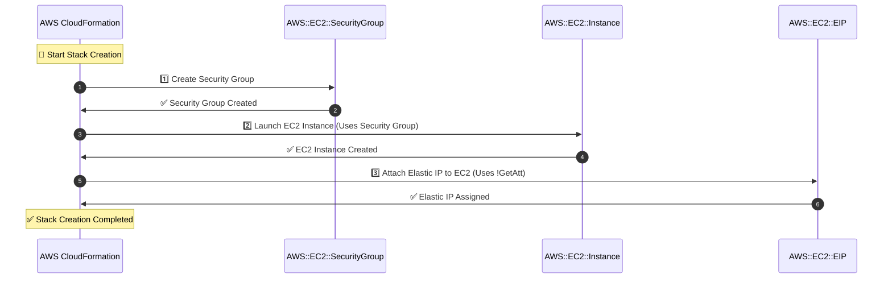

# **🔗 Managing Dependencies in AWS CloudFormation: Linking Resources & Controlling Creation Order**

## 📌 **Introduction**

AWS CloudFormation **orchestrates the creation and management of AWS resources**. However, some resources depend on others to be created first. Managing these **dependencies** ensures a smooth and error-free deployment.

✔ **Prevents race conditions during stack creation**  
✔ **Ensures resources are created in the correct sequence**  
✔ **Links resources dynamically to establish relationships**

---

## 🔑 **How CloudFormation Manages Resource Dependencies**

By default, AWS CloudFormation **creates resources in parallel**, but dependencies can be specified using:

| **Method**                       | **Purpose**                                                        |
| -------------------------------- | ------------------------------------------------------------------ |
| **`!Ref` Intrinsic Function**    | Creates an implicit dependency by referencing another resource.    |
| **`!GetAtt` Intrinsic Function** | Retrieves attributes of a resource to be used by another resource. |
| **`DependsOn` Property**         | Explicitly defines resource creation order.                        |
| **Wait Conditions**              | Ensures specific tasks are completed before proceeding.            |

---

## 🏗️ **Methods to Link Resources in CloudFormation**

### **1️⃣ Using `!Ref` to Implicitly Link Resources**

The `!Ref` function **creates an implicit dependency**, meaning the referenced resource **must exist before** it is used.

🔹 **Example:** Attach a security group (`MySecurityGroup`) to an EC2 instance.

```yaml
Resources:
  MySecurityGroup:
    Type: AWS::EC2::SecurityGroup
    Properties:
      GroupDescription: "Allow SSH"
      SecurityGroupIngress:
        - IpProtocol: tcp
          FromPort: 22
          ToPort: 22
          CidrIp: 0.0.0.0/0

  MyEC2Instance:
    Type: AWS::EC2::Instance
    Properties:
      InstanceType: t2.micro
      ImageId: ami-12345678
      SecurityGroups:
        - !Ref MySecurityGroup # Implicit dependency
```

✅ **Ensures the Security Group is created before the EC2 instance.**

---

### **2️⃣ Using `!GetAtt` to Reference Resource Attributes**

The `!GetAtt` function **retrieves attributes from one resource** and applies them to another.

🔹 **Example:** Attach an Elastic IP (EIP) to an EC2 instance using `!GetAtt`.

```yaml
Resources:
  MyEC2Instance:
    Type: AWS::EC2::Instance
    Properties:
      InstanceType: t2.micro
      ImageId: ami-12345678

  MyElasticIP:
    Type: AWS::EC2::EIP
    Properties:
      InstanceId: !GetAtt MyEC2Instance.InstanceId # Fetches EC2 Instance ID
```

✅ **Ensures the EC2 instance exists before assigning the Elastic IP.**

---

### **3️⃣ Using `DependsOn` for Explicit Ordering**

The `DependsOn` property **forces CloudFormation to create resources in a specific order**.

🔹 **Example:** Ensure an S3 bucket is created before an IAM policy referencing it.

```yaml
Resources:
  MyS3Bucket:
    Type: AWS::S3::Bucket

  MyIAMPolicy:
    Type: AWS::IAM::Policy
    DependsOn: MyS3Bucket # Explicit dependency
    Properties:
      PolicyName: "S3AccessPolicy"
      Roles:
        - !Ref MyIAMRole
      PolicyDocument:
        Statement:
          - Effect: Allow
            Action: "s3:*"
            Resource: !Sub "arn:aws:s3:::${MyS3Bucket}/*"
```

✅ **Ensures the S3 bucket exists before applying the IAM policy.**

---

### **4️⃣ Using Wait Conditions for External Dependencies**

A `WaitCondition` **pauses CloudFormation stack creation until an external event occurs**.

🔹 **Example:** Pause stack creation until a configuration script completes.

```yaml
Resources:
  MyWaitHandle:
    Type: AWS::CloudFormation::WaitConditionHandle

  MyWaitCondition:
    Type: AWS::CloudFormation::WaitCondition
    DependsOn: MyEC2Instance
    Properties:
      Handle: !Ref MyWaitHandle
      Timeout: "600" # Wait for 10 minutes

  MyEC2Instance:
    Type: AWS::EC2::Instance
    Properties:
      InstanceType: t2.micro
      ImageId: ami-12345678
```

✅ **Waits for an external signal before proceeding with stack creation.**

---

## 🔄 **Sequence Diagram: Resource Creation Order in CloudFormation**

This sequence diagram illustrates **how CloudFormation handles dependencies** when creating an EC2 instance with an attached security group and Elastic IP.



✅ **Ensures resources are created in the correct order.**

---

## 📜 **Best Practices for Managing Resource Dependencies**

✅ **Use `!Ref` for automatic dependency resolution** whenever possible.  
✅ **Use `!GetAtt` to dynamically retrieve attributes** of dependent resources.  
✅ **Use `DependsOn` only when explicit ordering is necessary.**  
✅ **Leverage Wait Conditions** for scenarios requiring external completion signals.  
✅ **Enable Drift Detection** to track unauthorized infrastructure changes.

---

## ✅ **Conclusion**

AWS CloudFormation **automates resource dependencies** using `!Ref`, `!GetAtt`, `DependsOn`, and Wait Conditions.

✔ **Ensures correct resource creation order**  
✔ **Prevents stack failures due to missing dependencies**  
✔ **Simplifies infrastructure automation & reduces manual errors**

💡 **Mastering dependency management in CloudFormation leads to efficient and reliable AWS deployments!** 🚀
