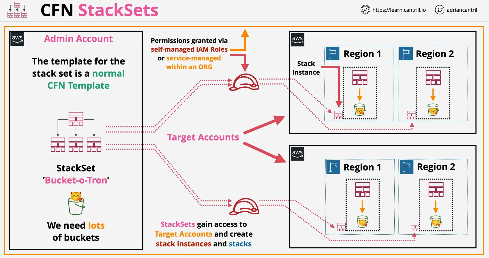

# **🔢 AWS CloudFormation StackSets**

AWS CloudFormation **StackSets** enable you to deploy and manage **CloudFormation stacks across multiple AWS accounts and regions** from a **centralized** control point.

✔ **Simplifies infrastructure management** – Deploy CloudFormation stacks at scale.  
✔ **Ensures consistency** – Enforce standardized infrastructure across accounts/regions.  
✔ **Automates deployments** – Apply infrastructure changes automatically across environments.

---



---

## **🛠️ How AWS CloudFormation StackSets Work?**

### **Key Components:**

**1️⃣ StackSet** – A **template and configuration** that defines the stack to be deployed across accounts/regions.  
**2️⃣ Stack Instances** – Individual stacks deployed in each target account and region.  
**3️⃣ Administrator Account** – The AWS account that manages StackSet operations.  
**4️⃣ Target Accounts** – AWS accounts where the stack will be deployed.  
**5️⃣ Execution Role** – An IAM role in each target account that grants permissions for deployment.

✅ **AWS Organizations Integration:** Use StackSets with **Service-Managed Permissions** to automate deployments across your organization.

---

## **🔗 StackSet Deployment Models**

### **1️⃣ Self-Managed Permissions**

- **Administrator Account** deploys stacks to **target accounts**.
- **Execution IAM Role** is required in each target account.
- Best for organizations with **custom IAM permission models**.

### **2️⃣ Service-Managed Permissions (AWS Organizations Integration)**

- StackSets automatically deploy to **all accounts in an AWS Organization**.
- AWS CloudFormation manages IAM roles **automatically**.
- Best for large-scale **enterprise deployments**.

✅ **Recommendation:** Use **Service-Managed Permissions** for streamlined, secure deployments across an AWS Organization.

---

## **🌎 Why Use AWS CloudFormation StackSets?**

🔹 **Multi-Account Deployments** – Deploy CloudFormation stacks across multiple AWS accounts within an AWS Organization.  
🔹 **Multi-Region Deployments** – Ensure infrastructure is consistent across AWS regions.  
🔹 **Centralized Management** – Control deployments from a single AWS account.  
🔹 **Automated Rollouts** – Enable automatic stack creation, updates, and deletions across accounts.  
🔹 **IAM Permission Control** – Manage IAM roles for StackSet execution securely.

---

## **🏗️ Creating an AWS CloudFormation StackSet**

### **1️⃣ Define the StackSet Template**

The **CloudFormation template** should define the infrastructure resources (e.g., IAM roles, VPCs, S3 buckets).

**Example CloudFormation Template (S3 Bucket Creation):**

```yaml
AWSTemplateFormatVersion: "2010-09-09"
Description: "StackSet Example - S3 Bucket Deployment"

Resources:
  MyS3Bucket:
    Type: AWS::S3::Bucket
    Properties:
      BucketName: !Sub "my-stackset-bucket-${AWS::Region}-${AWS::AccountId}"
```

✔ **Defines an S3 bucket that will be deployed across accounts/regions.**

---

### **2️⃣ Create the StackSet in AWS CloudFormation**

#### **Using AWS CLI**

```sh
aws cloudformation create-stack-set \
  --stack-set-name MyStackSet \
  --template-body file://stackset-template.yaml \
  --permission-model SERVICE_MANAGED
```

✔ **Creates a StackSet with service-managed permissions.**

---

### **3️⃣ Add Stack Instances (Deploy to Accounts/Regions)**

Deploy the StackSet across multiple AWS accounts and regions.

#### **Using AWS CLI**

```sh
aws cloudformation create-stack-instances \
  --stack-set-name MyStackSet \
  --accounts 111122223333 444455556666 \
  --regions us-east-1 us-west-2
```

✔ **Deploys the StackSet to multiple accounts (`111122223333`, `444455556666`) in multiple regions (`us-east-1`, `us-west-2`).**

---

### **4️⃣ Updating a StackSet**

If you need to update the stack, modify the StackSet template and apply the update.

#### **Using AWS CLI**

```sh
aws cloudformation update-stack-set \
  --stack-set-name MyStackSet \
  --template-body file://updated-template.yaml
```

✔ **Updates the CloudFormation resources across all stack instances.**

---

## **❌ Deleting StackSets**

To remove stacks from target accounts, delete stack instances first, then delete the StackSet.

### **1️⃣ Delete Stack Instances**

```sh
aws cloudformation delete-stack-instances \
  --stack-set-name MyStackSet \
  --accounts 111122223333 444455556666 \
  --regions us-east-1 us-west-2 \
  --no-retain-stacks
```

✔ Removes the stack instances without retaining resources.

### **2️⃣ Delete the StackSet**

```sh
aws cloudformation delete-stack-set --stack-set-name MyStackSet
```

✔ Deletes the StackSet after all instances are removed.

---

## **🔤 Key Terms in AWS CloudFormation StackSets**

| **Term**                | **Definition**                                                                 |
| ----------------------- | ------------------------------------------------------------------------------ |
| **Concurrent Accounts** | The number of AWS accounts where stack operations are executed simultaneously. |
| **Failure Tolerance**   | Maximum number of accounts or regions that can fail during deployment.         |
| **Retain Stacks**       | Retains the stack resources when deleting stack instances to avoid data loss.  |

## **⚠️ StackSet Limitations & Considerations**

| **Limitation**                             | **Description**                                                     |
| ------------------------------------------ | ------------------------------------------------------------------- |
| **Requires IAM Roles**                     | Execution roles must exist in target accounts (Self-Managed).       |
| **Region-Specific**                        | Stacks must be created in **AWS-supported regions**.                |
| **StackSet Updates Are Sequential**        | Updates happen **one region at a time**, not simultaneously.        |
| **Stack Deletion Order Matters**           | You must delete **stack instances first** before deleting StackSet. |
| **Service-Managed Model Requires AWS Org** | Only works if your accounts are part of an **AWS Organization**.    |

---

## **✅ Best Practices for Using StackSets**

✔ **Use AWS Organizations & Service-Managed Permissions** for automated multi-account deployments.  
✔ **Design templates with dynamic naming** (e.g., `!Sub "${AWS::Region}-${AWS::AccountId}"`).  
✔ **Enable StackSet drift detection** to monitor infrastructure consistency.  
✔ **Test updates in a single region/account first** before rolling out globally.  
✔ **Use parameters in templates** to customize deployments per account/region.  
✔ **Avoid frequent updates** to minimize deployment time across accounts.

---

## 📍 **Conclusion**

AWS CloudFormation **StackSets** enable **scalable, automated, and consistent** infrastructure deployments across **multiple AWS accounts and regions**.

✔ **Streamlines infrastructure management at scale**.  
✔ **Ensures standardization and compliance** across AWS environments.  
✔ **Reduces operational overhead** for multi-account deployments.

💡 **Mastering StackSets simplifies enterprise-wide AWS CloudFormation deployments!** 🚀
