# **🧾 EC2 User Data in AWS CloudFormation**

EC2 **User Data** allows automation of instance initialization tasks, such as **software installation, configuration management, and script execution** at startup.

✅ **Runs on first boot** – Executes automatically when the instance starts.  
✅ **Used for software setup** – Installs and configures applications like Apache, Docker, or Nginx.  
✅ **Can be combined with CloudFormation** – Automates instance configuration in stack deployments.

---

## **🔖 How EC2 User Data Works in CloudFormation**

- **When an EC2 instance boots**, it **retrieves the User Data script** and executes it as the root user.
- **User Data runs only once by default**, but it can be configured to execute on every reboot.

```mermaid
sequenceDiagram
    autonumber
    participant CloudFormation as AWS CloudFormation
    participant EC2 as EC2 Instance
    CloudFormation->>EC2: 1️⃣ Launch EC2 with User Data Script
    EC2->>EC2: 2️⃣ Execute User Data on First Boot
    EC2->>EC2: 3️⃣ Install Software & Configure System
    EC2->>CloudFormation: 4️⃣ Report Instance Ready
```



> **Ensures instances are fully configured upon launch.**

---

## **🔖 Example: Defining User Data in CloudFormation**

Installing Apache Using EC2 User Data

```yaml
Resources:
  MyEC2Instance:
    Type: AWS::EC2::Instance
    Properties:
      ImageId: ami-12345678
      InstanceType: t3.micro
      UserData:
        Fn::Base64: |
          #!/bin/bash
          yum update -y
          yum install -y httpd
          systemctl start httpd
          systemctl enable httpd
          echo "Hello from EC2" > /var/www/html/index.html
```

### **📝 Explanation**

1️⃣ **Base64 Encoded Script**

- CloudFormation requires `UserData` to be **Base64 encoded** (`Fn::Base64`).

2️⃣ **Script Execution**

- Updates system packages (`yum update -y`).
- Installs Apache (`yum install -y httpd`).
- Starts and enables Apache (`systemctl start httpd && systemctl enable httpd`).
- Creates a webpage (`echo "Hello from EC2" > /var/www/html/index.html`).

> _When the instance starts, Apache is installed, started, and accessible via a web browser._

---

## **🔖 Running User Data on Every Boot (Not Just First Boot)**

By default, User Data **runs only once**. To **re-run it on every reboot**, modify `/etc/rc.local`:

```yaml
Resources:
  MyEC2Instance:
    Type: AWS::EC2::Instance
    Properties:
      UserData:
        Fn::Base64: |
          #!/bin/bash
          echo "Re-running User Data" >> /var/log/userdata.log
          bash /var/lib/cloud/instance/scripts/part-001
```

> _Ensures the script executes every time the instance reboots._

---

## **🔖 Passing Parameters to EC2 User Data from CloudFormation**

```yaml
Parameters:
  InstanceName:
    Type: String
    Default: "MyServer"

Resources:
  MyEC2Instance:
    Type: AWS::EC2::Instance
    Properties:
      UserData:
        Fn::Base64: !Sub |
          #!/bin/bash
          hostnamectl set-hostname ${InstanceName}
```

> _Sets the instance hostname dynamically based on CloudFormation parameters._

---

## **🔖 Troubleshooting User Data Execution**

| **Issue**                              | **Solution**                                                 |
| -------------------------------------- | ------------------------------------------------------------ |
| **User Data did not execute**          | Ensure the script has `#!/bin/bash` at the start.            |
| **Script ran but failed**              | Check logs in `/var/log/cloud-init-output.log`.              |
| **User Data did not re-run on reboot** | Modify `/etc/rc.local` to re-run the script.                 |
| **Base64 encoding issues**             | Ensure `Fn::Base64` is properly wrapping the script in YAML. |

---

## **🔖 Best Practices for Using EC2 User Data in CloudFormation**

✅ **Keep User Data Scripts Minimal**

- Use **CloudFormation Helper Scripts (`cfn-init`)** for complex tasks.

✅ **Enable Logging for Debugging**

```yaml
UserData:
  Fn::Base64: |
    #!/bin/bash
    echo "User Data Running..." > /var/log/userdata.log
```

- Helps in troubleshooting script execution.

✅ **Use `!Sub` for Dynamic Parameters**

- Instead of hardcoding values, **use CloudFormation parameters.**

✅ **Store Large Scripts in S3 Instead of Embedding in User Data**

```yaml
UserData:
  Fn::Base64: |
    #!/bin/bash
    aws s3 cp s3://mybucket/setup.sh /tmp/setup.sh
    chmod +x /tmp/setup.sh
    /tmp/setup.sh
```

- Helps keep CloudFormation templates clean and **reduces size limitations.**

---

## **📍 Conclusion**

EC2 **User Data in CloudFormation** enables **automated instance initialization** by running scripts at startup.

✔ **Automates software installation and configuration.**  
✔ **Supports parameterized and reusable instance setup.**  
✔ **Can be configured to execute at every reboot.**

💡 **Mastering EC2 User Data ensures efficient, automated AWS instance deployments!** 🚀
