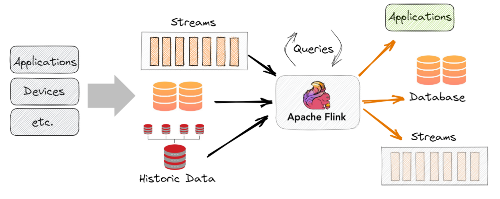
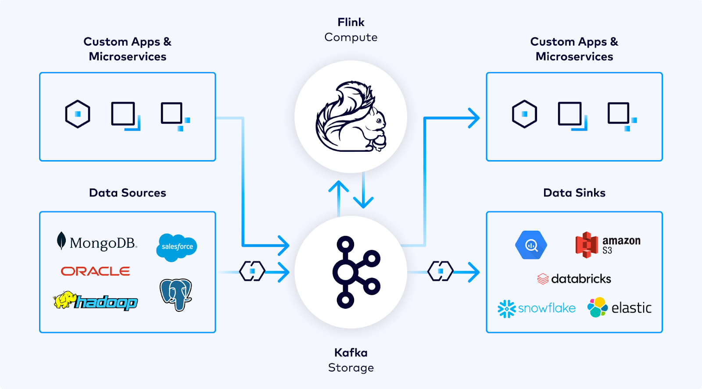
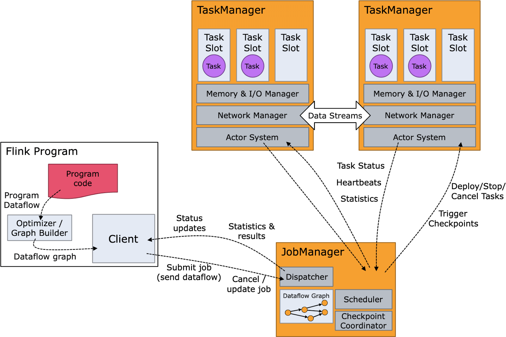

# **🦨 Introduction to Apache Flink**

---

    
    

---

## **📋 What is Apache Flink?**

**Apache Flink** is an open-source, distributed framework for processing **streaming and batch data**. It is designed for **real-time, high-performance, and fault-tolerant data processing**, making it a popular choice for handling continuous data streams and complex analytics.

💡 **Key Idea:**  
Flink processes data as it arrives (real-time streaming) while also supporting batch workloads.

---

## **⚙️ Key Features of Apache Flink**

1. **Stream-First Architecture:**

   - Built for real-time data processing, but supports batch processing as a subset of streaming.

2. **Event-Time Processing:**

   - Processes data based on the actual event time (when the event occurred) rather than when it was received.

3. **Fault Tolerance:**

   - Uses **checkpoints** to recover from failures without losing data.

4. **Stateful Processing:**

   - Maintains state across events, enabling complex calculations over time (e.g., session windows, aggregations).

5. **High Throughput, Low Latency:**

   - Processes massive amounts of data quickly with minimal delays.

6. **Scalability:**

   - Dynamically scales to handle increasing workloads across distributed clusters.

7. **Integration with Big Data Ecosystem:**
   - Works seamlessly with tools like Apache Kafka, Hadoop, Cassandra, and AWS S3.

---

## **🌟 Why Use Apache Flink?**

1. **Real-Time Insights:**

   - Ideal for scenarios requiring instant feedback or decisions, such as fraud detection or IoT monitoring.

2. **Advanced Stream Processing:**

   - Handles complex operations like event-time windowing, session tracking, and pattern recognition.

3. **Robust Fault Recovery:**

   - Automatically recovers and continues processing after failures, ensuring reliability.

4. **Unified Framework:**
   - Supports both streaming and batch processing, reducing the need for separate tools.

---

## **🔄 How Apache Flink Works**

1. **Data Sources (Input):**

   - Flink ingests data from sources like Kafka, Amazon Kinesis, databases, or files.

2. **Processing:**

   - Executes operations like transformations, aggregations, and joins in real time.
   - Supports event-time and processing-time semantics.

3. **State Management:**

   - Maintains a state for ongoing calculations, enabling complex use cases like trend analysis or session tracking.

4. **Data Sinks (Output):**
   - Sends processed data to destinations like databases, data lakes, or dashboards.

---

## **🛠️ Key Components of Apache Flink**

    

1. **Job Manager:**

   - Coordinates distributed processing tasks and schedules work.

2. **Task Managers:**

   - Workers that execute the assigned tasks, process data, and manage state.

3. **Data Streams:**

   - Represents data flowing through the system in real time.

4. **Operators:**

   - Perform transformations, aggregations, and filtering on data streams.

5. **State Backend:**
   - Stores and manages the state of ongoing calculations.

---

## **📊 Use Cases for Apache Flink**

1. **Real-Time Analytics:**

   - Analyzing user behavior on a website to recommend products instantly.

2. **IoT Data Processing:**

   - Monitoring sensor data in factories, smart homes, or wind turbines.

3. **Fraud Detection:**

   - Detecting anomalies in financial transactions in real time.

4. **Event Processing:**

   - Tracking customer interactions, such as clicks or purchases, in live applications.

5. **Log Processing:**
   - Aggregating and analyzing server logs for system monitoring.

---

## **⚡ Apache Flink vs. Apache Spark**

| **Feature**            | **Apache Flink**                          | **Apache Spark**                            |
| ---------------------- | ----------------------------------------- | ------------------------------------------- |
| **Processing Model**   | Stream-first with batch as a subset.      | Batch-first with streaming as an extension. |
| **Event-Time Support** | Strong event-time semantics.              | Basic event-time support.                   |
| **State Management**   | Advanced, built-in state management.      | Relies on external storage for state.       |
| **Fault Tolerance**    | Uses fine-grained checkpoints.            | Uses micro-batch processing.                |
| **Latency**            | Lower latency, ideal for real-time tasks. | Higher latency due to micro-batches.        |

---

## **🌍 Real-Life Example: Apache Flink in Action**

**Scenario:**  
A ride-sharing company wants to monitor trips in real time to identify delays and optimize driver assignments.

**How Flink Helps:**

1. **Data Ingestion:**

   - Streams GPS and trip data from drivers using Apache Kafka.

2. **Processing:**

   - Tracks the status of trips, identifies delays, and calculates ETAs in real time.

3. **Output:**
   - Sends processed data to a dashboard for real-time monitoring and alerting.

**Result:**  
The system ensures efficient trip management and improves customer satisfaction.

---

## **🧠 Simple Analogy**

Think of Apache Flink as a **real-time traffic control system**:

- It continuously monitors the flow of cars (data) on the road (streams).
- It uses past and current traffic patterns (stateful processing) to predict and optimize routes (insights).

---

## **🌟 Benefits of Apache Flink**

1. **Real-Time Processing:**

   - Perfect for applications requiring low-latency responses.

2. **Resilient State Management:**

   - Maintains reliable state even in the face of system failures.

3. **Scalable Architecture:**

   - Efficiently handles workloads of any size by adding more resources.

4. **Flexible Integration:**
   - Works seamlessly with other big data tools and storage systems.

---

## **📦 Tools and Integrations**

1. **Data Sources:**

   - Apache Kafka, AWS Kinesis, RabbitMQ, databases, files.

2. **Data Sinks:**

   - Databases (MySQL, PostgreSQL), AWS S3, Elasticsearch, or HDFS.

3. **Processing Tools:**
   - Can complement or integrate with Apache Hadoop, Spark, or Presto for additional processing.
