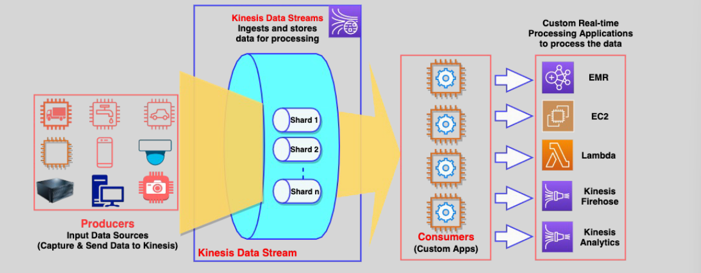
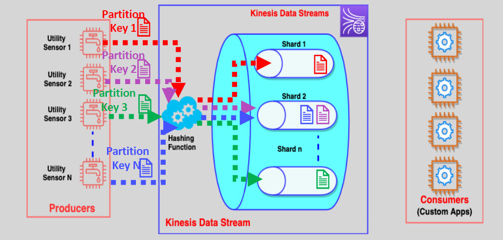

# 📡 Amazon Kinesis Data Streams: Real-Time Data Processing

Amazon Kinesis Data Streams (KDS) is a **fully managed, scalable, and durable service** designed to handle **real-time data streaming** at massive scales. It enables organizations to **collect, process, and analyze data** in milliseconds, empowering data-driven decisions and real-time applications.

---

    

---

## 🌟 **Key Features of Kinesis Data Streams**

1. **Real-Time Data Ingestion**:

   - Collect gigabytes of data **per second** from diverse sources like:
     - Website click streams.
     - Database event streams.
     - Financial transactions.
     - Social media feeds.
     - IT logs and location tracking.

2. **Massive Scalability**:

   - Scales seamlessly to accommodate thousands of data producers and consumers.

3. **Low Latency**:

   - Data is available for processing within **milliseconds** of being ingested.

4. **Durable Storage**:

   - Data is replicated synchronously across **three Availability Zones** (AZs) for durability.
   - Retention period: **24 hours by default** (extendable up to 365 days).

5. **Integration with AWS Ecosystem**:
   - Works seamlessly with services like **AWS Lambda**, **Amazon S3**, **Amazon Redshift**, and **Amazon Elasticsearch**.

---

## 🔧 **How Kinesis Data Streams Works**

1. **Data Producers**:

   - Applications, sensors, or systems send data to a **Kinesis stream**.
   - Supported tools include:
     - **Kinesis Producer Library (KPL)**.
     - **Kinesis API** using AWS SDKs.
     - **Kinesis Agent** (simple to deploy for log ingestion).

2. **Stream Architecture**:

   - Data is divided into **shards**, each capable of handling:
     - **1 MB/sec** write throughput.
     - **2 MB/sec** read throughput.
   - **Partition Keys** determine which shard receives a particular record.

3. **Data Consumers**:
   - Applications consume data using the **Kinesis Client Library (KCL)** or **AWS SDKs**.
   - Data can be used for:
     - Dashboards.
     - Generating alerts.
     - Real-time analytics.

---

## 🛠️ **Key Components**

    

1. **Records**:

   - Units of data ingested into the stream.
   - Each record has:
     - **Partition Key**: Determines which shard the data goes to.
     - **Sequence Number**: Assigned by Kinesis for ordering.

2. **Shards**:

   - Building blocks of a Kinesis stream.
   - More shards = Higher throughput (and cost).
   - **Re-sharding** allows you to:
     - **Split**: Increase throughput by dividing a shard into two.
     - **Merge**: Reduce cost by combining two shards.

3. **Retention Period**:
   - Data is stored in the stream for **24 hours** by default.
   - Extendable up to **365 days** for long-term use cases.

---

## 🔄 **Capacity Modes**

1. **On-Demand Mode**:

   - **Automatic scaling** of shards based on traffic.
   - Ideal for workloads with **variable or unpredictable traffic**.
   - Pay **per GB** of data written and read.

2. **Provisioned Mode**:
   - Define the number of **shards** in the stream manually.
   - Capacity scales with the number of shards.
   - Suitable for **steady or predictable workloads**.

---

## 🔑 **Security**

1. **Encryption**:

   - **At Rest**: Encrypt data using AWS KMS.
   - **In Transit**: Secured with TLS.

2. **Access Control**:
   - Use **AWS Identity and Access Management (IAM)** policies to control access to streams.

---

## 🌟 **Use Cases**

1. **Real-Time Analytics**:

   - Monitor website activity, application performance, or user behavior in real time.

2. **Log and Metric Aggregation**:

   - Centralize logs from various sources for monitoring or troubleshooting.

3. **Event Streaming**:

   - Enable **event-driven architectures** for microservices or serverless applications.

4. **IoT Data Processing**:
   - Analyze data from connected devices like sensors or smart appliances.

---

## 🛠️ **Comparison: On-Demand vs. Provisioned Mode**

| **Feature**            | **On-Demand Mode**                      | **Provisioned Mode**                              |
| ---------------------- | --------------------------------------- | ------------------------------------------------- |
| **Throughput Scaling** | Automatic (no manual shard management). | Manually scale by adding/removing shards.         |
| **Cost**               | Pay per GB of data written and read.    | Pay per shard-hour (based on provisioned shards). |
| **Best For**           | Unpredictable or variable workloads.    | Predictable and steady workloads.                 |

---

## ✅ **Why Choose Kinesis Data Streams?**

1. **Real-Time Processing**:

   - Enables applications to react to data instantly.

2. **Flexibility**:

   - Supports various data formats and processing methods.

3. **Integration**:

   - Works with AWS analytics tools and third-party systems.

4. **Durability**:
   - Synchronous replication ensures data is never lost.

---

## 📚 **Conclusion**

Amazon Kinesis Data Streams is a powerful, scalable service for processing **real-time data**. Whether you're building dashboards, processing IoT streams, or powering event-driven architectures, Kinesis simplifies the complexity of streaming data at scale. Its flexibility, durability, and integration with the AWS ecosystem make it an excellent choice for real-time applications.
