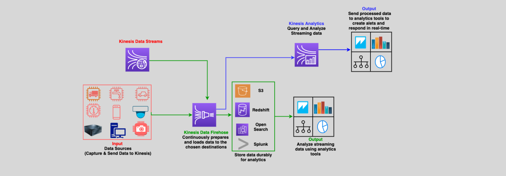

# 🧯 Amazon Kinesis Data Firehose

Amazon Kinesis Data Firehose (KDF) is a **fully managed, real-time data streaming and ETL service** designed to **capture, transform, and deliver streaming data** to various destinations such as **Amazon S3**, **Amazon Redshift**, **OpenSearch**, and **Splunk**.

---

---

## 🌟 **Key Features of Kinesis Data Firehose**

### 1. **Fully Managed Service**

- No need to manage infrastructure or manually scale resources.
- Automatically adjusts to handle incoming data volumes.

### 2. **Data Transformation**

- Uses **AWS Lambda** to process and transform data before delivery.
- Enables format conversion (e.g., JSON to Parquet or ORC) for analytics.

### 3. **Data Delivery Destinations**

- Seamlessly integrates with:
  - **Amazon S3**: For storage and data lakes.
  - **Amazon Redshift**: For data warehousing and analytics.
  - **OpenSearch**: For real-time search and monitoring.
  - **Splunk**: For log analysis and visualization.

### 4. **Near Real-Time Analytics**

- Delivers data within seconds, enabling actionable insights for dashboards and analytics.

### 5. **Data Optimization**

- Buffers, batches, compresses, and encrypts data before delivery, reducing storage costs and improving security.

### 6. **Seamless Integration with Kinesis Data Streams**

- Can ingest data directly from **Kinesis Data Streams (KDS)** for downstream processing.

---

## 🛠️ **How Kinesis Data Firehose Works**

1. **Data Producers**:

   - Send real-time streaming data to **Firehose** using:
     - AWS SDKs
     - AWS IoT Core
     - Kinesis Agent

2. **Data Transformation**:

   - **Optional**: Use **AWS Lambda** functions to clean, process, or reformat data.

3. **Buffering**:

   - Data is buffered for a user-defined interval (default 5 minutes, up to 24 hours) or until a size threshold is reached.

4. **Data Delivery**:
   - Transformed and batched data is delivered to destinations like S3, Redshift, OpenSearch, or Splunk.

---

## 🎯 **Common Use Cases**

1. **Log Analytics**:

   - Stream logs from servers or applications to OpenSearch or Splunk for real-time monitoring.

2. **IoT Analytics**:

   - Process data from IoT devices and deliver it to Redshift or S3 for analysis.

3. **Security Monitoring**:

   - Aggregate and analyze security logs for threat detection and compliance.

4. **Clickstream Analytics**:
   - Track user behavior on websites or apps in near real-time.

---

## 🔄 **Key Differences: Kinesis Data Firehose vs. Kinesis Data Streams**

| **Feature**               | **Kinesis Data Firehose (KDF)**                                    | **Kinesis Data Streams (KDS)**                                              |
| ------------------------- | ------------------------------------------------------------------ | --------------------------------------------------------------------------- |
| **Use Case**              | Deliver and process data to destinations for storage or analytics. | Real-time data ingestion for custom processing or applications.             |
| **Management**            | Fully managed, auto-scales based on demand.                        | Requires shard management to scale throughput.                              |
| **Transformation**        | Built-in Lambda support for data transformation.                   | Custom transformations require a consumer application.                      |
| **Delivery Destinations** | S3, Redshift, OpenSearch, Splunk.                                  | Requires a consumer to define delivery destinations.                        |
| **Data Retention**        | Buffers data temporarily (up to 24 hours).                         | Retains data for replay up to 7 days (or 365 days with extended retention). |
| **Data Processing**       | Automated batching, compression, and encryption before delivery.   | Raw data streamed; consumer applications handle batching and processing.    |
| **Latency**               | Delivers data with a slight delay (near real-time, seconds).       | Streams data with millisecond latency for real-time applications.           |
| **Cost Model**            | Pay for data ingestion and processing.                             | Pay for shards and data transfer.                                           |

---

## ✅ **Why Choose Kinesis Data Firehose?**

1. **Ease of Use**:

   - Fully automated, minimal configuration required.

2. **Data Delivery Focus**:

   - Ideal for delivering processed data to analytics and storage destinations.

3. **Seamless Transformation**:

   - Built-in support for **AWS Lambda** to clean and enrich data before delivery.

4. **Cost-Effective**:
   - Pay for data volume and processing, no need to manage shards.

---

## 📚 **Conclusion**

Amazon Kinesis Data Firehose simplifies real-time data streaming by automating the process of **ingesting**, **transforming**, and **delivering data** to popular destinations like S3, Redshift, and OpenSearch. It is the perfect choice for organizations looking to integrate streaming data into their analytics and business intelligence workflows with minimal operational overhead. For highly customizable real-time applications, **Kinesis Data Streams** is the alternative.
