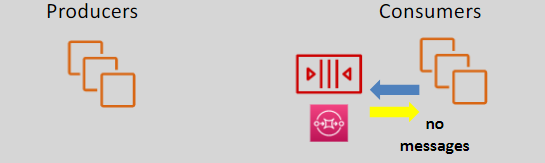
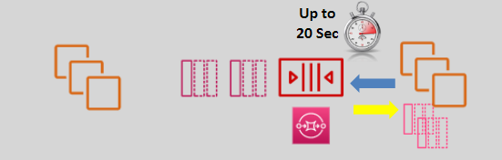

# 📬 **Amazon SQS: Comprehensive Guide to Message Queuing**

Amazon Simple Queue Service (SQS) is a fully managed message queuing service that enables reliable, scalable, and secure communication between different components of your applications. Ideal for serverless and microservices architectures, SQS helps decouple and coordinate the components of distributed systems, enhancing performance, reliability, and scalability.

---

## 🔑 **Key Features**

- **Fast & Reliable:** Delivers messages quickly and ensures they are not lost.
- **Durable:** Stores messages across multiple Availability Zones (AZs) within an AWS region.
- **Secure:** Integrates with AWS Identity and Access Management (IAM) for controlled access.
- **Fully Managed:** Eliminates the need to manage and maintain message queues.
- **Scalable:** Handles an unlimited number of messages and scales automatically with your application's needs.

---

## 🌀 **Message Lifecycle**

Understanding the message lifecycle in Amazon SQS is crucial for effectively utilizing its features to build robust applications. Here's a step-by-step breakdown of how messages flow from producers to consumers, including success and failure scenarios.

### 1. **Message Production**

- **Producer Sends Message:**

  - Applications or services (like EC2 instances or Lambda functions) send messages to an SQS queue.
  - **Batch Sending:** Up to **10 messages** can be sent in a single batch, with a total size not exceeding **256KB**. This helps optimize throughput and reduce costs by minimizing the number of API requests.

  **Example:** An application sends order details to an SQS queue for processing by backend services.

- **Delay Queue (Optional):**

  - **Definition:** A feature that postpones the delivery of new messages to the queue.
  - **Configuration:** Set a delay time (0 seconds to 15 minutes) when sending a message.
  - **Purpose:** Schedule tasks for future processing or implement retry logic without additional application code.

  **Example:** Delaying a message for user account activation by 10 minutes after registration.

### 2. **Message Storage**

- **Retention Period:**

  - **Definition:** The duration a message remains in the queue before it is automatically deleted if not processed.
  - **Range:** 1 minute to 14 days (default is 4 days).
  - **Purpose:** Ensures messages are available for processing within a specified timeframe.

  **Example:** Setting a retention period of 7 days for order processing messages to allow ample time for handling delayed orders.

### 3. **Message Retrieval and Processing**

- **Consumer Polls Queue:**

  - Consumers (like EC2 instances or Lambda functions) poll the queue to retrieve messages for processing.
  - **Polling Types:**
    - **Short Polling (Default):** Returns immediately, even if the queue is empty. This can lead to higher costs due to the increased number of requests.
    - **Long Polling:** Waits up to **20 seconds** (configurable) for a message to appear before responding. This reduces the number of empty responses and lowers costs by minimizing unnecessary polling.

  **Example:** A Lambda function polls the SQS queue every few seconds to process incoming messages.

- **Visibility Timeout:**

  - **Definition:** The duration during which a retrieved message is hidden from other consumers.
  - **Range:** 0 seconds to 12 hours (default is 30 seconds).
  - **Purpose:** Prevents multiple consumers from processing the same message simultaneously.

  **Flow:**

  1. **Retrieve Message:** Consumer fetches a message from the queue.
  2. **Lock Message:** The message becomes invisible to other consumers for the duration of the Visibility Timeout.
  3. **Process Message:** Consumer processes the message.
  4. **Delete Message:** Upon successful processing, the consumer deletes the message from the queue.
  5. **Failed Processing:** If the consumer fails to delete the message within the Visibility Timeout, the message becomes visible again for another attempt.

  **Example:** A message to process an image upload has a Visibility Timeout of 60 seconds. If processing completes within this time, the message is deleted. If not, it becomes visible again for another attempt.

### 4. **Message Deletion or Redelivery**

- **Successful Processing:**

  - After processing, the consumer deletes the message, ensuring it won't be processed again.

- **Failed Processing:**

  - If processing fails or exceeds the Visibility Timeout, the message becomes visible again for another consumer to process.
  - **Dead Letter Queues (DLQ):**

    - **Purpose:** Capture messages that fail processing multiple times, aiding in troubleshooting and error handling.
    - **Configuration:** Set up a DLQ to receive messages after a specified number of failed processing attempts.

    **Example:** A message fails to process three times and is moved to a DLQ for manual review.

---

## 🗂️ **Queue Types**

Amazon SQS offers two primary types of queues to cater to different application needs: **Standard Queues** and **FIFO (First-In-First-Out) Queues**.

### 💥 1. **Standard SQS Queue**

- **Throughput:** Unlimited transactions per second (TPS).
- **Delivery:** At least once delivery; duplicates are possible.
- **Ordering:** Best-effort ordering; messages might not be received in the exact order they were sent.
- **Use Case:** Suitable for high-throughput, distributed systems where occasional duplicates are acceptable.

  **Example:** Processing user registrations where duplicate processing is not critical.

### 🔢 2. **FIFO SQS Queue**

- **Throughput:**
  - **Standard Mode:** 300 TPS per API action.
  - **With Batching:** Up to 3,000 TPS per API action.
- **Delivery:** Exactly once processing; no duplicates.
- **Ordering:** Strictly preserves the order of messages.
- **Use Case:** Ideal for applications where the order of operations and exactly-once processing are critical, such as financial transactions.

  **Example:** Processing payment transactions where order and uniqueness are essential.

---

## ❓ **Polling Types**

SQS operates on a **poll-based** model, where consumers must poll the queue to retrieve messages. Understanding the polling types helps optimize cost and performance.

### 1. ⚡ **Short Polling (Default)**

- **Behavior:** Returns immediately, even if the queue is empty.
  
- **Cost:** Higher due to the increased number of requests, as empty responses still count as requests.
- **Use Case:** Suitable for scenarios where immediate response is required, regardless of message availability.

  **Example:** An application needs to check for messages continuously without delay, even if there are no messages.

### 2. ⌛ **Long Polling**

- **Behavior:** Waits up to **20 seconds** (configurable) for a message to appear in the queue before responding.
  
- **Cost:** Lower, as it reduces the number of empty responses and unnecessary polling.
- **Use Case:** Efficient for reducing costs and improving performance by minimizing unnecessary polling.

  **Example:** A worker service processes messages as they arrive, waiting for up to 20 seconds for new messages to reduce polling frequency.

**How to Implement Long Polling:**

- **Receive Message Wait Time:** Configure the `WaitTimeSeconds` parameter in your poll request.
- **Queue Configuration:** You can also set a default long polling duration for the queue itself to apply to all consumers.

---

## 🕑 **Retention Period, Visibility Timeout & Delay Queue**

These three features are integral to managing how messages are handled within the SQS queue, ensuring reliability and efficiency.

### 1. **Retention Period**

- **Definition:** The duration a message remains in the queue before it is automatically deleted if not processed.
- **Range:** 1 minute to 14 days (default is 4 days).
- **Purpose:** Ensures messages are available for processing within a specified timeframe.
- **Impact:** A longer retention period ensures messages remain available for longer, accommodating delayed processing or high traffic spikes.
- **Example:** Use a retention period of 14 days for backup tasks that might require extended processing time.

### 2. **Visibility Timeout**

- **Definition:** The duration of time a message is locked for read by other consumers after it has been read by a consumer to process it.
- **Range:** 0 seconds to 12 hours (default is 30 seconds).
- **Purpose:** Prevents multiple consumers from processing the same message simultaneously.
- **Impact:** Ensures that only one consumer can process a message at a time, reducing the risk of duplicate processing.
- **Example:** For tasks that take up to 2 minutes to process, set the Visibility Timeout to 3 minutes to allow for retries if processing fails.

### 3. **Delay Queue**

- **Definition:** Allows for delaying the delivery of new messages to the queue.
- **Range:** 0 seconds to 15 minutes (default is 0 seconds).
- **Purpose:** Schedules message processing for a future time, useful for delaying tasks or implementing retries.
- **Impact:** Enables you to postpone processing of messages without additional application logic.
- **Example:** Delay messages by 5 minutes to batch process updates or schedule notifications.

---

## 🛡️ **Auto Scaling the Consumers**

To efficiently process messages, consumers can scale based on specific CloudWatch metrics. This ensures that your application can handle varying loads without manual intervention.

### 📈 **Key CloudWatch Metrics for Auto Scaling:**

1. **ApproximateAgeOfOldestMessage:**

   - **Definition:** The approximate age of the oldest non-deleted message in the queue.
   - **Use Case:** Helps determine if messages are being processed in a timely manner. High values may indicate a backlog.

2. **NumberOfMessagesSent:**

   - **Definition:** The number of messages added to the queue.
   - **Use Case:** Tracks the influx of new messages, aiding in scaling decisions based on message volume.

3. **ApproximateNumberOfMessagesVisible:**
   - **Definition:** The number of messages available for retrieval from the queue.
   - **Use Case:** Indicates how many messages are ready to be processed, guiding the scaling of consumer instances.

### 🛠️ **Implementation Steps:**

1. **Set Up Auto Scaling Groups (for EC2 Consumers):**

   - **Configuration:** Define scaling policies based on the above CloudWatch metrics.
   - **Example:** Increase the number of EC2 instances when `ApproximateNumberOfMessagesVisible` exceeds a certain threshold.

2. **Configure Lambda Functions:**

   - **Automatic Scaling:** Lambda functions inherently scale based on the number of incoming messages, reducing the need for manual scaling configurations.
   - **Monitoring:** Use CloudWatch metrics to monitor and adjust concurrency settings if necessary.

3. **Monitor and Adjust:**
   - Continuously monitor the selected metrics to ensure optimal scaling and processing performance.
   - Adjust thresholds and scaling policies based on application requirements and observed patterns.

---

## 💰 **Pricing**

Amazon SQS offers a simple and cost-effective pricing model based on usage, ensuring you only pay for what you use.

### 📊 **Pricing Components:**

1. **Requests:**

   - **Standard Queues:** \$0.40 per million requests.
   - **FIFO Queues:** \$0.50 per million requests.

2. **Payload:**

   - **Standard Queues:** Each **64 KB chunk** of payload is considered **one request**.
   - **FIFO Queues:** Similar pricing applies with slight differences based on throughput and features.

3. **Data Transfer:**
   - **Outbound Data:** Charges apply for data transferred out of AWS regions.
   - **Inbound Data:** Typically free, but always refer to the [AWS SQS Pricing](https://aws.amazon.com/sqs/pricing/) for detailed information.

### 📌 **Cost Considerations:**

- **Batch Operations:**

  - **Efficiency:** Sending or receiving messages in batches can optimize costs by reducing the number of API requests.
  - **Example:** Sending 10 messages in a single batch counts as 10 requests, same as sending them individually.

- **FIFO Queues:**

  - **Higher Cost:** Due to advanced features like exactly-once processing and strict ordering, FIFO queues are priced slightly higher than Standard queues.

- **Data Transfer:**
  - **Monitor Costs:** Especially if your application involves significant outbound traffic, keep an eye on data transfer costs.

### 💡 **Example Calculation:**

- **Scenario:**

  - **Queue Type:** Standard
  - **Messages Sent:** 5 million per month
  - **Message Size:** 128 KB (counts as 2 requests per message)

- **Calculation:**

  - **Requests Cost:** 5M messages × 2 requests = 10M requests

    - 10M × $0.40 / 1M = **$4.00\*\*

  - **Total Monthly Cost:** **\$4.00**

---

## 🏁 **Conclusion**

Amazon SQS is a versatile and reliable message queuing service that simplifies asynchronous communication in modern applications. Whether you're building serverless architectures or microservices, SQS enhances performance, scalability, and reliability while reducing operational overhead. By understanding its key features, message lifecycle, queue types, polling methods, and pricing model, you can effectively integrate SQS into your applications to handle messaging needs efficiently.
