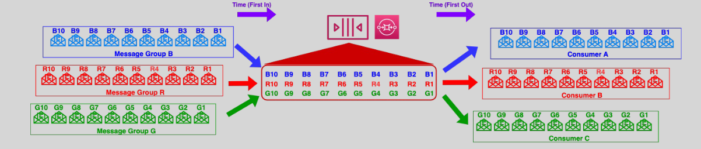
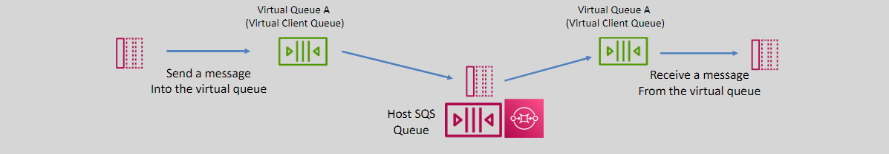

# 📬 **Amazon SQS Additional Features: Enhancing Message Queue Functionality**

Amazon Simple Queue Service (SQS) is a fully managed message queuing service that enables reliable, scalable, and secure communication between different components of your applications. Beyond its core features, SQS offers several additional functionalities that further enhance its capabilities, making it an indispensable tool for modern serverless and microservices architectures. This guide explores **Dead Letter Queues (DLQs)**, **Grouping Messages in FIFO Queues**, and **Temporary Queues (Virtual Queues)**, providing clear explanations and practical insights to help you leverage these features effectively.

---

## 🔑 **Key Additional Features**

1. **Dead Letter Queues (DLQs)**
2. **Grouping Messages in FIFO Queues**
3. **Temporary Queues (Virtual Queues)**

---

## 📮 **1. Dead Letter Queues (DLQs)**

**Dead Letter Queues (DLQs)** are specialized SQS queues used to handle messages that fail to process successfully after a configurable number of attempts. They play a critical role in ensuring that problematic messages do not clog the main queue, facilitating easier troubleshooting and improving the reliability of your application.

### 🛠️ **How DLQs Work**

- **Message Failure Handling:**

  - When a consumer (e.g., EC2 instance or Lambda function) fails to process a message successfully after a specified number of receive attempts, the message is moved to the DLQ.

- **Configuration:**
  - **Max Receive Count:** Defines how many times a message can be received before being sent to the DLQ.
  - **Association:** Attach a DLQ to your primary SQS queue via the queue's redrive policy.

### 🔄 **Dead Letter Queue Re-drive**

**Dead Letter Queue Re-drive** allows you to move messages from a DLQ back to the source queue for reprocessing. This is useful for recovering from transient issues or applying fixes to the processing logic without losing any messages.

#### 🛠️ **Steps to Re-drive Messages:**

1. **Identify Messages:** Determine which messages in the DLQ need to be reprocessed.
2. **Re-drive Configuration:** Use the AWS Management Console, AWS CLI, or SDKs to initiate the re-drive process.
3. **Move Messages:** Messages are moved from the DLQ back to the source queue, making them available for processing again.
4. **Monitor Processing:** Ensure that the underlying issue causing message failures has been resolved to prevent repeated failures.

---

## 📂 **2. Grouping Messages in FIFO Queues**

**Grouping Messages in FIFO Queues** ensures that messages belonging to the same group are processed in a strict order. This feature is exclusive to FIFO (First-In-First-Out) queues and is essential for applications where the sequence of message processing is critical.

### 🛠️ **How It Works**

- **Message Group ID:**

  - Each message in a FIFO queue must include a `MessageGroupId`. This identifier defines the group to which the message belongs.

- **Ordered Processing:**
  - Messages with the same `MessageGroupId` are processed one by one in the exact order they were sent.
  - Messages from different groups can be processed concurrently, enabling scalability while maintaining order within each group.

### 🔑 **Benefits of Message Grouping**

- **Order Preservation:** Ensures that messages within the same group are handled sequentially, maintaining the integrity of operations.
- **Scalable Processing:** Allows different message groups to be processed in parallel, optimizing throughput without compromising order.
- **Simplified Logic:** Reduces the complexity of managing message order within your application code.

### 📌 **Example Use Case**

Consider an e-commerce application where orders from the same customer must be processed in the order they were placed:

1. **Order Messages:**

   - Each order message includes a `MessageGroupId` corresponding to the customer's ID.

2. **Processing Sequence:**

   - Orders for the same customer are processed one after another, ensuring that order fulfillment respects the sequence of placement.

3. **Concurrent Processing:**
   - Orders from different customers are processed simultaneously, leveraging the scalability of FIFO queues without sacrificing order within each group.

---

## 🕒 **3. Temporary Queues (Virtual Queues)**

**Temporary Queues (Virtual Queues)** provide lightweight, automatically-deleted queues for specific messaging patterns, such as request/response interactions. These queues simplify communication between application threads or processes, reducing development time and operational costs.

### 🛠️ **How Temporary Queues Work**

- **Lightweight Communication Channels:**

  - Temporary queues are created on-demand for specific application flows or processes.

- **Automatic Mapping:**

  - These virtual queues are mapped onto a single **host queue**, consolidating multiple temporary queues and simplifying management.

- **Unique URLs:**

  - Each temporary queue has its own URL, allowing producers and consumers to interact with them independently.

- **Cost Efficiency:**
  - Requests to temporary queue URLs do not incur additional costs, making them economical for transient communication needs.

### 🔑 **Benefits of Temporary Queues**

- **Simplified Development:**

  - Quickly set up communication channels without managing multiple physical queues.

- **Cost Savings:**

  - Reduce costs by leveraging a single host queue for multiple temporary queues.

- **Automatic Cleanup:**
  - Temporary queues are automatically deleted when no longer needed, ensuring no leftover resources.

### 📌 **Example Use Case**

**Request/Response Pattern:**

1. **Client Request:**

   - A client sends a request message to a temporary queue designated for handling responses.

2. **Service Processing:**

   - The service processes the request and sends a response back to the temporary queue.

3. **Automatic Deletion:**
   - Once the communication is complete, the temporary queue is automatically deleted, freeing up resources.

---

## 🏁 **Conclusion**

Amazon SQS's additional features—**Dead Letter Queues (DLQs)**, **Grouping Messages in FIFO Queues**, and **Temporary Queues (Virtual Queues)**—provide enhanced control, reliability, and flexibility for managing your application's messaging needs.

- **DLQs** ensure that failed messages are handled gracefully, preventing them from disrupting your main processing workflows.
- **Message Grouping** in FIFO queues maintains the order of critical operations while allowing scalable processing across different groups.
- **Temporary Queues** streamline specific communication patterns, reducing development complexity and operational costs.
