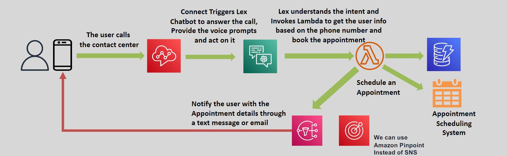

# ☎️ AWS Connect: Cloud Contact Center Made Easy

    

AWS Connect is a **cloud-based Contact Center as a Service (CCaaS)** solution that helps businesses deliver seamless, personalized, and scalable customer support experiences. Designed to be easy to use, AWS Connect eliminates the complexity of traditional contact center solutions.

---

## 🌟 Key Features

### 🛠️ Simple Setup

- Quickly configure your contact center with an intuitive, self-service interface.
- No specialized hardware or complex software installations required.

### 📈 Scalable and Flexible

- Scale to handle customer interactions at any level—from a small team to enterprise-grade operations.
- Pay only for what you use with no upfront costs.

### 🤖 AI Integration

- Integrates with AWS services like **Amazon Lex** to enable AI-powered conversational bots.
- Automate routine customer interactions, like answering FAQs or booking appointments.

### 🎯 Personalized Customer Engagement

- Route customers to the right agents based on their history, preferences, or issue type.
- Enable dynamic and natural conversations for better customer satisfaction.

---

## 🎯 Use Case: Amazon Connect & Lex Integration

AWS Connect integrates seamlessly with **Amazon Lex** to automate customer interactions.

- **Example:** Use Lex to answer customer calls and:
  - Retrieve customer information.
  - Schedule or modify appointments.

    

---

## ✅ Why Choose AWS Connect?

- **Ease of Use:** Simplifies contact center setup and management.
- **Cost-Effective:** Pay-as-you-go model ensures you only pay for what you use.
- **Advanced Features:** Leverage AI and automation to improve efficiency.
- **Global Reach:** Operate contact centers across the globe with ease.

---

AWS Connect empowers businesses to create dynamic and engaging customer experiences. Whether you’re running a small business or a global enterprise, it provides the tools you need to deliver exceptional customer support.
