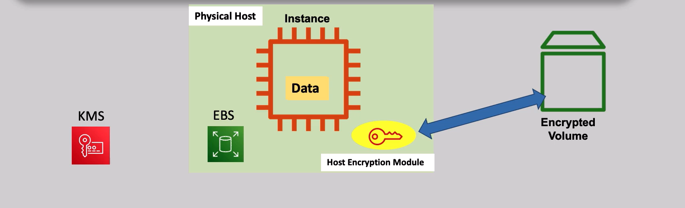
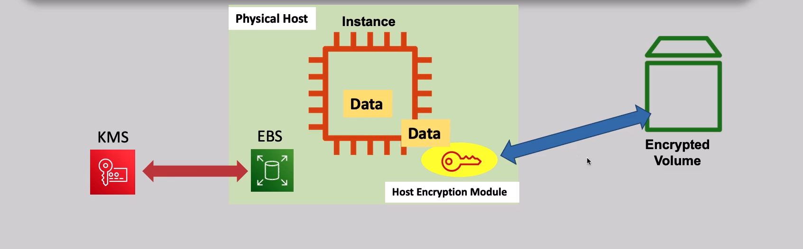
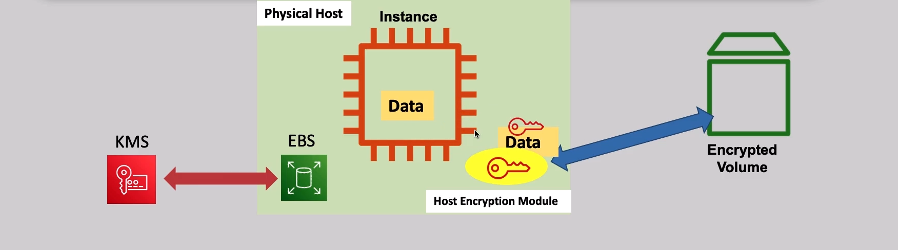
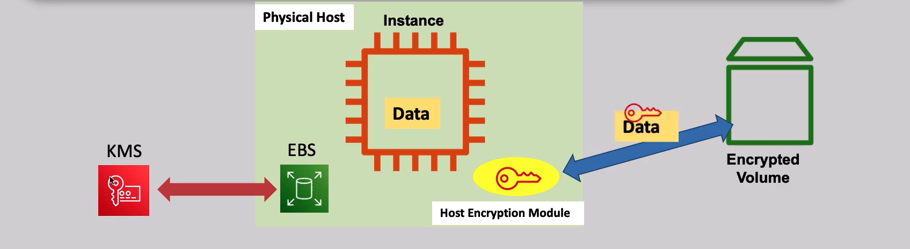
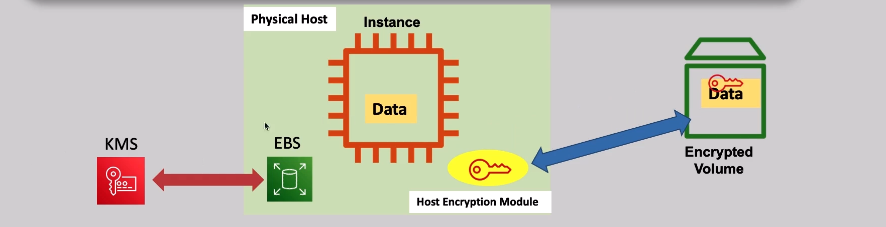
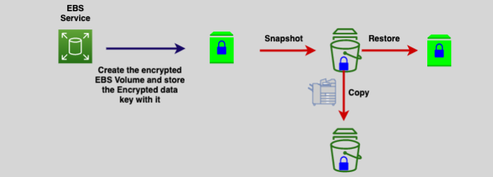
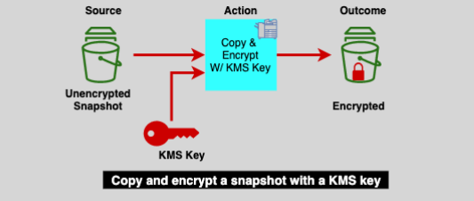
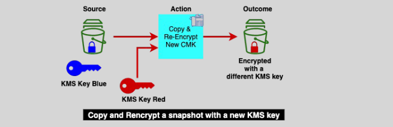
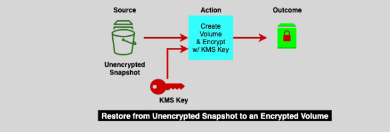
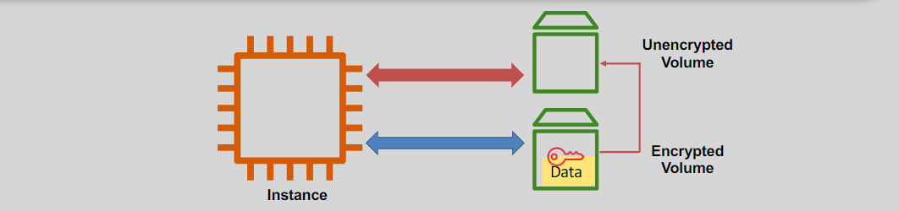

# **EBS Encryption 🔐**

Amazon Elastic Block Store (EBS) encryption offers seamless data security by encrypting data at rest using **AWS Key Management Service (KMS)**. The encryption process ensures your data is secure from unauthorized access, both when stored and in transit to and from the EBS volumes. EBS encryption is fully integrated into the EC2 and EBS services without needing additional management from your side.

## **How EBS Encryption Works 🔄**

The encryption process involves several components working together to ensure your data remains secure. Here’s how encryption works step-by-step:

### **Encryption Lifecycle**

- **KMS** generates a **data encryption key** (DEK) that is used to encrypt data.
- **Host encryption module** encrypts the data and decrypts it when necessary.
- **EC2 instance** generates data and sends it to the host encryption module for encryption.
- The **EBS volume** stores the encrypted data.

### **Steps in the Encryption Process**

1. **Data Generation by EC2 Instance**: The EC2 instance generates the data that needs to be stored securely.
   

2. **Data Encryption by Host Encryption Module**: The host encryption module uses the encryption key from KMS to encrypt the data before sending it to the EBS volume.
   

3. **Encrypted Data Stored in EBS Volume**: The encrypted data is stored on the EBS volume, where it remains protected at rest.
   

4. **Data Decryption When Accessed**: When the EC2 instance needs to read the data, the host encryption module decrypts the data using the data key and sends it back to the instance.
   

## **Copying EBS Snapshots 📸**

- **Snapshots** are point-in-time backups of your EBS volumes that are stored in **Amazon S3** and automatically encrypted at rest.
- You can copy snapshots **within the same region** or **across different regions**. However, to create a volume from a snapshot in another region, you must first copy the snapshot to that region.

**Snapshot Copy Use Cases:**

- **Geographic expansion** 🌍
- **Disaster recovery** ⚠️
- **Migration to another region** 🚚
- **Data retention and compliance** 📜

## **Encryption Status of Volumes and Snapshots 🔍**

### **1. Encrypting a Volume:**

- When you encrypt a volume using a KMS Key, all the **snapshots**, **volumes restored from snapshots**, and **copies of snapshots** are encrypted automatically.  
  

### **2. Creating an Encrypted Volume from an Unencrypted Snapshot:**

- You can create an encrypted EBS volume directly from an unencrypted snapshot by enabling encryption during the creation process.  
  

### **3. Re-encrypting an Encrypted Snapshot:**

- While you cannot change the encryption status of an existing volume or snapshot, you can **copy** the snapshot to apply a new KMS key for encryption.  
  

### **4. Restoring an Encrypted Volume from an Unencrypted Snapshot:**

- You can restore an encrypted volume from an unencrypted snapshot, but it requires copying and enabling encryption during the process.  
  

### **5. Unencrypting an Encrypted Volume:**

Although there’s no direct way to decrypt an encrypted volume, you can indirectly unencrypt a volume by:

1. **Attaching a second unencrypted volume** to the same EC2 instance.
2. **Migrating the data** from the encrypted volume to the unencrypted volume.
3. Once data is migrated, **delete the encrypted volume** if no longer needed.  
   

## **Account-Level Default Encryption 🔒**

### **Enforcing Encryption by Default:**

- You can enable **encryption by default** at the AWS account level for EBS volumes in any region.
- **What happens when it's enabled**:
  - **All new volumes** created will be encrypted by default.
  - **Snapshots and copies** of unencrypted snapshots will be automatically encrypted.
- **Note**: Encryption by default only applies to **new resources**. It does not retroactively encrypt existing volumes or snapshots.
