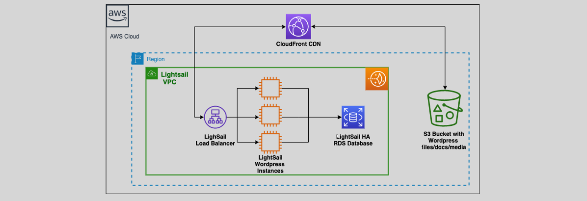

# **Amazon Lightsail 💡**

AWS Lightsail is a simplified cloud service designed to help developers easily build and manage websites or web applications with minimal cost and effort. Lightsail provides pre-configured, scalable cloud resources that are perfect for developers who need a straightforward solution for hosting small to medium-sized projects.

## **Key Features**

- **Pre-configured Resources ⚙️**: Lightsail includes easy-to-use templates for instances, containers, and managed databases.
- **Affordable Pricing 💰**: Simple, predictable pricing with no surprises, making it cost-effective for small businesses or developers.
- **SSD-backed Storage 💾**: Offers high-performance SSD storage for your instances, ensuring faster read and write operations.
- **Load Balancers ⚡**: Helps distribute traffic across multiple instances, ensuring high availability and better scalability.
- **Content Delivery Network (CDN) 🌍**: Integrated CDN for delivering content quickly and reliably to users around the world.
- **DNS Management 🔧**: Built-in DNS management to simplify domain and traffic routing for your websites or applications.
- **Snapshots 📸**: Allows you to take backups of your Lightsail instances, ensuring your data is safe.

## **Use Cases**

- **Web Hosting 🌐**: Ideal for hosting websites and web applications, from simple blogs to eCommerce sites.
- **Developers and Startups 🚀**: Perfect for developers needing a cost-effective and simple cloud hosting platform.
- **Managed Databases 🗄️**: Easily deploy managed databases for your apps, without needing to manage the database infrastructure yourself.

## **Conclusion 🎯**

Amazon Lightsail is an easy-to-use, low-cost cloud platform designed for developers and small businesses. With pre-configured resources like instances, databases, load balancers, and SSD storage, it simplifies the deployment of websites and web applications, allowing you to focus on building and scaling your project while keeping costs predictable.
