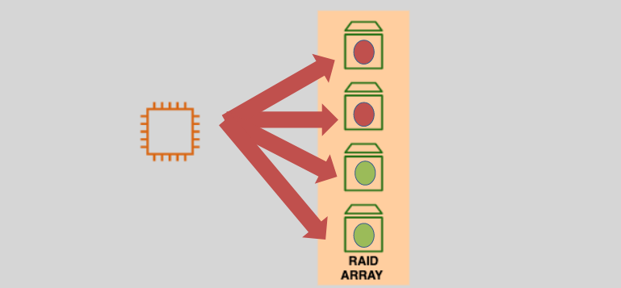
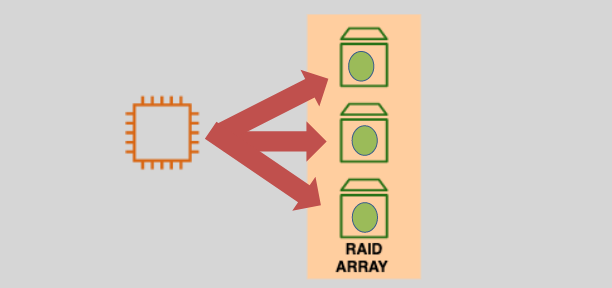

# **RAID with EBS Volumes 💾**

**RAID (Redundant Array of Independent Disks)** is a technology that combines multiple disk drives into a **single unit** to **improve performance**, **increase redundancy**, and provide **fault tolerance**. Although **RAID** is not an AWS service, it can be implemented at the operating system level on EC2 instances using EBS volumes. By using RAID, you can enhance the storage capabilities of your EC2 instance and achieve better performance or data protection, depending on the RAID level you choose.

In AWS, you can use RAID with **EBS volumes** to optimize storage for various use cases. However, it is important to note that RAID is typically **not recommended** for use on **root/boot volumes**, and it requires additional management at the OS level.

## **RAID Usage with EBS Volumes 🚀**

You can use RAID with **EBS volumes** to:

- **Increase IOPS (Input/Output Operations Per Second)** for workloads that require high disk performance, such as databases.
- **Improve fault tolerance** by duplicating data across multiple disks to reduce the risk of data loss.
- **Enhance overall performance** by distributing I/O operations across multiple EBS volumes.

### **Recommended for:**

- **EBS-Optimized EC2 instances** that require higher disk performance.
- **Workloads** that need high throughput and low latency, such as databases or large-scale data processing.
- **Non-root volumes** (avoid using RAID for root/boot volumes).

## **RAID Types Supported by EBS Volumes**

### **RAID 0 – Disk Striping 🏎️**

- **Performance**: Provides **high IOPS** and **throughput** by striping data across multiple disks, resulting in faster read and write speeds.
- **Redundancy**: No redundancy; if one disk fails, all data in the RAID array is lost.
- **Use Case**: Ideal for high-performance workloads where redundancy is not a priority, such as temporary data storage or high-speed processing.  
  

### **RAID 1 – Disk Mirroring 🛡️**

- **Performance**: No performance improvement in terms of IOPS, but improves fault tolerance by **mirroring** data across two EBS volumes.
- **Redundancy**: Provides **data redundancy**. If one disk fails, the data remains accessible from the other mirrored disk.
- **Use Case**: Ideal for critical applications that require high data protection but do not need enhanced performance. It is useful for smaller, fault-tolerant environments.  
  

### **RAID 10 (1+0) – Combination of RAID 1 and RAID 0 ⚡**

- **Performance**: Combines the performance benefits of **RAID 0** and the redundancy of **RAID 1**.
- **Redundancy**: Provides both **performance enhancement** and **fault tolerance** by striping data across mirrored pairs.
- **Use Case**: Ideal for applications that require both high IOPS and redundancy, such as databases and mission-critical applications. Requires a minimum of **four volumes**.  
  

## **Key Considerations for RAID with EBS Volumes**

- **RAID is Managed at the OS Level**: RAID must be set up and managed within the operating system running on the EC2 instance. AWS does not provide native RAID functionality for EBS volumes.
- **EBS Optimized Instances**: For optimal RAID performance, use **EBS-optimized instances** that provide dedicated bandwidth to EBS, reducing the chance of I/O bottlenecks.
- **Snapshots and RAID**: EBS snapshots are taken at the volume level, and RAID volumes are no different. Each RAID volume can be snapshotted, but note that the snapshot will include data from all disks in the RAID array.
- **Not Recommended for Root Volumes**: It’s generally not recommended to configure RAID on the root/boot volume, as this can complicate instance recovery and performance.

## **Conclusion 🎯**

Using RAID with EBS volumes can significantly enhance the performance and reliability of your EC2 instances, especially for high-performance or high-availability workloads. By choosing the appropriate RAID level, you can strike the right balance between performance and redundancy for your specific application needs.

- **RAID 0**: Best for performance-focused applications.
- **RAID 1**: Best for fault tolerance without performance tradeoffs.
- **RAID 10**: Best for both performance and redundancy.

Remember to use **EBS-optimized EC2 instances** and configure your RAID array at the OS level for the best results!
