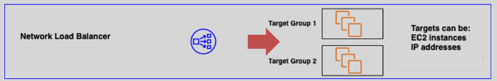

# ELB Types

## ELB –Types

### 1.Classic Load Balancer

- uses backend ec2 instance as target
  

### 2. Application Load Balancer

- uses target groups as target
  

### 3.Networking Load Balancer

- uses target groups as target
  

### 4. Gateway Load Balancer

- uses security devices as target
  

## Target Groups

A target group is a logical grouping of targets (EC2 Instances, IP addresses, or ECS microservices).

- A target is an endpoint registered with the ALB/NLB as part of a target group
- A target group is a regional construct
- IP addresses can be used to add targets that are instances in a peered VPC, on-premises servers, and any AWS resources that can be addressed by IP and port.
- ALB/NLB can route traffic to multiple target groups
- A target can be registered with a target group multiple times using different ports
