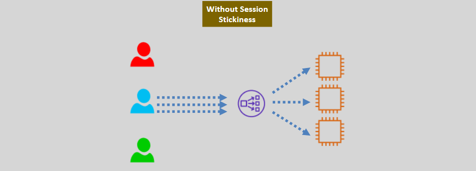
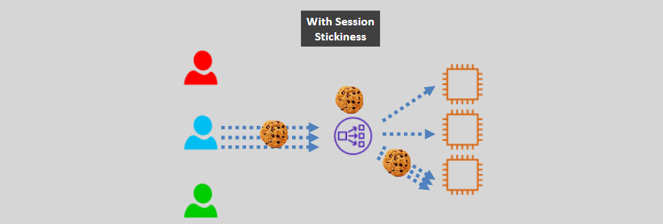
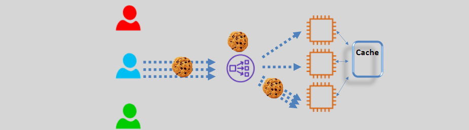

# **Session Stickiness (Sticky Sessions) 🔄🧲**

Session Stickiness, also known as Sticky Sessions, is a feature in AWS Elastic Load Balancing (ELB) that binds a user’s session to a specific backend instance or target. This ensures that all requests from a particular user during a session are directed to the same instance, maintaining session consistency and improving user experience for stateful applications.

## **1. What is Session Stickiness? 🤔**

- **Definition:** Session Stickiness allows a load balancer to associate a user’s session with a specific backend instance using cookies. This ensures that subsequent requests from the user are routed to the same instance.
- **Mechanism:** Utilizes cookies to identify and maintain session affinity between the client and the backend instance.

### **Key Points:**

- **Supported by All ELBs:** Application Load Balancers (ALB), Network Load Balancers (NLB), and Classic Load Balancers support session stickiness.
- **Cookie-Based Identification:** Relies on cookies for maintaining session affinity. The client must support cookies for this mechanism to work effectively.

## **2. How Session Stickiness Works 🔄**

### **Application Load Balancer (ALB) Support:**

- **Types of Cookies:**
  - **Application-Based Cookies:** If the application generates its own cookies, ALB can use these to maintain stickiness.
  - **Duration-Based Cookies:** ALB can generate its own cookies to manage session stickiness based on a defined duration.
- **Stickiness Duration:** You can define how long the session should remain sticky by setting the stickiness duration. After this period, the session affinity can be reassigned.

### **Network Load Balancer (NLB) Support:**

- **Source IP Stickiness:** NLB uses the client’s source IP address to maintain session stickiness, ensuring that requests from the same IP are directed to the same backend instance.

### **Target Group Level Configuration:**

- **Enable Stickiness:** Session stickiness is enabled at the target group level.
- **Multiple Target Groups:** If you have a forward action with multiple target groups and enable stickiness for one or more, stickiness must be enabled at the target group level to ensure requests remain within the same group.

## **3. When to Use Session Stickiness ✅**

### **Recommended Scenarios:**

1. **Stateful Applications:**

   - **Use Case:** Applications that store session data locally on the instance, such as shopping carts in e-commerce websites.
   - **Benefit:** Ensures that the user’s session data remains consistent without requiring external session storage.

2. **Legacy Applications:**

   - **Use Case:** Older applications that are not designed to scale horizontally or do not support distributed session management.
   - **Benefit:** Provides a simple way to maintain session continuity without modifying the application architecture.

3. **Temporary Solutions:**
   - **Use Case:** Short-term deployments where implementing a stateless architecture is not immediately feasible.
   - **Benefit:** Offers a quick fix to maintain session consistency while planning for a more scalable solution.

## **4. When Not to Use Session Stickiness ❌**

### **Non-Recommended Scenarios:**

1. **Stateless Applications:**

   - **Use Case:** Modern, scalable applications designed to handle requests independently without relying on session-specific data on instances.
   - **Drawback:** Introduces unnecessary complexity and can limit the load balancer’s ability to distribute traffic evenly.

2. **High Availability and Scalability:**

   - **Use Case:** Environments requiring seamless scaling and high availability.
   - **Drawback:** Sticky sessions can lead to uneven load distribution, potentially causing some instances to become overloaded while others remain underutilized.

3. **Microservices Architectures:**

   - **Use Case:** Applications built with microservices that rely on distributed data stores and stateless services.
   - **Drawback:** Contradicts the principles of microservices, where each service should operate independently without session affinity.

4. **Session Failover Requirements:**
   - **Use Case:** Scenarios where session failover and recovery are critical.
   - **Drawback:** If the bound instance fails, the user’s session may be disrupted, leading to a poor user experience.

## **5. Considerations and Limitations ⚠️**

- **Fault Tolerance:**

  - **Issue:** Session stickiness is not fault-tolerant. If the specific backend instance fails, the user’s session may be disrupted.

- **Load Distribution:**

  - **Issue:** Using sticky sessions can lead to an uneven distribution of connections and traffic, especially with multiple clients behind a NAT/PAT device.

- **Client Compatibility:**

  - **Requirement:** The client must support cookies for session stickiness to function correctly.

- **Weighted Target Groups:**
  - **Limitation:** Application-based stickiness does not work with weighted target groups. Ensure stickiness is configured appropriately when using weighted target groups.

## **6. Best Approaches When Not Using Session Stickiness 🌟**

### **Adopt Stateless Design:**

- **Description:** Design applications to be stateless, where each request contains all the information needed to process it, eliminating the need for session affinity.
- **Benefits:**
  - Enhances scalability and load balancing efficiency.
  - Simplifies failover and recovery processes.

### **Implement External Session Storage:**

- **Description:** Use external storage solutions like Amazon DynamoDB, ElastiCache (Redis or Memcached), or databases to store session data.
  
- **Benefits:**
  - Enables session data to be accessible from any backend instance.
  - Facilitates horizontal scaling without session affinity constraints.

### **Use JSON Web Tokens (JWT):**

- **Description:** Implement JWTs for stateless authentication, where session information is encoded within the token itself.
- **Benefits:**
  - Reduces the need for server-side session storage.
  - Enhances security by ensuring session data is tamper-proof.

### **Leverage AWS Services for Session Management:**

- **Description:** Utilize AWS services like AWS AppConfig or AWS Systems Manager Parameter Store to manage session-related configurations and data.
- **Benefits:**
  - Centralizes session management.
  - Integrates seamlessly with other AWS services for enhanced security and scalability.

### **Use a Session Cache:**

- **Description:** Implement a session cache where all web/app nodes write to it, allowing any node to continue the session if another node fails.
- **Benefits:**
  - Improves fault tolerance by decoupling session data from individual instances.
  - Ensures continuity of user sessions despite backend failures.

## **7. Conclusion 🎯**

Session Stickiness can be a valuable feature for specific use cases, particularly for stateful or legacy applications requiring session consistency. However, it poses challenges for scalability, load distribution, and high availability in modern, stateless architectures.

**When to Use Session Stickiness:**

- **Stateful Applications:** Maintain session data locally on instances.
- **Legacy Systems:** Support older applications without distributed session management.
- **Temporary Measures:** Provide quick session consistency fixes.

**When Not to Use Session Stickiness:**

- **Stateless Designs:** Enhance scalability and load balancing.
- **High Availability Needs:** Ensure even load distribution and fault tolerance.
- **Microservices Architectures:** Maintain independent, stateless service operations.

**Best Practices When Avoiding Session Stickiness:**

- **Design Stateless Applications:** Simplify scalability and resilience.
- **Externalize Session Data:** Use centralized storage solutions.
- **Implement Token-Based Authentication:** Utilize JWTs for secure, stateless sessions.
- **Use Session Caches:** Enhance fault tolerance and session continuity.
