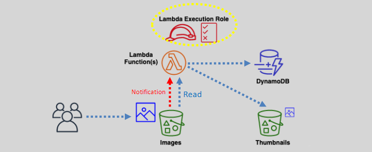

# Lambda - Permissions

## Execution Role

A Lambda function requires IAM permissions to read/write or perform actions on other AWS services or resources



- This is granted through the Lambda function’s execution role.
- The default (basic) execution role grants Lambda permissions on CloudWatch logs to write logs.
- S3 Invokes/notifies the Lambda function through the Lambda function’s resource-based policy

---

## S3 Event Notifications

Lambda can process event notifications from S3

- S3 will send an event to Lambda every time an object is created or deleted.
  - We need to enable versioning on the source bucket to ensure notifications are sent about every write action on any of the objects.
- S3 will require permissions in the Lambda function’s resource-based policy to invoke the function.
- If the Lambda processing will need an S3bucket to store the output, use a different S3bucket than the event source.

## Lambda Resource-based Policy & Cross-Account Access

We can provide AWS services or accounts permissions to invoke a Lambda function using the Lambda function’s resource-based policy.

Cross-account IAM roles can be used for this type of access.

```json
{
  "Version": "2012-10-17",
  "Id": "default",
  "Statement": [
    {
      "Sid": "lambda-allow-s3-my-function",
      "Effect": "Allow",
      "Principal": {
        "Service": "s3.amazonaws.com"
      },
      "Action": "lambda:InvokeFunction",
      "Resource": "arn:aws:lambda:us-east-2:123456789012:function:myfunction:*",
      "Condition": {
        "StringEquals": {
          "AWS:SourceAccount": "123456789012"
        },
        "ArnLike": {
          "AWS:SourceArn": "arn:aws:s3:::my-bucket"
        }
      }
    }
  ]
}
```
