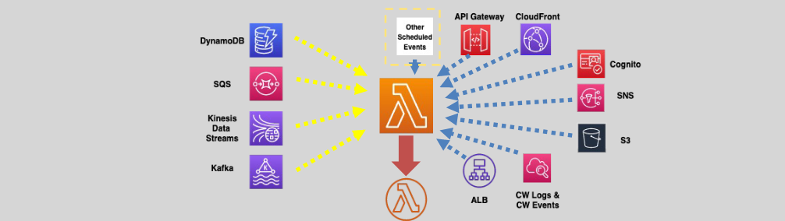
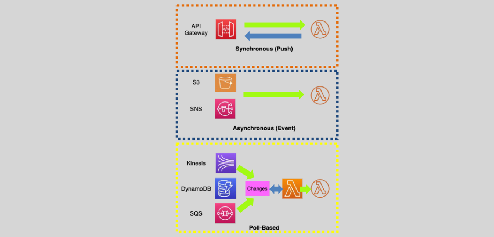

# Lambda Triggers

**A Lambda function can be triggered or invoked using:**

- Events such as AWS services' events.
- Direct HTTPS requests or using Amazon API Gateway.
- API calls from SDKs.
- Scheduled events (EventBridge).

---

## Lambda Execution Models – Synchronous, Asynchronous and Poll Based

- The services either push events to invoke Lambda (push based),
- Or the Lambda service polls the services for events, then invokes the Lambda functions (poll based)
- Amazon Lex, AWS config, SES, Alexa, IoT, CloudFormation, Step Functions can also trigger a function.
- An ALB can have Lambda functions as registered targets.

### Synchronous Invocation

- Lambda runs the function and waits for the response.
- When the function execution ends, it returns the function’s response

### Asynchronous Invocation:

- Lambda is invoked asynchronously when the event source hands off the event to the lambda function without waiting for a response.
- S3, SNS and other AWS services invoke Lambda functions asynchronously

### Poll-Based

- Amazon Lambda service checks for changes in the respective service and involves a Lambda function if changes are detected.
