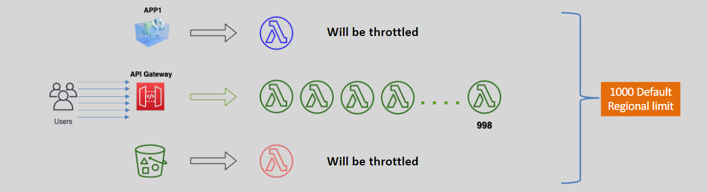

# Lambda - Concurrent Execution

## Without Reserved Concurrency

- Concurrent execution refers to triggering a Lambda function more than once at the same time.
- The default regional concurrency quota starts at 1,000 (soft limit). This is for all functions in an account in a region
- If the aggregate concurrent regional concurrency quota is reached, further Lambda invocations will be throttled.
  

## With Reserved Concurrency

- Reserved Concurrency of a function ensures that a desired concurrency level for a Lambda function is reachable when needed. No other function can share this.
- Further invocations for a function beyond its reserved concurrency will be throttled.
- It is configured at the function level and is free of charge
- now if you control the limit of each function concurrent execution
  
