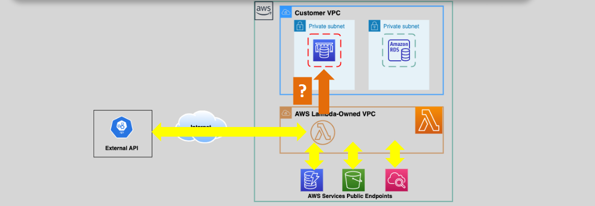
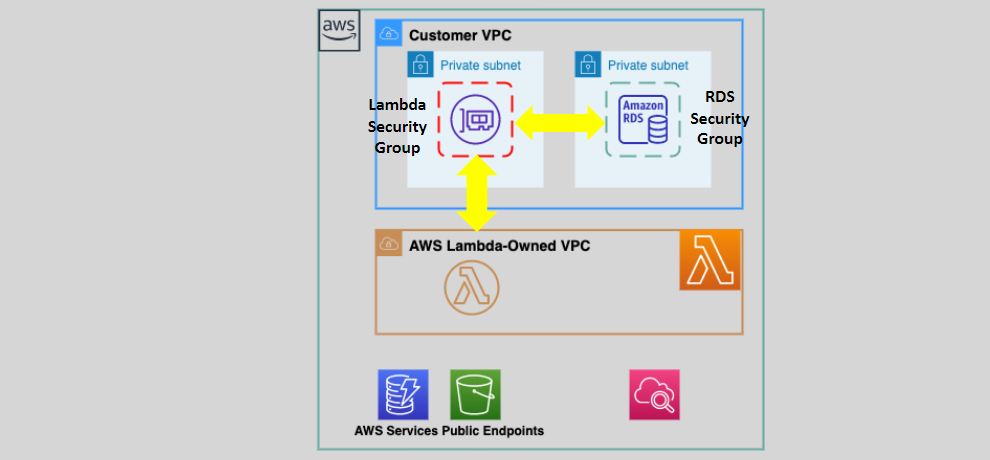
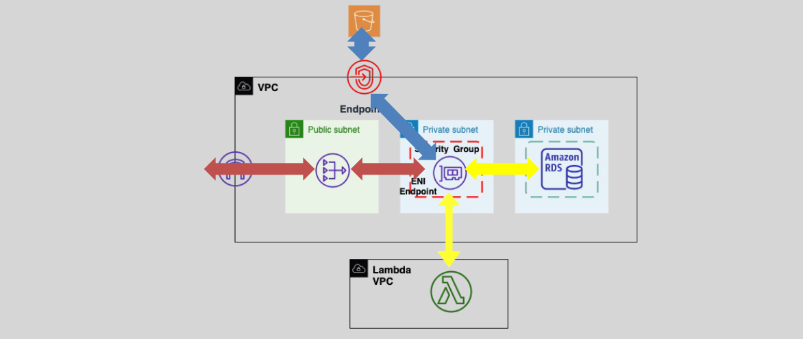

# 🌐 **AWS Lambda Within a VPC: Enhancing Security and Connectivity**

AWS Lambda can operate both inside and outside of a Virtual Private Cloud (VPC), allowing you to securely connect your serverless functions to your private resources. This guide provides a clear and concise overview of running Lambda functions within a VPC, covering public and private configurations, internet access, and key considerations to ensure seamless and secure operations.

---

## 🖥️ **Public Lambda Function (Default)**

By default, AWS Lambda functions run in a Lambda-managed VPC, granting them internet access without additional configuration.

### 📌 **Key Features:**

- **Default Environment:**
  - Lambda functions are launched in an AWS-managed VPC.
- **Internet Access:**
  - Functions have outbound internet access, allowing them to interact with AWS services' public endpoints.
- **Use Cases:**
  - Ideal for functions that require access to public APIs or AWS services without needing to connect to private resources.
    

### ⚠️ **Considerations:**

- **Limited Access to Private Resources:**
  - Cannot directly access resources within your own VPC, such as private databases or internal services.

---

## 🔒 **Private Lambda Function**

Configuring a Lambda function to run within your own VPC provides enhanced security by allowing access to private resources.

### 📌 **Key Features:**

- **VPC Configuration:**
  - Specify the **VPC**, **Subnet IDs**, and **Security Groups** during Lambda function setup.
- **Elastic Network Interface (ENI):**
  - AWS Lambda creates an ENI within the specified VPC to enable communication.
- **IAM Role Permissions:**
  - The Lambda function's execution role must include the `AWSLambdaVPCAccessExecutionRole` policy to permit ENI creation.
- **Security Group Settings:**
  - Ensure that the VPC's security groups allow traffic from the Lambda function's ENI.
    

### 🛠️ **Configuration Steps:**

1. **Navigate to the Lambda Console:**
   - Select your Lambda function in the AWS Management Console.
2. **Configure VPC Settings:**
   - In the **"Configuration"** tab, choose **"VPC"**.
   - Select the desired **VPC**, **Subnets**, and **Security Groups**.
3. **Assign Execution Role:**
   - Ensure the function's IAM role includes the `AWSLambdaVPCAccessExecutionRole` policy.
4. **Save Changes:**
   - Apply the VPC configuration to enable the Lambda function to access private resources.

### ⚠️ **Considerations:**

- **Latency:**
  - Functions within a VPC might experience slightly higher latency due to network configurations.
- **ENI Limits:**
  - Be mindful of the number of ENIs created, as they consume VPC resources.

---

## 🌐 **Private Lambda with Access to the Internet**

While running Lambda functions within a VPC enhances security, they lose default internet access. To enable internet connectivity, additional configurations are required.

### 📌 **Key Features:**

- **No Default Internet Access:**
  - Lambda functions in a VPC cannot access the internet unless configured otherwise.
- **NAT Gateway:**
  - Use a **NAT Gateway** in a public subnet to provide outbound internet access to Lambda functions in private subnets.
    
- **VPC Endpoints:**
  - Utilize **VPC Endpoints** to securely connect Lambda functions to AWS services without traversing the internet.
- **High Availability:**
  - Configure multiple subnets to create one ENI per subnet, ensuring high availability.

### 🛠️ **Configuration Steps:**

1. **Set Up a NAT Gateway:**
   - Create a NAT Gateway in a public subnet within your VPC.
   - Ensure the NAT Gateway has an Elastic IP address assigned.
2. **Update Route Tables:**
   - Modify the route tables of the private subnets to direct outbound internet traffic (0.0.0.0/0) through the NAT Gateway.
3. **Configure VPC Endpoints:**
   - Create VPC Endpoints for AWS services your Lambda functions need to access (e.g., S3, DynamoDB).
4. **Associate Multiple Subnets:**
   - Include multiple subnets in different Availability Zones when configuring the Lambda function to enhance fault tolerance and availability.

### ⚠️ **Considerations:**

- **Cost:**
  - NAT Gateways incur additional costs. Consider using NAT Instances for cost savings in certain scenarios.
- **Security:**
  - Ensure that security groups and network ACLs are properly configured to allow necessary traffic while maintaining security.
- **Scalability:**
  - VPC Endpoints help reduce the need for internet access and can improve performance by keeping traffic within the AWS network.

---

## ⚖️ **Comparison: Public vs. Private Lambda Functions**

| **Aspect**                      | **Public Lambda Function**                 | **Private Lambda Function**                                 |
| ------------------------------- | ------------------------------------------ | ----------------------------------------------------------- |
| **VPC Configuration**           | Runs in AWS-managed VPC by default         | Requires specifying VPC, Subnets, and Security Groups       |
| **Internet Access**             | Enabled by default                         | Disabled by default; requires NAT Gateway or VPC Endpoints  |
| **Access to Private Resources** | Limited to public endpoints                | Can access private databases, internal APIs, and services   |
| **Security**                    | Less secure for internal resources         | Enhanced security through VPC isolation                     |
| **Latency**                     | Lower latency for public services          | Potentially higher latency due to VPC networking            |
| **Cost**                        | Standard Lambda pricing                    | Additional costs for NAT Gateways and VPC Endpoints         |
| **Use Cases**                   | Public APIs, external service integrations | Internal applications, private data processing, secure APIs |

---

## 🏁 **Conclusion**

Running AWS Lambda functions within a VPC offers enhanced security and the ability to connect to private resources, making it ideal for applications that require restricted access and compliance. While public Lambda functions provide easy internet access and lower latency for public services, private configurations ensure that your serverless applications can securely interact with internal systems and databases.

By understanding the differences between public and private Lambda deployments and implementing the necessary network configurations, you can leverage the full potential of AWS Lambda to build secure, scalable, and efficient serverless applications tailored to your specific needs.
