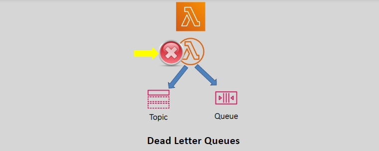
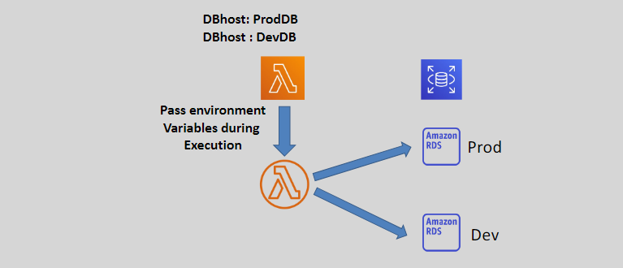

# Lambda Additional Features

## 1. Function URL

```txt
https://<url-id>.lambda-url.<region>.on.aws
```

- A function URL is a dedicated HTTP(s) endpoint for the Lambda function that we can optionally create.
- Function URLs are dual stack (IPv4 and IPv6).
- We can choose AWS_IAM such that only authenticated AWS identities can invoke the function through its URL.
- We can also make it public by choosing NONE, or no authentication required to in vokethe function using the URL.
- We can invoke the Lambda function using its endpoint URL from a web browser, curl,postman or any HTTP client.
- Lambda function URLs can have a resource-based policy assigned for access control.
- Lambda function URLs support Cross Origin Resource Sharing (CORS).

## 2. Dead Letter Queues (DLQs)



- For Asynchronous invocations that timeout or do not execute successfully, we can configure an SQS, an SNS topic, or an Amazon EventBridge as a Dead-Letter Queue (DLQ).
- Lambda will send the content of the event that failed to the DLQ.
- This is helpful for logging and troubleshooting purposes.

## 3. Environment Variables



- An environment variable is a pair of strings (key value pair) that are stored in a function's version-specific configuration.
- Environment variables can be used to store configuration information and adjust a function's behavior without updating the code.
- Environment variables can be used to pass environment-specific settings to the code.
- Lambda stores environment variables securely by encrypting them at rest.

## 4. Monitoring

- CloudWatch Logs
- CloudTrail
- X-Ray
  - Can be used to detect, analyze, and optimize lambda function performance.
  - It collects metadata from Lambda and other application components and generates a detailed service graph

## Other Features

- Functions defined as container images for non-supported languages.
- Code Signing – To ensure the code used by the function is not altered from what the developers created.
- Lambda extensions – Add thirty party monitoring tools to the execution environment.
- Database access using AWS Database proxy
- File system access using EFS (mount an EFS file system to a local directory)
