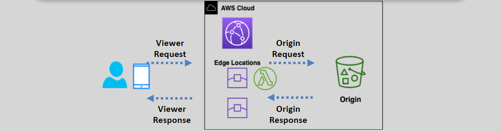

# CloudFront & Lambda@Edge

- The four CloudFront events are viewer request/response, origin request/response.
- Lambda@Edge is a feature of Amazon CloudFront and `cannot be used by itself`.
- Lambda@Edge is a software function code provided by the customer.
- AWS runs this code based on CloudFront configuration as a trigger to manipulate the requests at the edge locations.
- Using Lambda@Edge will significantly reduce latency and improve the user experience

**Use cases:**

- Process requests to CloudFront and do actions based on the HTTP User Agent header (client device, operating system, browser..etc).
- Run a 3rd party bot mitigation to find out if the client is a bot.
- Carry on user authentication and authorization actions.
