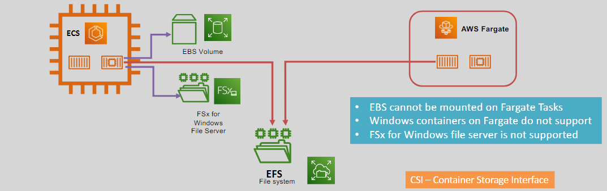

# 📦 **ECS Task Volume**

  

## ECS with EFS

- Both **Fargate** and **EC2** support **Elastic File System (EFS)** for persistent storage.

## ECS with FSx

- Windows-based applications can use **FSx for Windows File Server** (EC2 launch type only).
