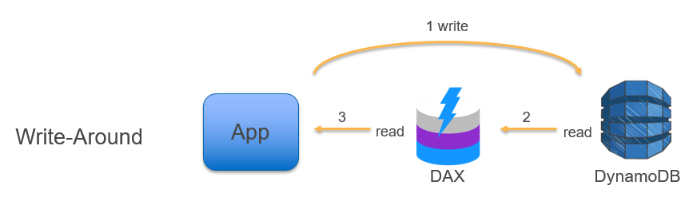
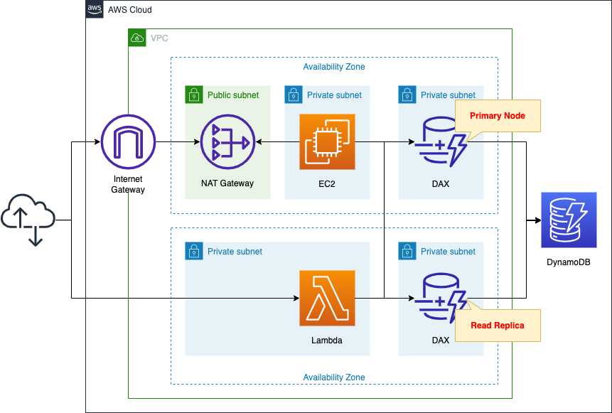

# AWS DynamoDB DAX Accelerator

DynamoDB Accelerator is a DynamoDB compatible caching solution (For DynamoDB only, not for other databases).

- DAX provides microsecond latency reads.
- DAX is for eventually consistent reads only.
- DAX gets deployed in the customer’s VPC as a Multi-AZ cluster of EC2 nodes (one primary and the rest are read replicas).

---

- Applications that use DAX will be deployed on Amazon EC2 instances with the DAX Client, in your VPC.
- The DAX client will direct all the DynamoDB API calls from the application to the DAX cluster.

---

- A DAX cluster can scale to millions of requests per second.
- AWS recommends deploying at least three nodes in three AZs for production fault tolerance.
- DAX clusters are regional resources. They can only interact with DynamoDB tables in the same region.

---

- DAX is a read through cache, It does not require changing the application logic to use it (no refactoring for the application).
- If DAX cannot serve the request or process it (Strongly consistent read or the data is not in the cache), it will pass it through to the DynamoDB table.
