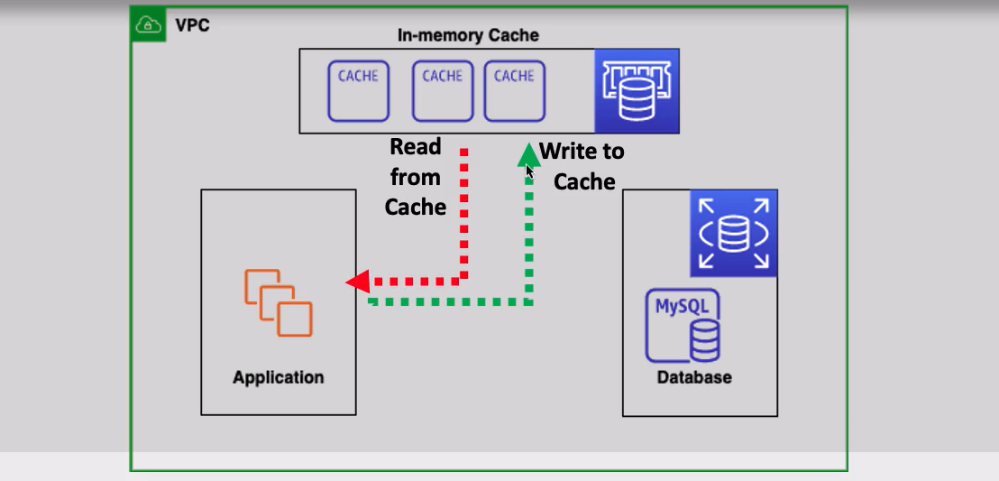
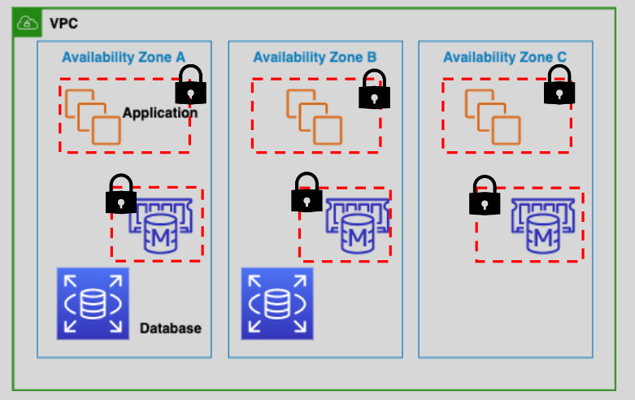
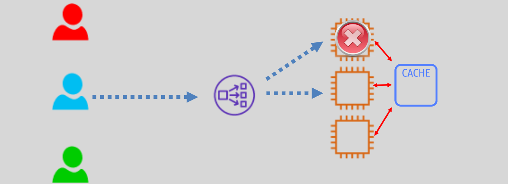

# AWS Elasticache

ElastiCache is a fully managed, distributed, in-memory key-value data store (or cache) in the cloud.

- It improves application performance and offloads databases’ read workload by in-memory caching (sub-millisecond latency) the results of frequently accessed data.
- Example use cases are social networking, gaming, media sharing and Q&A portals

## Clusters

ElastiCache nodes are launched in clusters of one or more nodes.

- ElastiCache nodes are based on EC2 instances
- ElastiCache nodes are launched in the customer’s VPC and are protected by security groups.
- Applications connect to the cluster using endpoints.
- Cluster nodes are not accessible from the internet.
- Cluster nodes can be On-Demand or Reserved EC2 instances (`Not Spot instances`).
- ElastiCache automatically replaces failed nodes.
- ElastiCache integrates with CloudWatch and SNS.

## Use Cases

### 1. Storing Session Data for Stateless Applications

Stateless applications require a mechanism to store session data.

- This would allow for continued user sessions.
- ElastiCache is a perfect fit in this scenario to store session state data
