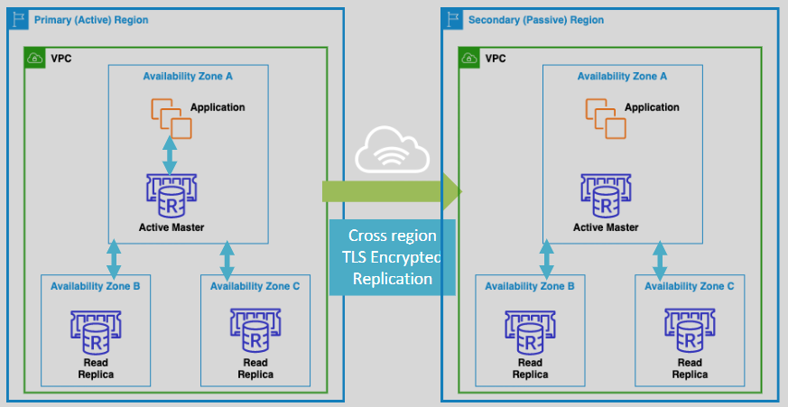

# ElastiCache for Redis Sorted Sets and Global Data Stores

## Sorted Sets

ElastiCache for Redis Sorted Sets can be used to do the complex computations when
used for gaming leaderboards.

- Redis sorted sets guarantee both uniqueness and element ordering.
- Re-ranking happens in real-time each time a new element is added to the sorted set.
- Applications do not need to carry out the complex ranking computations

## Cross AWS Regions Read Replica Clusters

ElastiCache for Redis Global Data Stores facilitate creating cross AWS regions read replicas that are fully managed, fast and secure.

- Consists of a primary (active) cluster (read/write) and secondary (passive) clusters that are read only.
- Automatic, asynchronous replication from the primary to the secondary clusters.
- This is beneficial for low latency reads and for Disaster Recovery across regions.
- In case of a primary cluster failure, we can promote the secondary cluster.
