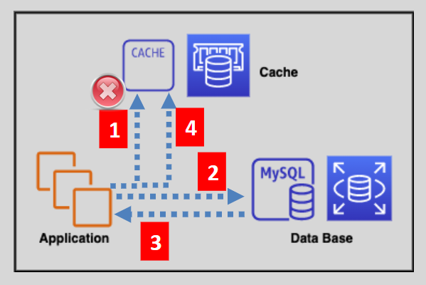
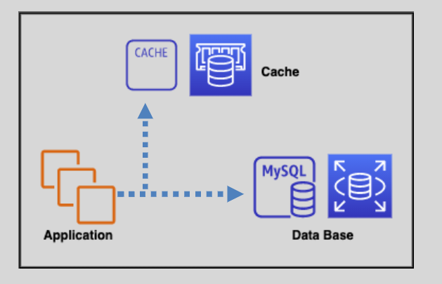
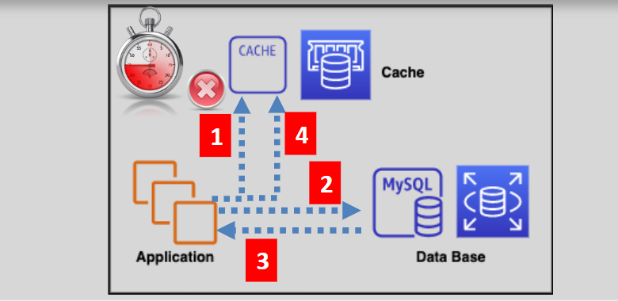

# Caching Strategies

## Lazy Loading

The application first tries to read from the cache.

- If found (cache hit), the data is read.
- If not found or expired (cache miss), the application queries the database.
- The application then writes the read data to the cache.

**Pros:**

- Only requested data is cached.

**Cons:**

- Cached data may become stale.
- Cache miss penalty (more trips to get the data)

## Write Through

The write-through strategy adds data or updates data in the cache whenever data is written to the database.

**Pros:**

- Data in the cache is never stale.

**Cons:**

- Every write involves two trips.
- Cache churn: Cached data may never be used.
- Missing data in new cache nodes (they start empty)

## Adding TTL

Adds a Time to Live value to each write in the cache, so the data won’t get too stale like in lazy loading.

**Pros:**

- Data in the cache is not stale.
- Avoids loading all the data to the cache
