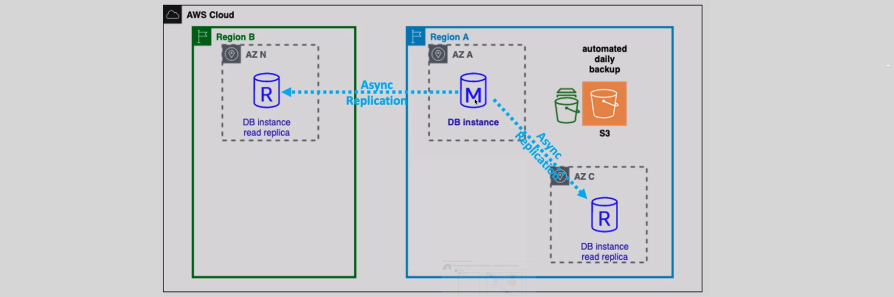
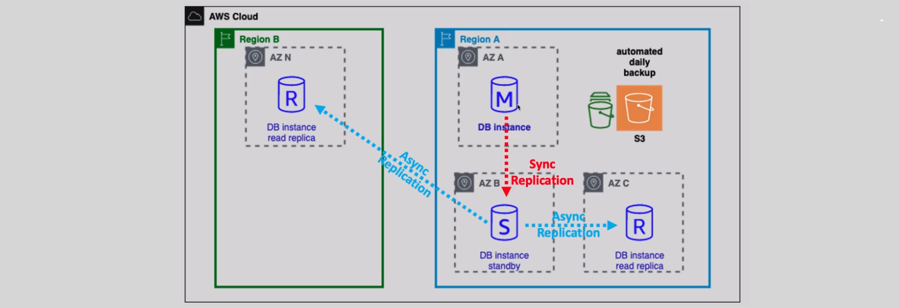
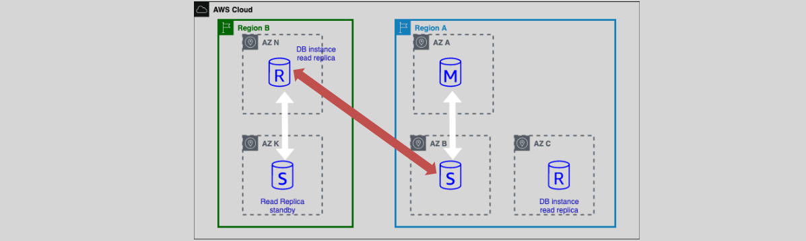

# **Amazon RDS – Scaling ⚖️**

Scaling your Amazon RDS (Relational Database Service) is an essential task to ensure that your databases can handle the growing demands of your applications. RDS offers **vertical scaling** (scaling up resources like instance size or storage) and **horizontal scaling** (scaling out by adding read replicas) to help meet these demands. Let’s break down these scaling strategies in more detail.

## **1. Vertical Scaling 🔼**

### **What is Vertical Scaling?**

Vertical scaling, or **scaling up**, refers to increasing the size of your RDS instance or adjusting its storage. You scale **within the same database instance** by upgrading the instance type or changing the storage type to meet increased performance or capacity requirements.

#### **Key Features of Vertical Scaling**:

- **Instance Type Change**: You can change the instance type (e.g., from db.m5.large to db.m5.xlarge) to gain more CPU, memory, and network performance.
- **Storage Type**: You can increase the database storage volume size or change the storage type (e.g., from General Purpose SSD to Provisioned IOPS SSD) to improve performance.
- **Scaling Up Only**: While you can **increase** the storage, you **cannot scale down** once you have increased the volume size.

#### **Auto Scaling for Storage 📈**

Amazon RDS offers **Auto Scaling** for storage, allowing your database storage to scale automatically based on the usage.

- **Automatic Scaling**: When enabled, RDS can automatically scale the storage of your DB instance without any downtime.
- **Storage Expansion Only**: Storage auto-scaling is available **only for storage** and does not apply to DB instance scaling.
- **Zero Downtime**: Storage scaling happens seamlessly without interrupting your application.

## **2. Horizontal Scaling 🌐**

Horizontal scaling is all about **scaling out** by adding more read capacity. Amazon RDS allows you to create **Read Replicas** to help distribute read-heavy workloads.

### **What Are Read Replicas?**

Read Replicas are copies of your RDS primary database instance that can serve read-only queries, helping to reduce the load on the primary instance. They can be created in the **same region** or across **different regions**.

#### **Key Features of Read Replicas:**

- **Asynchronous Replication**: Read replicas use asynchronous replication to copy data from the primary DB instance to the replica.
- **Different Instance Types**: The storage type or instance class of the read replica can be different from the primary DB instance, giving flexibility for scaling based on your application needs.
- **Promotion to Primary**: A read replica can be promoted to become a **primary DB instance** if necessary (useful for disaster recovery scenarios).

### **Read Replicas with Multi-AZ 🌍**

For even more availability and failover protection, you can configure **read replicas in a Multi-AZ** setup. This setup allows the read replica to be in a different availability zone for increased fault tolerance.

- **Independent Multi-AZ Configuration**: The Multi-AZ configuration for read replicas is independent of the primary DB instance’s Multi-AZ setting. You can configure the read replica in a Multi-AZ deployment, even if the primary DB instance is not in Multi-AZ.

  

## **Benefits of RDS Scaling 💡**

- **Vertical Scaling** allows you to handle increased loads by upgrading the instance size or storage without making significant changes to your application.
- **Horizontal Scaling** (with Read Replicas) allows you to distribute read-heavy traffic to multiple replicas, improving performance and reducing the load on the primary instance.
- **Auto Scaling** for storage ensures your database grows seamlessly without downtime.

## **Example Scenario 🚀**

Imagine you have an online store with an RDS database running on a db.m5.large instance type, but as your traffic increases, you need more read capacity.

1. **Step 1 – Vertical Scaling**: You upgrade the instance type to db.m5.xlarge for better CPU and memory performance.
2. **Step 2 – Horizontal Scaling**: You add a read replica to offload some of the read-heavy traffic from the primary DB instance.
3. **Step 3 – Multi-AZ for Failover**: You configure the read replica in a different AZ for fault tolerance, ensuring that if the primary instance fails, the read replica can be promoted to primary.

This scaling strategy allows your RDS instance to handle higher traffic loads and ensures high availability, improving the overall performance and resilience of your application.

## **Conclusion 🎯**

Amazon RDS provides powerful scaling features, both vertically and horizontally, to ensure your databases can scale as your application grows. By using **vertical scaling** to upgrade your instance and **horizontal scaling** with **read replicas**, you can easily handle increased traffic and maintain high availability and fault tolerance. Whether you choose **auto scaling** for storage or **multi-AZ** configurations for replicas, RDS scaling options offer flexibility, cost-efficiency, and ease of use for growing applications.
