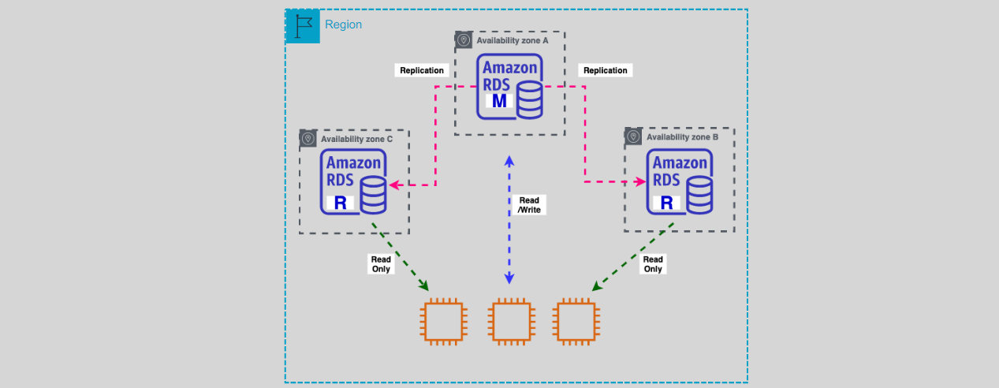

# **Amazon RDS – Multi-AZ DB Cluster Deployment for MySQL and PostgreSQL 🌐**

Amazon RDS offers a highly available and fault-tolerant solution with the Multi-AZ DB cluster deployment for MySQL and PostgreSQL. This configuration provides a primary database instance with one or more read-only replicas across multiple Availability Zones (AZs) in a region, ensuring automatic failover, increased availability, and better performance.

## **What is Multi-AZ DB Cluster Deployment? 🔄**

- **Primary DB Instance**: This is the main database instance that handles both reads and writes.
- **Read-Only DB Instances**: These are replicas that only handle read operations. They are deployed across different Availability Zones (AZs) to provide higher availability and fault tolerance.
- **Automatic Failover**: In case of primary DB failure, Amazon RDS automatically fails over to one of the read-only replicas in under 35 seconds, reducing downtime significantly.
- **Replication**: Data from the primary instance is replicated to the read replicas using native DB engine replication, ensuring that the read replicas have up-to-date data.

### **Deployment Options 📦**

This Multi-AZ deployment option is available for **MySQL** and **PostgreSQL** databases, offering an additional layer of reliability and performance.

- **Automatic Failover**: If the primary DB instance becomes unavailable, Amazon RDS automatically promotes one of the read replicas to become the new primary instance.
- **Transaction Latency**: The deployment provides up to 2x faster transaction commit latency compared to other deployment models.

## **Key Features of Multi-AZ DB Cluster Deployment 🔧**

### **1. Cluster Endpoints**

- **Cluster Endpoint**: This is the write endpoint, which connects to the primary DB instance for all write operations.
- **Reader Endpoint**: This endpoint connects to the read-only instances for read operations, distributing the read traffic across multiple replicas.

### **2. Automatic Failover and High Availability**

- In the event of a failure in the primary DB instance, the system automatically promotes one of the read replicas to become the new primary.
- The failover process typically happens within **35 seconds**, minimizing downtime.

### **3. Replication**

- **Replication Lag**: The replication from the primary DB to the read replicas happens through native DB engine replication, ensuring that the data on the read replicas is as current as possible.

### **4. Snapshots for Restoration**

- Multi-AZ DB clusters can be created by restoring from an existing snapshot, providing a seamless setup for new environments or disaster recovery scenarios.

## **Limitations ⚠️**

While the Multi-AZ DB cluster deployment for MySQL and PostgreSQL offers many benefits, there are certain limitations to be aware of:

- **Supported Versions**:

  - MySQL: Version 8.0.28 and higher.
  - PostgreSQL: Version 13.4.

- **Storage**: Only **Provisioned IOPS storage** is supported, ensuring high performance for your database.

- **Unsupported Features**:
  - **RDS Proxy**: Not supported with Multi-AZ DB clusters.
  - **Dual Stack Support**: IPv6 is not supported.
  - **Export to S3**: Snapshots cannot be exported to Amazon S3 buckets.
  - **IAM DB Authentication**: Not supported.
  - **Read Replicas**: Multi-AZ deployments do not support the use of additional read replicas.
  - **Storage Autoscaling**: Manual scaling is required for storage.

## **Benefits of Multi-AZ DB Cluster Deployment ✅**

- **High Availability**: Ensures high availability with automatic failover and read replicas across multiple Availability Zones.
- **Better Performance**: Up to 2x faster transaction commit latency, providing a more responsive database.
- **Resilience**: Reduces the risk of downtime and data loss due to automatic failover and replication.
- **Seamless Failover**: In case of failure, failover is automatic, with minimal disruption.

## **Conclusion 🎯**

Amazon RDS Multi-AZ DB cluster deployments for MySQL and PostgreSQL provide a highly available, fault-tolerant, and performance-optimized solution. The combination of automatic failover, read replicas, and enhanced replication ensures that your database applications remain resilient, even during hardware failures or planned maintenance. However, it is important to consider the limitations, such as the lack of IAM DB authentication and storage autoscaling. For applications that require high availability, reduced latency, and scalability, this deployment option is ideal.
