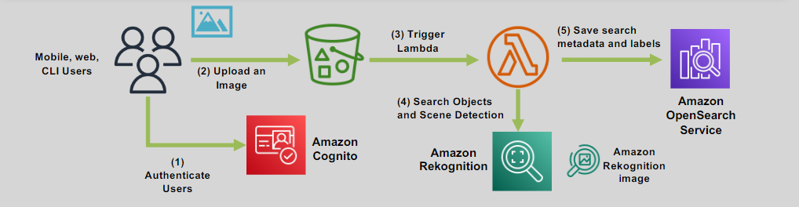
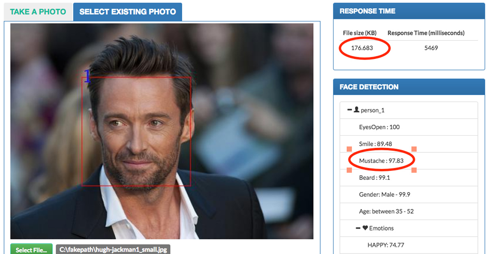
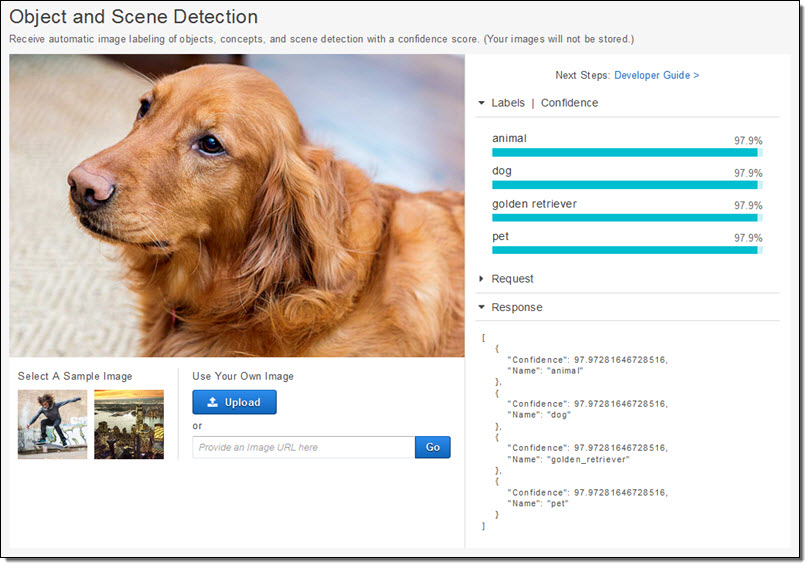

# 🤖 📷 Amazon Rekognition: Simplify Image and Video Analysis

Amazon Rekognition makes it easy to integrate powerful **image and video analysis** capabilities into your applications. This fully managed service requires no prior machine learning expertise, enabling developers to add advanced vision features quickly and efficiently.

---

    

---

## 🌟 Key Features

### 🔍 Comprehensive Analysis

- Identify **objects**, **people**, **text**, **scenes**, and **activities**.
- Detect **inappropriate content** for filtering and moderation.

### 😀 Facial Analysis and Recognition

- Perform accurate **facial analysis**, **face comparison**, and **face search**.
- Analyze facial attributes such as emotion, gender, and age.

### 📂 S3 Integration

- Easily analyze images and videos stored in **Amazon S3**.

---

## 🎯 Use Cases

    
    

1. **Search Image and Video Libraries:**

   - Quickly locate specific images or videos using labels or facial recognition.

2. **Face-Based User Verification:**

   - Securely authenticate users based on facial attributes.

3. **Personal Protective Equipment Detection:**

   - Ensure workplace safety by detecting helmets, gloves, and other gear.

4. **Sentiment and Demographic Analysis:**

   - Analyze emotions (e.g., happy or sad) and demographics (e.g., gender and race).

5. **Text Detection:**

   - Extract and analyze text from images for document processing or signage recognition.

6. **Labeling and Tagging:**

   - Automatically tag objects and scenes in media libraries.

7. **Celebrity Recognition:**

   - Identify well-known personalities in images or videos.

8. **Tracking Movements:**
   - Track people’s paths in videos for use cases like **airports** or **crime investigations**.

---

## 🔞🚨 Unsafe Content Detection

Amazon Rekognition can identify **inappropriate, offensive, or unwanted content** in images and videos, such as:

- **Adult Content.**
- **Violence or graphic imagery.**

### 🔄 Workflow Integration

- Directly integrates with **Amazon Augmented AI (A2I)** for human review workflows.
- Use cases include:
  - **Social Platforms:** Moderating content on dating or photo-sharing apps.
  - **Blogs and Forums:** Filtering user-uploaded content.
  - **Advertising:** Ensuring ad content complies with platform policies.

---

## ✅ Why Use Amazon Rekognition?

1. **Ease of Use:** Requires no machine learning experience to start.
2. **Scalability:** Processes large volumes of images and videos efficiently.
3. **Versatility:** Supports a wide range of use cases across industries.
4. **Cost-Effective:** Pay-as-you-go pricing ensures cost aligns with usage.

---

Amazon Rekognition empowers developers to enhance their applications with robust visual analysis capabilities. From security to personalization, Rekognition simplifies complex tasks, helping businesses unlock new possibilities with their visual data.
