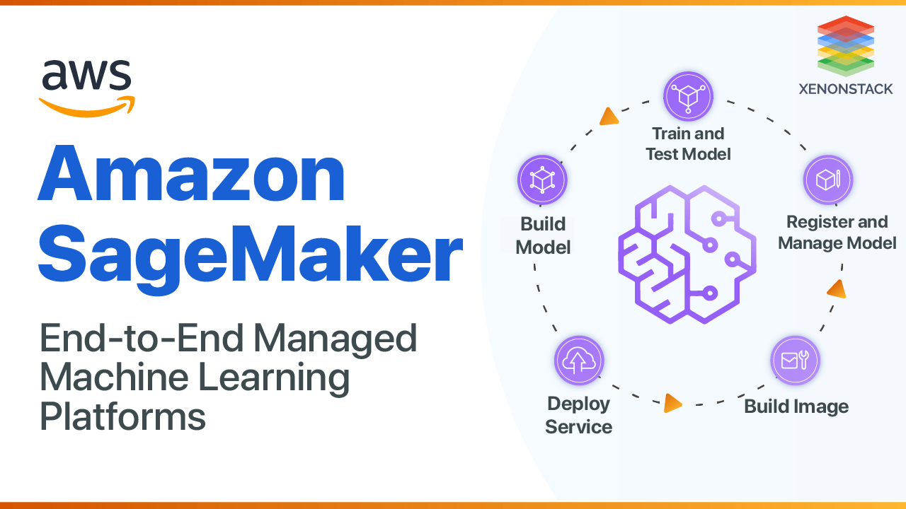

# 🤖 🧠 AWS SageMaker: Simplify Machine Learning at Scale

AWS SageMaker is a fully managed service that makes it easy to build, train, and deploy machine learning models at scale. Designed for both beginners and experienced practitioners, SageMaker offers tools and infrastructure to accelerate the entire machine learning workflow.

---

    

---

## 🌟 Key Features

### 🛠️ Build

- **Data Preparation:** Built-in tools like SageMaker Data Wrangler help clean and preprocess data.
- **Integrated Development Environment (IDE):** Use SageMaker Studio, a web-based IDE for ML workflows.
- **Pre-Built Algorithms:** Access a library of pre-built algorithms to speed up development.

### 🏋️ Train

- **Managed Training:** Automatically provisions infrastructure to train models.
- **Distributed Training:** Scale training across multiple instances for faster results.
- **Spot Instances:** Reduce training costs by using AWS Spot Instances.

### 🚀 Deploy

- **One-Click Deployment:** Deploy models to production-ready endpoints with minimal effort.
- **Auto-Scaling:** Automatically adjusts compute resources based on traffic.
- **Edge Deployment:** Use SageMaker Edge Manager to deploy models to edge devices.

---

## 🎯 Use Cases

1. **Predictive Analytics:** Develop models for customer behavior predictions.
2. **Image Recognition:** Build applications for detecting objects and features in images.
3. **Natural Language Processing (NLP):** Implement chatbots, sentiment analysis, and more.
4. **Fraud Detection:** Identify patterns and anomalies for fraud prevention.
5. **Personalization:** Create recommendation engines for e-commerce platforms.

---

## ✅ Why Use AWS SageMaker?

- **End-to-End Workflow:** Supports the entire ML lifecycle from data preparation to deployment.
- **Scalability:** Handle projects of any size with on-demand compute and storage.
- **Ease of Use:** Tools and pre-built features make it accessible to non-experts.
- **Cost Efficiency:** Pay-as-you-go pricing ensures cost-effective experimentation and production.

---

AWS SageMaker empowers organizations to harness the power of machine learning without the need to manage complex infrastructure. Whether you’re a data scientist or a developer, SageMaker simplifies the process of creating, training, and deploying ML models, making it a cornerstone for AI-driven innovation.
