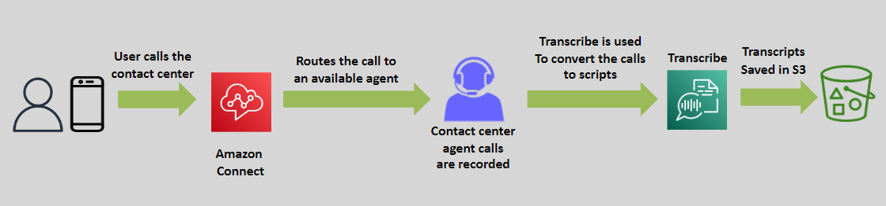

# 🤖 \( 📺 🔉 \> 🧾\) Amazon Transcribe

Amazon Transcribe is a fully managed service that enables developers to convert **speech to text** accurately and efficiently. Designed for transcription at scale, Transcribe uses advanced machine learning to process audio and video files into text, opening new possibilities for accessibility, analytics, and automation.

---

---

## 🌟 Key Features

### 🎙️ Speech-to-Text Conversion

- Accurately transcribes audio or video files into text.
- Supports various audio formats, accents, and languages.

### 🔧 Customization Options

- **Custom Vocabulary:** Improve accuracy for domain-specific terms.
- **Custom Language Models:** Enhance recognition for unique use cases.

### 🛠️ Advanced Capabilities

- **Speaker Identification:** Detect and label speakers in audio files.
- **Real-Time Transcription:** Convert live audio streams into text in real-time.
- **Timestamping:** Add timestamps to text for synchronization with media.

### 🔄 Seamless Integration

- Works with other AWS services such as **Amazon S3** for input/output storage and **AWS Lambda** for automation.

---

## 🎯 Use Cases

1. **Customer Support:** Transcribe call center interactions for analytics.
2. **Media & Entertainment:** Generate subtitles and captions for videos.
3. **Education:** Provide transcription for lectures and e-learning materials.
4. **Healthcare:** Convert doctor-patient conversations into structured text for medical records.
5. **Accessibility:** Enable transcription for visually impaired users.

---

## 🚨 Difference Between Amazon Transcribe and Amazon Lex

| Feature                         | Amazon Transcribe                         | Amazon Lex                                       |
| ------------------------------- | ----------------------------------------- | ------------------------------------------------ |
| **Primary Function**            | Converts speech to text                   | Builds conversational interfaces with voice/text |
| **Natural Language Processing** | No NLP capabilities                       | Advanced NLP for intent recognition              |
| **Real-Time Interactions**      | Focused on transcription, not interaction | Designed for interactive chatbots and assistants |
| **Speaker Identification**      | Detects and labels multiple speakers      | Not applicable                                   |
| **Integration with Polly**      | Not applicable                            | Natively integrates for text-to-speech           |
| **Use Case Focus**              | Audio transcription and accessibility     | Conversational AI and automation                 |

---

## ✅ Why Choose Amazon Transcribe?

1. **Accuracy:** Advanced ML ensures high-quality transcriptions.
2. **Flexibility:** Supports various formats and real-time transcription.
3. **Scalability:** Handles large-scale transcription needs effortlessly.
4. **Ease of Integration:** Works seamlessly with other AWS services.

---

Amazon Transcribe is the go-to solution for transforming speech into actionable text. Whether you’re enhancing accessibility, analyzing customer interactions, or automating workflows, Transcribe delivers reliable and scalable transcription capabilities.
