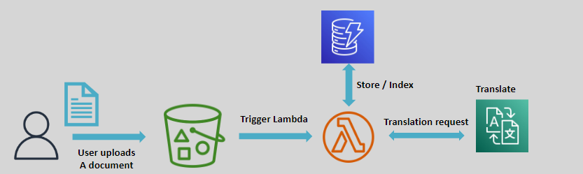
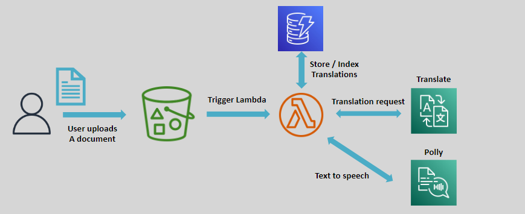

# 🌍 Amazon Translate: Break Language Barriers

Amazon Translate is a **neural machine translation service** that enables fast, high-quality, and cost-effective translation of text between English and a wide range of supported languages. It simplifies cross-language communication for global applications.

---

    

---

## 🌟 Key Features

- **High-Quality Translation:** Uses neural machine learning models for accurate translations.
- **Fast and Scalable:** Handles large volumes of text efficiently.
- **Easy Integration:** Accessible via the **AWS Console**, **CLI**, **APIs**, and **SDKs**.

---

## 🎯 Use Case

Combine **Amazon Translate**, **AWS Lambda**, and **Amazon Polly** to:

    

- Translate documents into multiple languages.
- Convert the translated text into speech for accessibility or interactive applications.

---

## ✅ Why Choose Amazon Translate?

1. **Accuracy:** Provides reliable translations for various languages and contexts.
2. **Affordability:** Offers cost-effective pricing for large-scale translations.
3. **Flexibility:** Supports multiple integration methods for seamless deployment.
4. **Global Reach:** Enables applications to cater to a diverse, multilingual audience.

---

Amazon Translate is an essential tool for businesses looking to expand their global reach, improve user accessibility, or automate multilingual communication effortlessly.
