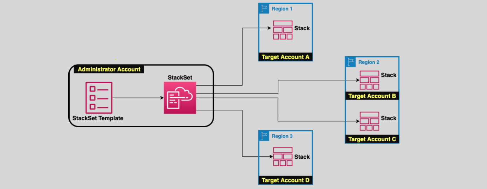

# CloudFormation

CloudFormation is a service that can help create and set up AWS resources.

**It allows customers to:**

- Manage their AWS infrastructure as code (IaC),
- Replicate the infrastructure in other regions,
- Control and track changes to the infrastructure,
- Simplify the infrastructure creation and management

## Lifecycle


1. Customers simply create a CloudFormation template (JSON or YAML),
1. Upload it to an S3 bucket, and CloudFormation will take care of the rest.
1. The result is called a CloudFormation Stack.
1. CloudFormation can create almost any AWS resource including IAM policies

## Change Sets

- Updating a stack is possible using Change Sets.
  - We need to submit a modified version of the original templates or different input parameters.
  - CloudFormation will use that to generate a Change Set.
  - Customers can review the Change Set before it gets deployed.
- When deleting a stack using a deletion policy, we can select to retain stack resource(s) that we need to keep

## Template Sections

- AWSTemplateFormatVersion: "version date"
- Description: String
- Metadata: template metadata
- Parameters: set of parameters (Values to pass at runtime)
- Mappings: set of mappings (key/value pairs - Like a lookup table)
- Conditions: set of conditions (Defining dependencies)
- Transform: set of transforms (serverless apps – SAM version to use)
- Resources: set of resources
- Outputs: set of outputs Required

## StackSets


CloudFormation StackSets allows us to create, update, or delete stacks across multiple accounts and regions using a single template and a single operation

- An administrator account creates the stacks in target accounts.
- A trust relationship needs to be established between the admin account and the target accounts.
- Any change made to the template will affect all stacks

## Access Control

We can achieve the desired account control using IAM, CloudFormation Specific IAM Conditions, and CloudFormation Stack policies.

- CloudFormation-specific IAM Conditions can limit which CloudFormation template to use, and the resources that can be created or updated.
- A stack policy (resource-based policies) is a JSON document that applies directly to the stack and is used to prevent accidental updates/deletion of the stack resources.
- A stack policy describes what update actions can be performed on designated resources.

## Permissions

CloudFormation gets the permissions to create and perform stack operations either from the IAM user’s permissions or through a `stack service role`.

- Assign a stack service role during stack creation to specify explicitly what CF can do on the stack.
- Use the least privilege principle when assigning permissions to the role to avoid unintentional escalation of permissions for the other IAM users with permissions on the stack

### Example

```json
// View Only
{
  "Version": "2012-10-17",
  "Statement": [
    {
      "Effect": "Allow",
      "Action": [
        "cloudformation:DescribeStacks",
        "cloudformation:DescribeStackEvents",
        "cloudformation:DescribeStackResource",
        "cloudformation:DescribeStackResources"
      ],
      "Resource": "*"
    }
  ]
}
```

```json
// View and Create Stacks

{
  "Version": "2012-10-17",
  "Statement": [
    {
      "Effect": "Allow",
      "Action": [
        "sqs:*",
        "ec2:*",
        "cloudformation:CreateStack",
        "cloudformation:GetTemplate",
        "cloudformation:ValidateTemplate",
        "cloudformation:DescribeStacks",
        "cloudformation:DescribeStackEvents",
        "cloudformation:DescribeStackResources"
      ],
      "Resource": "*"
    }
  ]
}
```
