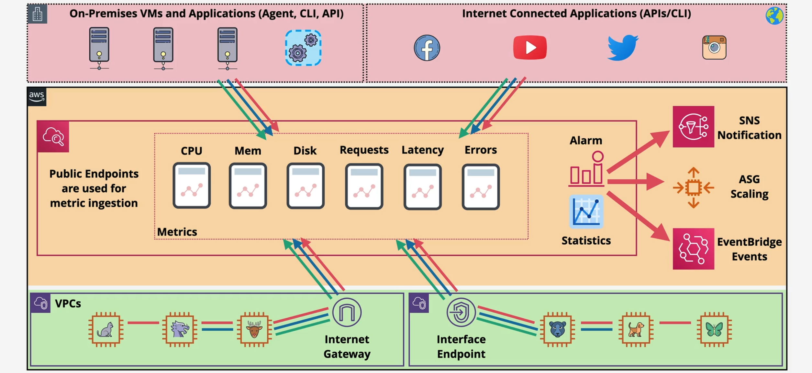

# 🌩️ **AWS CloudWatch: Comprehensive Overview**

_Version 1.0 | January 1, 2025 | Prepared by [Your Name/Organization]_

---

## 📝 Executive Summary

Amazon **CloudWatch** is a comprehensive monitoring and observability service provided by AWS, designed to deliver real-time insights into AWS resources and applications. By collecting, tracking, and analyzing metrics, logs, and events, CloudWatch enables organizations to maintain optimal performance, ensure operational health, and respond swiftly to any issues within their AWS environments. This document offers an in-depth exploration of CloudWatch's core components, features, integrations, best practices, security considerations, cost optimization strategies, advanced functionalities, real-world case studies, and more. Whether you're an AWS administrator, developer, or IT professional, this guide aims to equip you with the knowledge and tools to leverage CloudWatch effectively for a resilient and efficient cloud infrastructure.

---

## 📑 Table of Contents

1. [Executive Summary](#-executive-summary)
2. [Introduction to AWS CloudWatch](#1-introduction-to-aws-cloudwatch)
3. [CloudWatch Metrics](#2-cloudwatch-metrics)
   - [Understanding Metrics](#21-understanding-metrics)
   - [Metric Types](#22-metric-types)
   - [Metric Management](#23-metric-management)
   - [Creating and Using Metrics](#24-creating-and-using-metrics)
4. [CloudWatch Logs](#3-cloudwatch-logs)
   - [Features of CloudWatch Logs](#31-features-of-cloudwatch-logs)
   - [Logs Components](#32-logs-components)
   - [Custom Metrics and Metric Filters](#33-custom-metrics-and-metric-filters)
   - [Security and Encryption](#34-security-and-encryption)
   - [Additional Components](#35-additional-components)
5. [CloudWatch Dashboards](#4-cloudwatch-dashboards)
   - [Features of Dashboards](#41-features-of-dashboards)
6. [CloudWatch Alarms](#5-cloudwatch-alarms)
   - [Alarm Configuration](#51-alarm-configuration)
   - [Actions Triggered by Alarms](#52-actions-triggered-by-alarms)
7. [Integration and Access](#6-integration-and-access)
   - [Integration Methods](#61-integration-methods)
   - [Accessing CloudWatch](#62-accessing-cloudwatch)
8. [Practical Use Cases](#7-practical-use-cases)
   - [Security Monitoring](#71-security-monitoring)
   - [Cost Management](#72-cost-management)
   - [System Health Monitoring](#73-system-health-monitoring)
9. [Best Practices](#8-best-practices)
   - [Metric Selection](#81-metric-selection)
   - [Dashboard Design](#82-dashboard-design)
   - [Alert Configuration](#83-alert-configuration)
   - [Automation](#84-automation)
10. [Security Considerations](#9-security-considerations)
    - [Access Control](#91-access-control)
    - [Data Encryption](#92-data-encryption)
    - [Compliance](#93-compliance)
11. [Cost Optimization](#10-cost-optimization)
    - [Monitor Usage](#101-monitor-usage)
    - [Leverage Free Tier](#102-leverage-free-tier)
    - [Optimize Retention Policies](#103-optimize-retention-policies)
    - [High-Resolution Metrics](#104-high-resolution-metrics)
12. [Advanced Features](#11-advanced-features)
    - [Anomaly Detection](#111-anomaly-detection)
    - [Contributor Insights](#112-contributor-insights)
    - [Composite Alarms](#113-composite-alarms)
    - [Integrations with Other AWS Services](#114-integrations-with-other-aws-services)
13. [Comparison with Other Monitoring Tools](#12-comparison-with-other-monitoring-tools)
14. [Real-World Case Studies](#13-real-world-case-studies)
    - [E-Commerce Platform Performance Monitoring](#131-e-commerce-platform-performance-monitoring)
    - [Financial Services Compliance Logging](#132-financial-services-compliance-logging)
15. [Troubleshooting and FAQs](#14-troubleshooting-and-faqs)
    - [Troubleshooting Common Issues](#141-troubleshooting-common-issues)
    - [Frequently Asked Questions](#142-frequently-asked-questions)
16. [Performance Metrics and KPIs](#15-performance-metrics-and-kpis)
    - [Key Performance Indicators (KPIs)](#151-key-performance-indicators-kpis)
    - [Benchmarking](#152-benchmarking)
17. [Step-by-Step Guides and Tutorials](#16-step-by-step-guides-and-tutorials)
    - [Getting Started with CloudWatch](#161-getting-started-with-cloudwatch)
    - [Configuring Custom Metrics](#162-configuring-custom-metrics)
    - [Utilizing CloudWatch Logs Insights](#163-utilizing-cloudwatch-logs-insights)
18. [Glossary](#17-glossary)
19. [References](#18-references)
20. [Compliance and Regulatory Information](#19-compliance-and-regulatory-information)
21. [Conclusion](#20-conclusion)

---

## 1. Introduction to AWS CloudWatch

Amazon **CloudWatch** is a robust monitoring and observability service that offers system-wide visibility into resource utilization, application performance, and operational health within the AWS ecosystem. Introduced to address the growing need for comprehensive monitoring, CloudWatch plays a pivotal role in ensuring that AWS resources and applications operate seamlessly by providing actionable insights through real-time data collection and analysis.

### Historical Context

Since its inception, CloudWatch has evolved to become an integral part of AWS, continually adding features to meet the dynamic needs of cloud infrastructure management. Its integration with a wide array of AWS services and the ability to handle custom metrics and logs make it a versatile tool for developers, administrators, and IT professionals.

### Key Use Cases

- **Performance Monitoring:** Track and analyze metrics to ensure applications run smoothly.
- **Operational Troubleshooting:** Identify and resolve issues promptly using detailed logs and metrics.
- **Security Auditing:** Monitor security-related events and access patterns.
- **Cost Management:** Keep track of resource utilization to optimize costs.
- **Compliance:** Ensure adherence to industry standards through detailed logging and monitoring.

---

## 2. CloudWatch Metrics

**CloudWatch Metrics** are the cornerstone of AWS CloudWatch's monitoring capabilities. They represent variables over time and can be either predefined (out-of-the-box) or custom metrics tailored to specific needs.



### 2.1. Understanding Metrics

- **Metric:** A time-ordered set of data points representing the value of a variable over a specific period.

  - **Examples:** `CPUUtilization`, `NetworkIn`, `DiskWriteBytes` (for EC2 instances).

- **Namespace:** A container for metrics, categorizing them by service or application.

  - **Examples:** `AWS/EC2`, `AWS/Lambda`.

- **Datapoint:** An individual data point within a metric, consisting of:

  - **Timestamp**
  - **Value**
  - **Unit of Measure** (optional)

- **Dimension:** A name/value pair that uniquely identifies a metric.
  - **Examples:**
    - `Name: InstanceId`, `Value: i-222222222`
    - `AutoScalingGroupName`, `ImageId`, `InstanceType`

### 2.2. Metric Types

- **Out-of-the-Box Metrics:** Default metrics provided by AWS services.
- **Custom Metrics:** User-defined metrics created from various sources within AWS, on-premises, or external environments.
  - **Example:** Number of rejected TCP/IP packets in a specific VPC, Subnet, or ENI.

#### 2.2.1. Metric Granularity

CloudWatch offers two levels of metric granularity:

- **Standard Metrics:** Collected at 1-minute intervals, suitable for most monitoring needs.
- **High-Resolution Metrics:** Collected at intervals as low as 1 second, ideal for applications requiring near real-time monitoring and rapid response times.

**Best Practices:**

- **Select Relevant Metrics:** Focus on metrics that directly impact application performance and user experience.
- **Avoid Metric Overload:** Limit the number of custom metrics to prevent excessive costs and maintain clarity.
- **Use Aggregation Wisely:** Aggregate metrics where appropriate to simplify monitoring and analysis.

### 2.3. Metric Management

- **Ingestion, Storage, and Management:**

  - Metrics are ingested, stored, and managed within CloudWatch.

- **Access Methods:**

  - **Console UI**
  - **CLI (Command Line Interface)**
  - **API**
  - **Dashboards**
  - **Anomaly Detection**

- **Regional Scope:**

  - Metrics exist only in the region where they are created.

- **Access Interface:**
  - Accessible through a VPC interface endpoint.

### 2.4. Creating and Using Metrics

- **Dashboards:**

  - Create dashboards to monitor frequently observed metrics.
  - Metrics can be aggregated from different AWS regions and accounts.

- **Alarms:**
  - Set up alarms to react to specific metric conditions.
  - Alarms can notify or perform automated actions based on metric thresholds.

---

## 3. CloudWatch Logs

**CloudWatch Logs** is a robust logging service within CloudWatch that facilitates the monitoring, storage, and access of log files from both AWS and non-AWS sources.

### 3.1. Features of CloudWatch Logs

- **Centralized Logging:**

  - Consolidates logs from all systems, applications, and AWS services into a single, scalable service.

- **Storage:**

  - Logs are stored securely, with storage being a chargeable component.

- **Log Management:**

  - View logs as a single, consistent flow of time-ordered events.
  - Sort, query, and filter logs for specific error codes or patterns.
  - Archive logs securely for future reference.

- **Advanced Querying:**
  - Use **CloudWatch Logs Insights** for creating custom queries and visualizing log data in dashboards.

### 3.2. Logs Components


#### 3.2.1. Log Events

- **Definition:** Individual records of activity captured by CloudWatch Logs.
- **Sources:** Generated by AWS resources or applications (e.g., system logs, application logs, access logs).

#### 3.2.2. Log Streams

- **Definition:** A sequence of log events sharing the same source.
- **Organization:** Each log stream belongs to a **log group**.
- **Example Structure:**
  - **Log Group:** `ApplicationLogs`
    - **Log Stream:** `EC2_Instance_1`
    - **Log Stream:** `EC2_Instance_2`
    - **Log Stream:** `EC2_Instance_3`

#### 3.2.3. Log Groups

- **Definition:** Collections of log streams sharing the same properties (e.g., retention, monitoring, access control).
- **Retention Period:** Defines how long log events are stored before automatic deletion.
  - **Configurable Range:** From 1 day to 10 years.
  - **Default:** Logs are stored indefinitely.
  - **Configuration:** Set at the log group level.

### 3.3. Custom Metrics and Metric Filters


- **Metric Filters:**

  - Configured at the log group level.
  - Create custom CloudWatch metrics based on specific log patterns or terms.
  - **Functionality:** When a searched term is found in logs, CloudWatch Logs reports the data to the specified metric.

- **Resolution:**

  - **Standard Resolution:** Metric data is sent to CloudWatch every minute.
  - **High Resolution:** Configurable to 1, 5, 10, or 30 seconds (additional cost).

- **Data Flexibility:**
  - Feed metric data values up to 2 weeks in the past and up to 2 hours in the future.

### 3.4. Security and Encryption

- **Data Encryption:**
  - **In-Transit:** CloudWatch Logs encrypts data during transmission using TLS protocols.
  - **At-Rest:** Enable encryption for CloudWatch Logs at the log group level using AWS KMS keys to protect sensitive log data.

### 3.5. Additional Components

- **CloudWatch Logs Insights:**

  - **Purpose:** Interactive search and analysis of log data.
  - **Features:** Includes a specialized query language with powerful commands.
  - **Use Case:** Efficiently respond to operational issues by analyzing log data.

- **CloudWatch Logs Agent:**
  - **Requirement:** Must be installed on Amazon EC2 instances and on-premises servers.
  - **Function:** Collects logs and sends them to CloudWatch Logs.

---

## 4. CloudWatch Dashboards

**CloudWatch Dashboards** provide a customizable and centralized way to visualize and present specific metrics that require continuous monitoring.

### 4.1. Features of Dashboards

- **Automatic Dashboards:**

  - Pre-configured dashboards for AWS services.

- **Custom Dashboards:**

  - Create personalized dashboards to display selected metrics.
  - **Flexibility:** Combine metrics from different AWS regions and accounts.

- **Global Resources:**

  - Dashboards are accessible globally within the AWS environment.

- **Sharing Options:**

  - Share dashboards publicly or with specific users (e.g., SSO users).
  - Provide access via email lists with username/password credentials.

- **Pricing:**
  - **Free Tier:** Up to 3 dashboards.
  - **Paid Tier:** Monthly charges apply per additional dashboard.

---

## 5. CloudWatch Alarms

**CloudWatch Alarms** enable proactive monitoring by watching specific metrics and triggering actions based on defined thresholds.

### 5.1. Alarm Configuration

- **Scope:**

  - Monitor a single CloudWatch metric or a custom metric.
  - Use regular expressions based on multiple metrics.

- **Alarm States:**
  - **OK:** Metric is within the normal range.
  - **ALARM:** Metric has breached the defined threshold.
  - **INSUFFICIENT_DATA:** Not enough data to determine the state.

### 5.2. Actions Triggered by Alarms

- **Auto-Scaling:** Automatically adjust the number of resources based on demand.
- **EC2 Actions:** Recover, start, reboot, or terminate EC2 instances.
- **Notifications:** Send alerts to an SNS (Simple Notification Service) topic.
  > **Note:** CloudWatch Alarms cannot invoke a Lambda function directly.

---

## 6. Integration and Access

### 6.1. Integration Methods

- **AWS Service Integration:**

  - Integrate with the AWS management plane for seamless monitoring.

- **Agent Integration:**

  - **Example:** EC2 instances can use the CloudWatch Agent for richer metrics.

- **On-Premises Integration:**

  - Utilize the CloudWatch Agent or API to send custom metrics from on-premises systems.

- **Application Integration:**
  - Use APIs or agents to create custom metrics from application data.

### 6.2. Accessing CloudWatch

- **Interfaces:**
  - **Console UI:** Web-based interface for managing CloudWatch resources.
  - **CLI:** Command Line Interface for scripting and automation.
  - **API:** Programmatic access for integrating with other tools and services.
  - **VPC Interface Endpoint:** Secure access within a Virtual Private Cloud.

---

## 7. Practical Use Cases

### 7.1. Security Monitoring

- **Example:** Report on an AWS Account’s root user sign-in events to monitor unauthorized access attempts.

### 7.2. Cost Management

- **Example:** Set up billing alarms to track and control AWS spending.

### 7.3. System Health Monitoring

- **Example:** Collect and track metrics to monitor the health of an entire system’s resources, ensuring optimal performance and availability.

---

## 8. Best Practices

### 8.1. Metric Selection

- **Align with Objectives:** Select metrics that directly reflect business and application performance goals.
- **Balance Granularity:** Use standard metrics for general monitoring and high-resolution metrics for critical applications.

### 8.2. Dashboard Design

- **Clarity:** Organize dashboards logically, grouping related metrics together.
- **Visualization:** Use appropriate graph types (e.g., line charts for trends, bar charts for comparisons).
- **Interactivity:** Incorporate features like drill-downs for detailed analysis.

### 8.3. Alert Configuration

- **Meaningful Thresholds:** Set thresholds based on historical data and acceptable performance ranges.
- **Reduce Noise:** Implement multi-condition alarms to avoid alert fatigue from false positives.
- **Escalation Policies:** Define clear escalation paths for critical alerts.

### 8.4. Automation

- **Automated Responses:** Use CloudWatch Alarms to trigger auto-scaling or recovery actions.
- **Integration with CI/CD:** Incorporate monitoring into continuous integration and deployment pipelines for proactive issue detection.

---

## 9. Security Considerations

### 9.1. Access Control

- **IAM Policies:** Define granular IAM policies to control who can view, create, or modify CloudWatch resources.
- **Role-Based Access:** Utilize IAM roles to assign permissions based on job functions, minimizing the risk of unauthorized access.

### 9.2. Data Encryption

- **In-Transit Encryption:** CloudWatch encrypts data during transmission using TLS protocols.
- **At-Rest Encryption:** Enable encryption for CloudWatch Logs at the log group level using AWS KMS keys to protect sensitive log data.

### 9.3. Compliance

- **Regulatory Standards:** Configure CloudWatch to meet compliance requirements such as GDPR, HIPAA, and PCI-DSS by ensuring proper data handling and retention policies.
- **Audit Trails:** Use CloudWatch Logs to maintain audit trails for monitoring access and changes to critical resources.

---

## 10. Cost Optimization

### 10.1. Monitor Usage

- **Regular Audits:** Periodically review your CloudWatch metrics and logs usage to identify unused or underutilized resources.
- **Billing Alerts:** Set up billing alarms to monitor CloudWatch-related expenses and receive notifications when costs approach predefined thresholds.

### 10.2. Leverage Free Tier

- **Strategic Utilization:** Maximize the use of the free tier by consolidating metrics and logs where possible.
- **Evaluate Needs:** Assess which metrics are essential and which can be deprecated to stay within the free tier limits.

### 10.3. Optimize Retention Policies

- **Retention Strategy:** Align log retention periods with business and compliance requirements to avoid unnecessary storage costs.
- **Automated Deletion:** Implement automated log deletion policies for non-essential data to minimize storage expenses.

### 10.4. High-Resolution Metrics

- **Selective Use:** Apply high-resolution metrics only to critical applications that require detailed monitoring.
- **Cost-Benefit Analysis:** Weigh the benefits of high-resolution monitoring against the associated costs to ensure financial efficiency.

---

## 11. Advanced Features

### 11.1. Anomaly Detection

CloudWatch Anomaly Detection leverages machine learning to model normal metric behavior and automatically detect deviations. This proactive feature helps in identifying issues before they impact system performance, reducing downtime and enhancing reliability.

### 11.2. Contributor Insights

Contributor Insights provides real-time analysis of log data to identify top contributors affecting system performance. By visualizing the key drivers behind specific metrics, organizations can quickly pinpoint and address performance bottlenecks.

### 11.3. Composite Alarms

Composite Alarms allow the creation of alarms based on the combination of multiple individual alarms. This feature enables more sophisticated monitoring strategies, where actions can be triggered only when a specific combination of conditions is met, reducing alert fatigue and improving response accuracy.

### 11.4. Integrations with Other AWS Services

CloudWatch seamlessly integrates with various AWS services to provide a unified monitoring and management experience:

- **AWS Lambda:** Automate responses to specific events by triggering Lambda functions based on CloudWatch Alarms.
- **Amazon SNS:** Enable notifications and alerts by sending messages to SNS topics, which can then distribute them via email, SMS, or other protocols.
- **AWS Systems Manager:** Integrate for comprehensive resource management and automation, allowing for tasks like patch management and configuration updates based on monitoring data.
- **Third-Party Tools:** Connect with visualization and monitoring tools like Grafana to create more sophisticated dashboards and gain deeper insights into system performance.

---

## 12. Comparison with Other Monitoring Tools

While AWS CloudWatch offers a comprehensive set of monitoring and logging capabilities tailored for AWS environments, it is essential to understand how it compares with other popular monitoring tools:

- **Datadog:** A third-party monitoring service that provides extensive integrations and advanced analytics. While Datadog excels in multi-cloud environments and offers detailed dashboards, CloudWatch is more tightly integrated with AWS services and may offer better native performance metrics for AWS resources.

- **New Relic:** Known for its application performance monitoring (APM) capabilities, New Relic provides deep insights into application performance. CloudWatch, however, offers broader infrastructure monitoring within AWS, with additional capabilities like logs and events integration.

- **Prometheus:** An open-source monitoring tool that is highly customizable and widely used in Kubernetes environments. While Prometheus offers flexibility and strong community support, CloudWatch provides a managed service with seamless AWS integration, reducing the overhead of maintaining the monitoring infrastructure.

Choosing between these tools depends on specific organizational needs, existing infrastructure, and the level of integration required with AWS services.

---

## 13. Real-World Case Studies

### 13.1. E-Commerce Platform Performance Monitoring

**Challenge:** An e-commerce company experienced intermittent downtime during peak traffic periods, leading to lost sales and customer dissatisfaction.

**Solution:**

- **Implementation:** Deployed CloudWatch to monitor key metrics such as `CPUUtilization`, `NetworkIn`, and `RequestCount` for their EC2 instances and load balancers.
- **Dashboards:** Created custom dashboards to visualize real-time performance data across multiple regions.
- **Alarms:** Configured alarms to trigger auto-scaling policies when CPU usage exceeded 80%, ensuring sufficient resources during traffic spikes.
- **Anomaly Detection:** Enabled anomaly detection on critical metrics to identify unusual traffic patterns early.

**Outcome:** Improved system resilience and scalability, reducing downtime by 90% and enhancing customer satisfaction during high-traffic events.

### 13.2. Financial Services Compliance Logging

**Challenge:** A financial services firm needed to comply with stringent regulatory requirements for log retention and security.

**Solution:**

- **Implementation:** Utilized CloudWatch Logs to centralize and securely store all application and system logs.
- **Retention Policies:** Configured log groups with retention periods aligned with regulatory standards, ensuring logs were retained for the required duration.
- **Encryption:** Enabled encryption at rest using AWS KMS to protect sensitive log data.
- **Access Control:** Applied strict IAM policies to restrict access to logs, ensuring only authorized personnel could view or manage them.

**Outcome:** Achieved full compliance with regulatory requirements, enhanced log security, and streamlined audit processes.

---

## 14. Troubleshooting and FAQs

### 14.1. Troubleshooting Common Issues

**Issue:** Metrics are not appearing in the CloudWatch console.

- **Solution:**
  - Verify that the metrics are being sent to the correct AWS region.
  - Ensure that the appropriate IAM permissions are in place.
  - Check if the CloudWatch Agent is properly installed and configured.

**Issue:** Alarms are not triggering as expected.

- **Solution:**
  - Check the alarm configuration for correct threshold settings.
  - Ensure that the monitored metrics are being updated regularly.
  - Verify that the actions associated with the alarm are correctly configured.

**Issue:** High costs associated with CloudWatch usage.

- **Solution:**
  - Review the number of custom and high-resolution metrics being used.
  - Optimize log retention policies to reduce storage costs.
  - Utilize the free tier effectively and eliminate unnecessary metrics.

### 14.2. Frequently Asked Questions

**Q1:** How can I reduce the cost of using CloudWatch?

- **A:** Optimize your usage by selecting only necessary metrics, utilizing the free tier effectively, and setting appropriate log retention policies.

**Q2:** Can CloudWatch monitor on-premises servers?

- **A:** Yes, by installing the CloudWatch Agent on on-premises servers, you can collect and send metrics and logs to CloudWatch for centralized monitoring.

**Q3:** Is it possible to share CloudWatch dashboards with external stakeholders?

- **A:** Yes, CloudWatch dashboards can be shared publicly or with specific users, such as SSO users, by providing appropriate access permissions.

**Q4:** Can CloudWatch Alarms trigger AWS Lambda functions?

- **A:** Direct invocation of Lambda functions by CloudWatch Alarms is not supported. However, you can use Amazon SNS to send notifications, which can then trigger Lambda functions.

**Q5:** How do I set up log retention policies in CloudWatch Logs?

- **A:** Retention policies can be configured at the log group level within the CloudWatch Logs console, allowing you to set the desired retention period from 1 day to 10 years.

---

## 15. Performance Metrics and KPIs

### 15.1. Key Performance Indicators (KPIs)

- **System Uptime:** Measure the availability of critical AWS resources using uptime metrics.
- **Latency:** Track response times of applications to ensure optimal performance.
- **Error Rates:** Monitor the frequency of errors or failures in applications to identify and address issues promptly.
- **Resource Utilization:** Assess CPU, memory, and network usage to optimize resource allocation and cost-efficiency.

### 15.2. Benchmarking

Organizations can establish performance benchmarks based on historical data and industry standards. For example:

- **Uptime Goal:** Maintain 99.99% uptime for mission-critical services.
- **Latency Target:** Keep API response times under 200 milliseconds.
- **Error Rate Threshold:** Limit application error rates to below 0.1%.

By continuously monitoring these KPIs with CloudWatch, organizations can ensure they meet their performance and reliability objectives.

---

## 16. Step-by-Step Guides and Tutorials

### 16.1. Getting Started with CloudWatch

**Step 1:** **Create a CloudWatch Dashboard**

1. Navigate to the CloudWatch console.
2. Click on "Dashboards" in the navigation pane.
3. Select "Create dashboard" and provide a name.
4. Add widgets to display desired metrics and configure their layout.

**Step 2:** **Set Up a CloudWatch Alarm**

1. In the CloudWatch console, go to "Alarms" and click "Create alarm."
2. Choose the metric you want to monitor.
3. Define the threshold and conditions for the alarm.
4. Select actions to take when the alarm state changes (e.g., send a notification).

### 16.2. Configuring Custom Metrics

**Example:** Sending a Custom Metric Using the AWS CLI

```bash
aws cloudwatch put-metric-data \
  --metric-name PageLoadTime \
  --namespace "MyApp/Performance" \
  --unit Seconds \
  --value 1.23 \
  --dimensions InstanceId=i-1234567890abcdef0
```

**Step-by-Step:**

1. Open your terminal or command prompt.
2. Execute the above command, replacing `PageLoadTime`, `MyApp/Performance`, `1.23`, and `InstanceId` with your specific metric details.
3. Verify the metric appears in the CloudWatch console under the specified namespace.

### 16.3. Utilizing CloudWatch Logs Insights

**Tutorial: Querying Logs with CloudWatch Logs Insights**

1. Navigate to the CloudWatch console and select "Logs Insights."
2. Choose the log group you want to query.
3. Enter a query using the Logs Insights query language, for example:
   ```sql
   fields @timestamp, @message
   | filter @message like /ERROR/
   | sort @timestamp desc
   | limit 20
   ```
4. Run the query to retrieve and analyze the filtered log events.

---

## 17. Glossary

- **EC2 (Elastic Compute Cloud):** A web service that provides resizable compute capacity in the cloud.
- **KMS (Key Management Service):** A managed service that makes it easy to create and control encryption keys.
- **SNS (Simple Notification Service):** A fully managed messaging service for both application-to-application and application-to-person communication.
- **VPC (Virtual Private Cloud):** A virtual network dedicated to your AWS account, enabling you to launch AWS resources in a logically isolated section of the AWS cloud.
- **IAM (Identity and Access Management):** A service that helps you securely control access to AWS resources.
- **TLS (Transport Layer Security):** A cryptographic protocol designed to provide secure communication over a computer network.
- **ENI (Elastic Network Interface):** A virtual network interface that can be attached to an instance in a VPC.
- **API (Application Programming Interface):** A set of rules and protocols for building and interacting with software applications.
- **CLI (Command Line Interface):** A text-based interface used to interact with software and services.
- **Anomaly Detection:** A feature that uses machine learning to identify unusual patterns in metrics.

---

## 18. References

1. [AWS CloudWatch Documentation](https://docs.aws.amazon.com/cloudwatch/)
2. [AWS CloudWatch Best Practices](https://aws.amazon.com/cloudwatch/best-practices/)
3. [AWS Security Documentation](https://docs.aws.amazon.com/security/)
4. [CloudWatch Logs Insights Tutorial](https://aws.amazon.com/cloudwatch/logs-insights/)
5. [AWS IAM Documentation](https://docs.aws.amazon.com/iam/)
6. [AWS KMS Documentation](https://docs.aws.amazon.com/kms/)
7. [AWS SNS Documentation](https://docs.aws.amazon.com/sns/)
8. [CloudWatch Logs Agent Setup Guide](https://docs.aws.amazon.com/AmazonCloudWatch/latest/logs/QuickStartEC2Instance.html)
9. [AWS Compliance Programs](https://aws.amazon.com/compliance/programs/)

---

## 19. Compliance and Regulatory Information

AWS CloudWatch complies with several industry standards and certifications, including ISO 27001, SOC 1, SOC 2, and PCI-DSS. These certifications ensure that CloudWatch meets stringent security and compliance requirements, making it suitable for use in regulated industries such as finance and healthcare. Additionally, CloudWatch offers data residency options, allowing organizations to store log and metric data in specific AWS regions to comply with regional data protection laws.

### Data Residency

Organizations can choose to store their CloudWatch data in specific AWS regions to adhere to data residency requirements. This ensures that data does not leave designated geographic boundaries, supporting compliance with regional data protection regulations like GDPR in Europe or CCPA in California.

### Compliance Certifications

- **ISO 27001:** International standard for information security management.
- **SOC 1, SOC 2:** Standards for reporting on controls at service organizations.
- **PCI-DSS:** Security standard for organizations that handle credit card information.

By leveraging CloudWatch's compliance features, organizations can confidently manage their monitoring and logging needs while adhering to necessary regulatory frameworks.

---

## 20. Conclusion

Amazon **CloudWatch** is an indispensable tool for AWS users, providing comprehensive monitoring, logging, and alerting capabilities. By leveraging CloudWatch's robust features—such as metrics tracking, log management, customizable dashboards, and proactive alarms—organizations can maintain optimal performance, ensure operational health, and respond swiftly to any issues within their AWS environments.

Embracing CloudWatch's full potential enables businesses to gain deep insights into their infrastructure and applications, driving informed decisions and fostering a resilient cloud infrastructure. With continuous enhancements and integrations, CloudWatch remains a cornerstone of effective cloud management, empowering organizations to thrive in dynamic and scalable environments.
