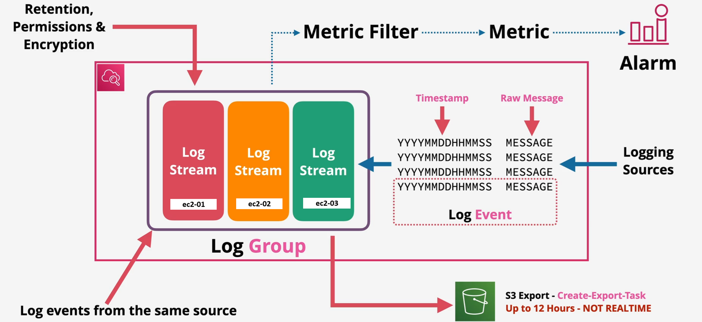

# CloudWatch Logs 📜

**CloudWatch Logs** is a scalable logging service that allows you to monitor, store, and access log files from AWS and non-AWS sources. It centralizes log data, making it easier to analyze and track application performance, system health, and operational issues.

CloudWatch Logs provides the flexibility to capture logs from various services such as Amazon EC2, Lambda, CloudTrail, and even on-premises systems. The logs are stored in a secure and scalable manner and can be easily queried for specific patterns, errors, or events.

**Key Features:**

- **Centralized Logging**: CloudWatch Logs centralizes log data from various sources like AWS resources, applications, and on-premises systems.
- **Highly Scalable**: It scales automatically to handle high volumes of log data.
- **Log Insights**: Interactive querying and analysis of log data.
- **Security**: Logs are encrypted in transit and at rest using AWS Key Management Service (KMS).

---

## CloudWatch Logs Components 🛠️

CloudWatch Logs consists of several key components that help in organizing and managing log data efficiently.

### 1. **Log Events** 📋

**Log events** are individual records of activity, typically generated by AWS resources or applications. These events capture specific activities or information at a given timestamp, such as error messages, request logs, or application-level events.

- **Example**: A log event could include an error message from an EC2 instance or an access log from an API Gateway.

### 2. **Log Streams** 🔄

A **log stream** is a sequence of log events that share the same source. For instance, if an application running on EC2 produces logs, the logs from that EC2 instance will be part of a log stream associated with the instance.

- **Example**: You may have three EC2 instances running an application, each producing logs:
  - **Log Group: ApplicationLogs**
    - **Log Stream: EC2_Instance_1**
    - **Log Stream: EC2_Instance_2**
    - **Log Stream: EC2_Instance_3**

Each log stream contains events generated by its corresponding EC2 instance, and all streams are organized under the same log group.

### 3. **Log Groups** 📂

A **log group** is a collection of log streams that share the same retention, monitoring, and access control settings. Log groups allow you to organize your logs efficiently, making it easy to manage and set retention policies for different types of logs.

- **Example**: A log group could be created for an application’s logs, containing multiple log streams for various services or instances running the application.

### 4. **Retention Policies** 🗓️

CloudWatch allows you to configure the **retention period** for log groups, determining how long log data is stored before it is automatically deleted. The retention period can be set from 1 day to 10 years, helping you manage storage costs by controlling how long logs are retained.

- **Example**: You can set a retention period of 30 days for logs in a log group. After 30 days, CloudWatch will automatically delete the logs to free up storage space.

---

## CloudWatch Logs Insights 🔍

**CloudWatch Logs Insights** provides an interactive query engine that allows you to analyze your log data efficiently. It uses a purpose-built query language that enables you to search, filter, and analyze log events to gain insights into application performance and operational issues.

**Key Features:**

- **Powerful Queries**: Write simple queries to search for specific patterns or error codes.
- **Visualizations**: Visualize the results of your queries using charts, graphs, and tables.
- **Log Analysis**: Quickly analyze large volumes of log data to detect anomalies, performance issues, or errors.

**Example**: You can run a query to find all error messages in your logs within a specified time range or group logs by request ID to analyze the sequence of events.

---

## CloudWatch Logs Metric Filters 📊

CloudWatch Logs enables you to create **custom metrics** from log data using **metric filters**. Metric filters search for specific terms or patterns in your logs and convert them into CloudWatch metrics. This allows you to create custom alarms or dashboards based on the logs.

**Key Features:**

- **Custom Metrics**: Create metrics from log data to monitor specific events or errors.
- **Real-time Data**: Metric data is sent to CloudWatch every minute by default. You can configure the resolution to be higher (e.g., 1, 5, 10, or 30 seconds) for more granular data.
- **Cost**: High-resolution metrics may incur additional charges.

**Example:**

You could create a metric filter to track the number of error logs containing the word “Exception” in your application logs. Every time the filter detects the term, it will update the corresponding CloudWatch metric.

---

## CloudWatch Logs Agent 🛠️

The **CloudWatch Logs Agent** is required to collect and send log data from Amazon EC2 instances or on-premises servers to CloudWatch Logs. The agent must be installed on the source machine, and it can be configured to send both system and application logs.

**Key Features:**

- **EC2 Instances**: Collect logs from EC2 instances running Linux or Windows.
- **On-premises Servers**: Collect logs from on-premises servers using the CloudWatch Logs Agent.
- **Log File Monitoring**: The agent monitors log files and sends new log events to CloudWatch in near real-time.

**Installation:**

The CloudWatch Logs Agent can be installed using the AWS Systems Manager, or by manually installing and configuring the agent on EC2 instances.

---

## Security and Compliance 🔒

CloudWatch Logs integrates with **AWS Key Management Service (KMS)** to ensure that log data is encrypted both in transit and at rest. This is crucial for ensuring the confidentiality and integrity of sensitive log data.

**Encryption:**

- **In-Transit Encryption**: Log data is encrypted as it is transferred from the source (e.g., EC2 instances) to CloudWatch Logs.
- **At-Rest Encryption**: Log data is encrypted at the log group level using KMS keys, ensuring that stored logs are secure.

---

## Cost Considerations 💰

CloudWatch Logs is a pay-as-you-go service, and the cost depends on several factors:

- **Data Ingestion**: Charges for the amount of log data ingested into CloudWatch Logs.
- **Storage**: Charges for the storage of log data based on the retention period and the volume of data.
- **Log Insights Queries**: Charges apply based on the amount of log data scanned during queries.

---

## Use Cases for CloudWatch Logs 💡

- **Application Monitoring**: Collect and analyze application logs to detect errors and monitor performance.
- **Security Monitoring**: Track security-related events, such as unauthorized access or failed login attempts.
- **Compliance**: Archive logs for compliance purposes, ensuring that they are securely stored and accessible for auditing.
- **Operational Troubleshooting**: Quickly identify and troubleshoot operational issues by analyzing logs from various AWS services and applications.

---

In conclusion, **CloudWatch Logs** is a powerful tool for managing, analyzing, and securing your log data in AWS. It provides a central location for all your logs and allows you to perform detailed queries to gain valuable insights into your applications and system performance. By utilizing CloudWatch Logs, you can ensure better monitoring, quicker issue resolution, and more secure logging practices.
