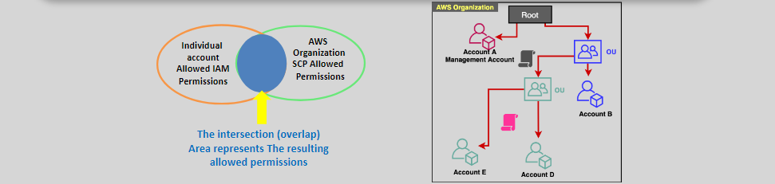

# 🌐 **AWS Organizations**

Amazon **AWS Organizations** is a powerful service designed to help you centrally manage and govern multiple AWS accounts. Whether you're scaling your business, managing diverse projects, or ensuring compliance across departments, AWS Organizations provides the tools necessary to streamline account management, optimize costs, and enforce policies effectively.

  

---

## 🚫 **Challenges Without AWS Organizations**

Managing numerous AWS accounts individually can be cumbersome and inefficient. Here's why AWS Organizations is essential:

- **Manual Management Complexity:**

  - Handling **tens or hundreds of AWS accounts** manually is error-prone and time-consuming.

- **Separate Billing Issues:**

  - Each account generates its **own bill**, preventing you from leveraging **volume discounts** and complicating cost management.

- **Policy Enforcement Difficulties:**

  - **Consistent policy application** across multiple accounts becomes a significant hassle without centralized management.

- **Critical Need for Centralization:**
  - To effectively manage numerous accounts, centralizing control is **imperative** for scalability, security, and efficiency.

---

## 🌟 **Introducing AWS Organizations**

**AWS Organizations** simplifies the management of multiple AWS accounts by providing a centralized framework for administration, billing, and policy enforcement.

### 🔑 **Key Features:**

- **Global Service:**

  - Operates **globally**, similar to IAM, ensuring high availability and reliability.

- **Highly Available and Durable:**

  - **Data replicated** across multiple servers within an AWS Region for resilience.

- **Eventual Consistency:**

  - **Read operations** are eventually consistent, ensuring up-to-date information over time.

- **Centralized Account Management:**
  - **Consolidate multiple accounts** into a single organization, managed from a **management account** for streamlined oversight.

---

## 🌟 **Benefits of AWS Organizations**

### 💼 **Centralized Management**

- **Unified Control:** Manage all AWS accounts from a single interface, reducing administrative overhead.
- **Hierarchical Grouping:** Organize accounts into **Organizational Units (OUs)** for streamlined policy application and management.

### 💰 **Consolidated Billing**

- **Volume Discounts:** Aggregate usage across accounts to take advantage of **economies of scale**.
- **Simplified Invoicing:** Receive a **single bill** for all accounts, making financial tracking and budgeting easier.

### 🔒 **Enhanced Security and Compliance**

- **Service Control Policies (SCPs):** Define and enforce policies across your organization to **restrict access** to specific AWS services and actions.
- **Centralized Backup Plans:** Implement **centralized backup strategies** across all accounts, ensuring data protection and compliance.

### 📊 **Optimized Resource Management**

- **Tag Policies:** Standardize tagging across accounts to improve **resource management** and **cost allocation**.
- **Central AWS Backup:** Apply consistent backup policies and manage backups for resources across the entire organization.

---

## ⚙️ **Modes of Operation**

AWS Organizations can operate in one of two modes:

1. **All Features Mode**

   - **Comprehensive Management:** Access to all features, including policy types like SCPs.
   - **Best for Large Enterprises:** Ideal for organizations needing detailed control and governance over multiple accounts.

2. **Consolidated Billing Mode**
   - **Basic Management:** Focuses primarily on centralized billing without advanced policy controls.
   - **Suitable for Smaller Organizations:** Perfect for businesses primarily seeking cost optimization through consolidated billing.

---

## 🧩 **Components of AWS Organizations**

### 🏛️ **1. Root**

- **Parent Container:** The **root** is the top-level container that holds all accounts and Organizational Units (OUs).
- **Single Instance:** Each organization has only **one root**.
- **Policy Inheritance:** Policies applied at the root level **propagate** to all OUs and member accounts.

### 🗂️ **2. Organizational Units (OUs)**

- **Hierarchical Grouping:** Organize accounts into **OUs** based on departments, projects, or any logical grouping.
- **Single Parent:** Each OU has only **one parent**, ensuring a clear hierarchy.
- **Policy Application:** Apply policies at the OU level to **automate** governance across grouped accounts.

### 👥 **3. Accounts**

- **Management (Master) Account:** The primary account that **controls** the organization and manages billing.
- **Member Accounts:** Additional accounts that are part of the organization, inheriting policies and billing structures.
- **Account Removal:** To remove a member account, ensure it has the necessary **standalone configurations**, including support plans, contact information, and payment methods.

---

## 🛡️ **Service Control Policies (SCPs)**

Service Control Policies (SCPs) are a cornerstone of AWS Organizations, enabling granular control over the actions that users and roles can perform within your AWS accounts.

### 🔑 **Key Features:**

- **Policy Definition:** SCPs define the **allowed** and **denied** AWS services and actions for IAM users and roles.
- **Policy Scope:** Can be applied at the **organization's root**, **OU level**, or **individual account level**.
- **Non-Granting Nature:** SCPs **do not grant permissions**; they **restrict** the maximum available permissions.

### 📌 **Important Considerations:**

- **Exclusions:**

  - SCPs **do not affect** the management account, resource-based policies, service-linked roles, or users/roles outside the organization.

- **Whitelisting vs. Blacklisting:**

  - **Whitelisting:** Define a list of **allowed** actions, denying everything else by default.
  - **Blacklisting:** Define a list of **denied** actions, allowing everything else by default.

- **Default Policy:**
  - A `FULLAWSACCESS` SCP is applied by default, allowing all actions unless explicitly denied.

---

## 📝 **Best Practices**

- **Organizational Structure:**

  - Design a **logical hierarchy** using OUs to reflect your organization's structure, facilitating easier policy management.

- **Policy Management:**

  - Start with **restrictive policies** and gradually **grant permissions** as needed to ensure security.

- **Regular Audits:**

  - Utilize **AWS CloudTrail** and **AWS Config** to monitor and audit account activities and policy compliance.

- **Cost Optimization:**

  - Leverage **consolidated billing** to identify cost-saving opportunities and apply **lifecycle policies** to manage resources effectively.

- **Security Enforcement:**
  - Implement **SCPs** to enforce security standards and prevent unauthorized access across all accounts.

---

## 📈 **Benefits Summary**

| **Feature**                 | **AWS Organizations**                                                              |
| --------------------------- | ---------------------------------------------------------------------------------- |
| **Centralized Management**  | Manage all AWS accounts from a single interface, reducing complexity and overhead. |
| **Consolidated Billing**    | Aggregate usage for volume discounts and simplified financial tracking.            |
| **Policy Enforcement**      | Apply SCPs to enforce security and compliance across the organization.             |
| **Hierarchical Grouping**   | Organize accounts into OUs for streamlined policy application and management.      |
| **Integrated Backup Plans** | Implement centralized backup strategies for consistent data protection.            |
| **Tag Standardization**     | Standardize resource tagging for improved management and cost allocation.          |
| **Scalability**             | Easily scale your AWS account management as your organization grows.               |

---

## 📝 **Important Notes**

- **🔒 Security Best Practices:**

  - Regularly review and update SCPs to align with evolving security requirements and organizational policies.

- **📈 Monitoring and Reporting:**

  - Use AWS tools like **CloudWatch**, **CloudTrail**, and **AWS Cost Explorer** to monitor activities, enforce compliance, and optimize costs.

- **🔧 Permissions Management:**

  - Ensure that the management account has the necessary permissions to manage the organization and apply policies effectively.

- **🌍 Global Availability:**
  - AWS Organizations operates globally, ensuring consistent management and policy enforcement across all regions.
