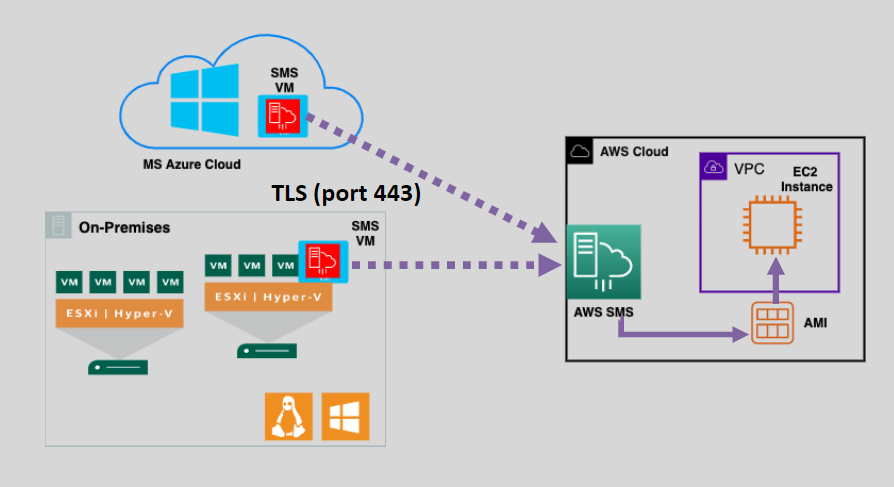

# 🛠️ AWS Server Migration Service (SMS)

AWS Server Migration Service (SMS) is a tool designed to automate the migration of virtual machines (VMs) from on-premises or Microsoft Azure environments to AWS. By streamlining the migration process, SMS minimizes complexity and downtime while ensuring reliable server transitions to the cloud.

---

    

---

## 🌟 Key Features of AWS SMS

### 🔄 Incremental VM Replication

- AWS SMS incrementally replicates on-premises or Azure VMs to **Amazon Machine Images (AMIs)** in AWS.
- Each VM is replicated as a separate AMI, allowing you to launch **Amazon EC2 instances** directly from these images.

### 🖥️ Multi-Platform Support

- Compatible with VMware, Microsoft Hyper-V, and Microsoft Azure cloud virtual machines.
- Supports both **Windows** and **Linux** operating systems.

### 🔐 Secure Migration

- Allows encryption of resulting AMIs to ensure data security during and after migration.

### 📦 Orchestrated Multi-Server Migration

- Migrate multiple VMs simultaneously while maintaining dependencies and configurations.

---

## 🛠️ How AWS SMS Works

1. **Deploy the SMS Connector:**
   - Install the **SMS Virtual Machine Connector** on your on-premises infrastructure or Azure cloud.
2. **Configure Migration Tasks:**
   - Use the AWS Management Console or CLI to configure server migration tasks.
3. **Incremental Replication:**
   - AWS SMS performs incremental replication of VMs to ensure data consistency with minimal downtime.
4. **Create AMIs:**
   - Each VM is replicated into an **AMI** in your AWS account.
5. **Launch EC2 Instances:**
   - Use the created AMIs to launch EC2 instances in AWS for production or testing purposes.

---

## 🎯 Benefits of AWS SMS

- **Simplified Migrations:** Automates the complex steps involved in VM migration.
- **Orchestrated Workflows:** Manage multi-server migrations efficiently.
- **Incremental Testing:** Test migrations incrementally before full cutover.
- **Minimal Downtime:** Incremental replication ensures minimal disruption to operations.
- **Broad OS Support:** Supports Windows and Linux VMs.
- **Notification Integration:** Use **AWS SNS** to send migration notifications.

---

## 🚨 Limitations of AWS SMS

- **Application Awareness:** SMS only migrates VMs and does not recognize applications or databases running on the VMs.
- **Obsolescence:** AWS recommends using **AWS Application Migration Service (AWS MGN)** for new migrations as it provides more advanced features and flexibility.

---

AWS Server Migration Service simplifies and accelerates the migration of virtual machines to AWS, making it an ideal solution for organizations looking to modernize their infrastructure with minimal disruption. While it’s a reliable option for VM migrations, consider **AWS MGN** for more advanced migration and disaster recovery needs.
