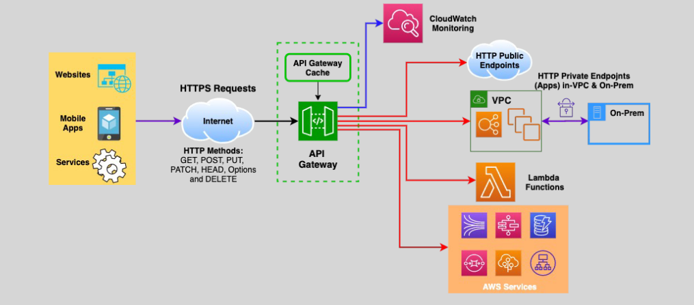
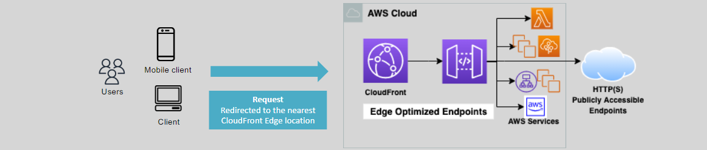

# 🌐 **Amazon API Gateway: Streamlining API Management**

Amazon API Gateway is a fully managed service that enables you to create, publish, maintain, monitor, and secure APIs at any scale. Whether you're building REST, HTTP, or WebSocket APIs, API Gateway simplifies the process, allowing you to handle hundreds of thousands of API calls efficiently.

---

## 🔍 **What is API Gateway?**

**Amazon API Gateway** is a fully managed service that facilitates the creation, deployment, and management of APIs. It acts as a front door for applications to access data, business logic, or functionality from your backend services.

### 📌 **Key Features:**

- **Fully Managed Service:** Handles the heavy lifting of API management, including scaling, monitoring, and security.
- **Supports Multiple API Types:** REST, HTTP, and WebSocket APIs.
- **Backend Integration:** Connects to various backend endpoints like EC2/ECS instances, Lambda functions, public/private HTTP endpoints, and AWS services (e.g., Kinesis, SQS, DynamoDB).
- **Secure HTTPS Endpoints:** Exposes secure HTTPS endpoints to users.
- **Caching:** Speeds up responses and reduces backend load with API caching.
- **Monitoring:** Logs API calls, latency, and error rates to AWS CloudWatch in near real-time.

---

## 🛠️ **Creating and Managing APIs**

APIs can be created and managed using multiple methods:

1. **AWS Management Console:** User-friendly graphical interface.
2. **CLI:** Command-line interface for scripting and automation.
3. **SDKs:** Programmatic access using AWS SDKs.
4. **AWS CloudFormation:** Infrastructure as Code for automated deployments.
5. **OpenAPI Extensions:** Utilize API Gateway extensions to OpenAPI (formerly Swagger) for defining APIs.

---

## 📚 **Supported API Types**

### 1. **RESTful APIs**

#### a. **REST APIs**

- **Features:** API proxy functionality, usage plans, API Keys, publishing, and monetizing APIs.

#### b. **HTTP APIs**

- **Optimized For:** APIs that proxy to Lambda and publicly routable HTTP endpoints.
- **Advantages:** Lower cost and lower latency compared to REST APIs.

### 2. **WebSocket APIs**

- **Purpose:** Maintain persistent, full-duplex connections for real-time, stateful communications (e.g., streaming).

### 🆚 **HTTP APIs vs. REST APIs**

| **Feature**                                             | **HTTP APIs** | **REST APIs** |
| ------------------------------------------------------- | ------------- | ------------- |
| **OIDC and OAuth Support**                              | ✔️            | ❌            |
| **Private Integration with ALB**                        | ✔️            | ❌            |
| **Mock Integration**                                    | ❌            | ✔️            |
| **API Caching, Usage Plans, API Keys**                  | ❌            | ✔️            |
| **CORS**                                                | ✔️            | ✔️            |
| **Request Transformation, Request/Response Validation** | ❌            | ✔️            |
| **Automatic Deployments**                               | ✔️            | ❌            |
| **Certificate for Backend Authentication**              | ❌            | ✔️            |
| **WAF and Resource Policies**                           | ❌            | ✔️            |
| **Edge Optimized and Private Endpoints**                | ❌            | ✔️            |
| **AWS X-Ray**                                           | ❌            | ✔️            |

---

## 🔧 **Endpoint Types**

### 1. **Edge Optimized Endpoint**

- **Functionality:** Fronted by CloudFront by default.
- **Use Case:** Serve public APIs to geographically diverse (global) clients with low latency.
- **Security:** Integrate CloudFront security features like DDoS protection and AWS WAF.
- **Deployment:** Deployed in a single region but accessible globally through CloudFront edge locations.

### 2. **Regional API Endpoint**

- **Functionality:** Serves API requests within the same AWS region.
- **Use Case:** Suitable for APIs targeted at regional client bases.
- **Routing:** Use Route 53 latency routing to deploy across multiple regions with the same custom domain.
- **Optional Security:** Protect public APIs using an additional CloudFront distribution.

### 3. **Private API Endpoint**

- **Functionality:** Serves APIs privately within a VPC using API Gateway VPC interface endpoints.
- **Use Case:** Secure APIs for internal applications without exposing them to the internet.
- **Access:** Accessible by workloads on EC2, ECS (Fargate), and on-premises clients via Direct Connect.
- **Security:** Control access using Interface endpoint resource policies.

---

## 🏁 **Conclusion**

Amazon API Gateway provides a robust, scalable, and secure platform for managing APIs of all types. Whether you're deploying globally with Edge Optimized Endpoints, regionally within a specific AWS region, or privately within your VPC, API Gateway offers the flexibility and tools necessary to meet diverse application needs. By leveraging its integration with various AWS services and supporting multiple API types, API Gateway simplifies the process of building and maintaining efficient APIs that enhance your application's performance and user experience.
