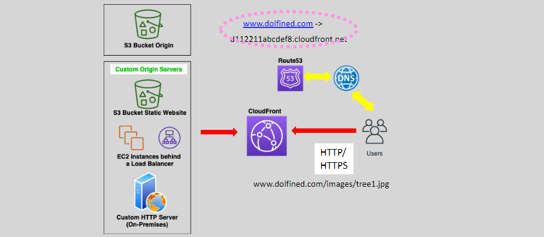

# Cloud Front - Origin Server and TTL

## Static or Dynamic Traffic

- Amazon CloudFront is a global service that can deliver content securely, and cost-effectively around the globe for the following content.

  - Static content (.html, .js, .css and images)
  - Dynamic content
  - Live videos streams
  - Video on Demand (VoD)
  - APIs

- CloudFront integrates with WAF and AWS Shield

- Delivering content through Cloudfront is cheaper and better than direct delivery from S3 or EC2.
- For dynamic traffic (traffic that changes frequently), CloudFront might not provide the same caching performance; however, CloudFront can provide advanced security features for that content.

## Origin Server

- An origin server is the location where the content that CloudFront will distribute exits.
- Up to 25 origins (soft limit) per CDN/web distribution.
- We can configure path patterns to route requests to the correct origin.
- Example origins: S3 buckets, S3 Static websites, EC2, ALB, Media Store, Media Share, and HTTP servers inside/outside AWS.
- We can use HTTP/HTTPS with viewers and origins.
- It supports PFS Perfect Forward Secrecy

### Custom Domain For Content Delivery

- Customers can map their own (Custom) domain name to the CloudFront distribution’s URL.
- If a user needs to get an object, tree1.jpg, it sends a DNS query to the DNS server.
- The DNS routes the user request to the nearest CloudFront edge location.
- CloudFront serves the image if it has it cached,
- If not, it will fetch it over the AWS backbone from the Origin, serve it, and cache it for subsequent object requests.
- CloudFront is basically acting as a reverse-proxy

## Time To Live (TTL)

Time To Live (TTL) (in seconds) : It defines how long CloudFront objects are cached before CloudFront forwards another request to the origin server to determine whether the object has been updated.

- The default is one day
  

- `TTL = 0` means CloudFront still caches the content; however, it must check with the origin server for updates with every new request for a cached object.
- If the object is updated, it will fetch and cache the updated object and serve it.
- Lowering the TTL is useful with dynamic content when there are frequent content updates.
- However, it also means more load to the origin server
