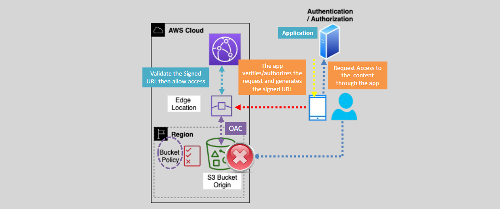

# Using CloudFront To Serve Private Content

Serving Private Content via CloudFront – Signed URLs & Signed Cookies

We need to distribute sensitive data or paid content through CloudFront and limit access to this content,

- We can use CloudFront to restrict access to cached content at edge locations using Signed URLs or Signed Cookies.
- The application signs the URL or Cookie with a private key of a key pair, and CloudFront validates the signature using the corresponding public key.
- We need to generate and load the Public key to CloudFront.
  

## Signed URLs & Signed Cookies – Which Ones To Use?

- Use Signed URLs if the application does not support cookies or to restrict access to individual files.
- Use Signed Cookies to provide access to multiple restricted files or when you do not want to change the current URLs.
- When the app creates the signed URLs or Cookies, we can specify the expiry time, when it starts to be valid (optional), and the source IP address range that can be used for access (optional).
