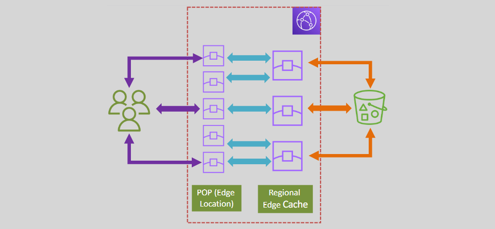
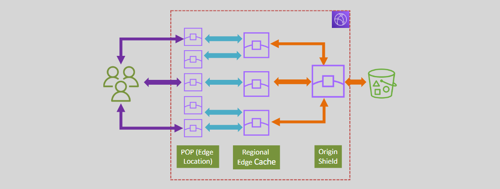

# CloudFront Origin Groups

- Edge Locations (POPs) are where objects are cached initially and when they continue to be frequently requested.
- Regional Edge caches is where CloudFront moves less popular cached objects to minimize the number of requests that have to get to the Origin server(s).

---

- If a request for an object cannot be found in the Edge location, CloudFront will check the regional edge cache for it.
- If not found, the request will be sent to the origin.
- This may pause duplicate requests going to the origin from different regional edge caches for the same user requests.
- This can form a load on the origin, and may lead to additional cost (resizing the origin)

---

- Origin shield is an additional caching layer between the regional edge cache and the origin.
- All requests from all regional edge caches go through Origin Shield.
- Origin shield filters duplicate requests and sends a single request to the origin to get the object.
- CloudFront edge caches and edge locations can get the object from Origin shield.
