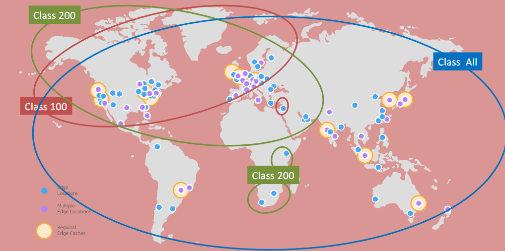

# **CloudFront - Monitoring, Logs, Access Classes & Pricing** 📊💰

Amazon CloudFront provides detailed monitoring, logging, and access classes to help you manage your content delivery, track usage, and optimize costs. Here's a breakdown of the features and pricing options available for CloudFront.

## **Access Logs** 📝

Access logs capture details about every request made to your CloudFront distribution. These logs provide essential information on the actual user requests for the content.

- **Enabling Logs**: You can enable access logs at the **CloudFront distribution level**. The logs are stored in an **S3 bucket** that you specify.

- **API Logs**: CloudFront also logs API calls made to CloudFront for configuration updates or Signed URL creation. These logs are sent to **CloudTrail** for detailed API call tracking.

## **CloudFront Edge Locations & Pricing Classes** 🌍

CloudFront edge locations are grouped into geographic regions, which are organized into different **price classes**.

### **Price Classes**:

- **Class All**: Default pricing class, uses all CloudFront edge locations worldwide to minimize latency.
- **Class 100**: North America, Europe, and Israel.
- **Class 200**: Excludes South America, Australia, and New Zealand.

By selecting a less expensive price class, you can reduce costs, though it may result in higher latency for requests from regions not within your chosen class.

- **Image for Price Classes**:
  

## **Free Tier** 🎁

Amazon Web Services (AWS) offers a **Free Tier** for CloudFront usage, which includes:

- **1TB of data transfer out**
- **10,000,000 HTTP/HTTPS requests**
- **2,000,000 CloudFront Function invocations**
- **1,000 invalidation paths**

This allows users to get started with CloudFront without incurring costs for small-scale usage.

## **Pricing Details** 💸

CloudFront pricing differs by AWS region, and below are some typical costs:

- **Data Transfer**:

  - First 10 TB/month: ~\$0.085 per GB.

- **Request Pricing**:

  - HTTP requests: **\$0.0075 per 10,000 requests**.
  - HTTPS requests: **\$0.0100 per 10,000 requests**.

- **Function Invocations**:
  - **\$0.6 per 1 million function invocations**.

---

With CloudFront’s monitoring, logging capabilities, and flexible pricing options, you can efficiently manage content delivery, track performance, and optimize your costs based on your needs.
