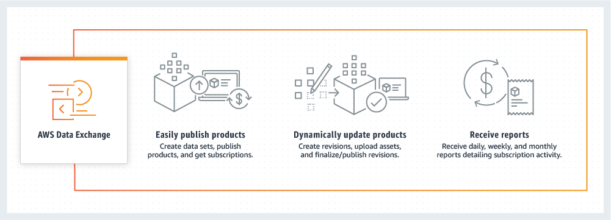
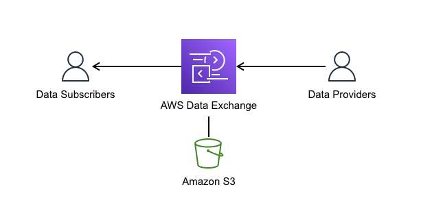

# **AWS Data Exchange**

**What is it?**
Think of AWS Data Exchange like an online store, but instead of buying products, you're subscribing to data. This data can be from various providers and can be used to enhance your own business or projects.

---

  
  

---

## **Use Cases with Examples:**

1. **Business Intelligence**:

   - **Example**: A retail company subscribes to foot traffic data for shopping malls. They use this data to understand peak times and optimize their staff scheduling.

2. **Market Research**:

   - **Example**: A startup wants to enter a new market. They subscribe to economic data of that region, such as consumer spending habits and demographic information, to tailor their products and marketing strategies.

3. **Data Enrichment**:

   - **Example**: A financial institution subscribes to credit score data to enhance their customer profiles, helping them make better lending decisions.

4. **Machine Learning**:
   - **Example**: A tech company subscribes to weather data to improve their machine learning models that predict energy consumption based on weather patterns.

## **How it Works:**

1. **Find Data**:

   - Browse AWS Data Exchange for data sets that match your needs. Think of it like shopping for groceries online.

2. **Subscribe**:

   - Just like subscribing to a magazine, you subscribe to the data you want. This means you'll get access to the data regularly.

3. **Use the Data**:
   - Integrate the data into your existing systems or analysis tools. It's like adding the groceries you bought into your recipes.

## **Simple Analogy**

Imagine you run a bakery. You need high-quality flour (data) to make the best cakes (business decisions). AWS Data Exchange is like a marketplace where you can find the best flour suppliers. Once you find a supplier (data provider), you subscribe to get regular deliveries. You then use this flour (data) to bake your delicious cakes (make informed business decisions).
