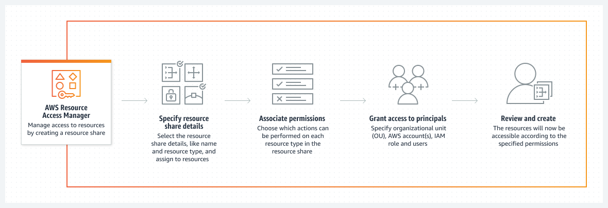

# 🌐 AWS Resource Access Manager (RAM): Simplify Resource Sharing

AWS Resource Access Manager (RAM) enables seamless sharing of AWS resources across accounts. Whether working with individual accounts or accounts in **AWS Organizations**, RAM makes it easy to centralize resource management and reduce duplication.

---

    

---

## 🌟 Key Features of AWS RAM

### 🔄 Flexible Resource Sharing

- Share resources with:
  - **Individual AWS accounts.**
  - **Organizational Units (OUs)** or the entire organization in AWS Organizations.
- Centralize resource creation and simplify access for multiple accounts.

### 💰 Cost Efficiency

- **Free to Use:** AWS RAM does not charge for its services.

---

## 🛠️ Examples of AWS RAM in Action

- **Shared Subnets:** Share subnets across accounts to create resources centrally.
- **Aurora Database Clusters:** Manage a central Aurora cluster and share it with multiple accounts.
- **Route 53 Resolver Rules:** Create and share centralized DNS resolver rules for streamlined network management.

---

## 🎯 Benefits of AWS RAM

### 🔒 Security and Compliance

- Provides security, visibility, and auditability for shared resources.
- Enforces **IAM policies** and **Service Control Policies (SCPs)** on shared resources to maintain access control.

### 📊 Operational Efficiency

- Reduces duplication of resources and operational overhead by enabling central management.

### 🌍 Broad Resource Support

- Share various resources, including:
  - **VPC resources** (e.g., subnets, transit gateways).
  - **Route 53 Rules.**
  - **Aurora clusters.**
  - **AWS App Mesh, AWS Glue, CodeBuild, and more.**

---

## ✅ Why Use AWS RAM?

1. **Centralized Management:** Simplifies resource sharing across accounts and OUs.
2. **Cost Efficiency:** Offers resource sharing without additional charges.
3. **Improved Security:** Integrates with AWS Identity and Access Management (IAM) and AWS Organizations to maintain secure access.
4. **Scalability:** Easily share and manage resources in large-scale AWS environments.

---

AWS Resource Access Manager is a powerful tool for organizations looking to optimize resource usage and reduce complexity. By enabling centralized resource sharing, RAM ensures that businesses can scale efficiently while maintaining security and visibility.
