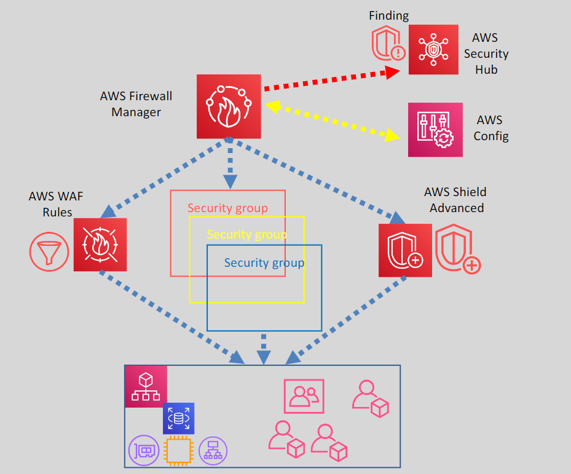

# 🧠 AWS Firewall Manager

AWS Firewall Manager simplifies the management and administration of AWS WAF, AWS Shield Advanced, VPC Security Groups, AWS Network Firewall, and Route 53 Resolver DNS Firewall in an AWS Organization.

  

## 🌟 Benefits of AWS Firewall Manager

- **Automatic Protection:** Automatically adds protections to existing and newly added resources across accounts.
- **Auto Subscription:** Automatically subscribes new AWS Organizations accounts to AWS Shield Advanced.
- **Security Group Management:** Applies Security Groups to all member accounts and newly added resources.
- **Custom Rules:** Works with custom WAF rules or rules purchased from AWS Marketplace.
- **Centralized Monitoring:** Provides centralized monitoring of DDoS attacks.
- **Integration:** Integrates with AWS Config for configuration change tracking and Security Hub to report findings.
