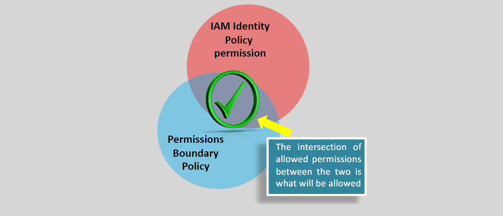
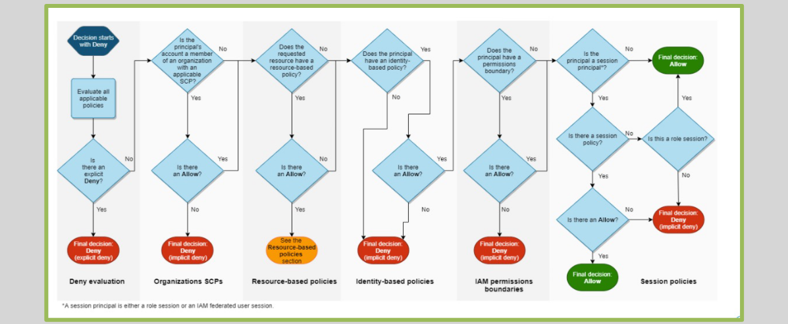

# **Resource-Based Policies in AWS** 🔒

Resource-based policies are policies that are directly attached to AWS resources, rather than being assigned to IAM identities such as users, groups, or roles. These policies define **who** (the principal) can access the resource and what actions they can perform on it.

## Key Features of Resource-Based Policies:

- **Attach to Resources**: They are applied to specific AWS resources like S3 buckets, Lambda functions, SQS queues, etc.
- **Principal Element**: The `Principal` element identifies the AWS identities (users, roles, services) that are allowed or denied access to the resource.
- **Cross-Account Access**: Resource-based policies allow sharing of resources across different AWS accounts.
- **Inline Policies**: Resource policies are inline (not managed) policies, meaning they exist only on the resource they are attached to.

## Example of a Resource-Based Policy

Here’s an example of an S3 bucket policy that allows a specific IAM user (`bob`) from a different AWS account to upload objects to the `example-bucket`:

```json
{
  "Version": "2012-10-17",
  "Statement": {
    "Effect": "Allow",
    "Principal": { "AWS": "arn:aws:iam::777788889999:user/bob" },
    "Action": ["s3:PutObject", "s3:PutObjectAcl"],
    "Resource": "arn:aws:s3:::example-bucket/*"
  }
}
```

## **IAM Resource-Based Policies vs. IAM Roles for Cross-Account Access** 🔄

### **Difference between Resource-Based Policies and IAM Roles**

- **Resource-Based Policies**: A resource-based policy directly allows or denies actions on a resource (e.g., an S3 bucket or SQS queue) for specific principals (such as users, roles, or services). The principal does not need to give up its permissions when accessing the resource, as the policy is directly tied to the resource itself.

- **IAM Roles for Cross-Account Access**: When using IAM roles for cross-account access, the principal temporarily assumes the permissions granted by the IAM role, meaning it "gives up" its original permissions to inherit those of the role.

### **When to Use Resource-Based Policies**

Resource-based policies are ideal when you want to share a resource across different accounts without needing to reassign the principal’s permissions. For example, you might want to allow a user in another AWS account to upload objects to your S3 bucket.

## **IAM Permissions Boundary** 🔐

### **What is a Permissions Boundary?**

A **Permissions Boundary** is an advanced feature in IAM that defines the maximum permissions that can be granted to a user or a role. It is a policy that sets an upper limit on the permissions a user or role can obtain from their identity-based policies.

- **Doesn't Grant Permissions**: Permissions boundaries **do not grant** permissions themselves. Instead, they limit the permissions that can be granted by the identity-based policy.
- **Intersection of Permissions**: The effective permissions for an IAM entity are determined by the intersection of the identity-based policy and the permissions boundary.
  

### **Use Cases for Permissions Boundaries**:

- **Delegating Permissions Management**: For example, you can delegate the ability to create roles or assign permissions to trusted employees, but restrict the level of permissions they can assign.
- **Controlling Maximum Permissions**: Prevent users from being granted excessive permissions, especially in production environments.

#### Example of Using Permissions Boundaries in IAM Policies:

```json
"StringEquals": {
  "iam:PermissionsBoundary": "arn:aws:iam::AccountID:policy/PermBoundaryName"
}
```

## **IAM Policy Evaluation Logic (Within an AWS Account)** 🔍



The IAM policy evaluation logic helps AWS determine whether a specific action is allowed or denied based on the policies attached to the user, group, or role. Here’s a simple breakdown of the evaluation process:

1. **All policies are evaluated**: Both identity-based policies (attached to the user) and resource-based policies (attached to the resource).
2. **Explicit Deny overrides Allow**: If there is an explicit deny in any of the policies, it takes precedence over any allow statement.
3. **Implicit Deny by Default**: If there is no matching allow, access is implicitly denied.

## **Conclusion** 🌟

Resource-Based Policies are essential for controlling access to AWS resources, especially for cross-account scenarios or when a resource needs to share access across different identities. By using these policies, you can ensure secure and granular access control without the need for IAM role assumptions. Additionally, **Permissions Boundaries** and the **IAM Policy Evaluation Logic** provide advanced control over what permissions are granted, ensuring your AWS environment is both flexible and secure.
