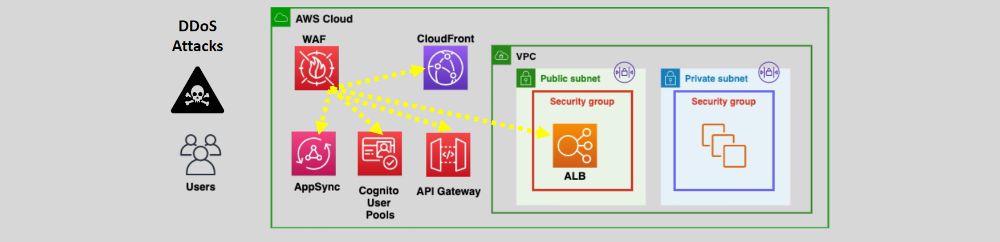
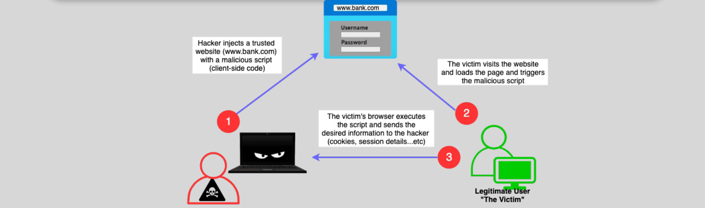
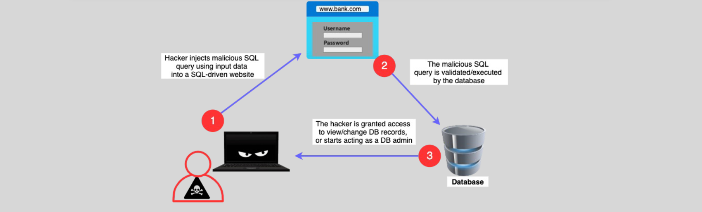

# AWS WAF 🧱

AWS Web Application Firewall (WAF) is a **managed service** designed to protect web applications and APIs from common web exploits, attack patterns, and unwanted traffic. By analyzing HTTP/S requests and applying custom or managed rules, AWS WAF helps secure applications and optimize resource utilization.

---

## 🧱 **What is AWS WAF?**

AWS WAF is a **Web Application Firewall** that defends web applications and APIs against threats like **SQL injection**, **cross-site scripting (XSS)**, and excessive resource consumption.

  

### **Key Features:**

- Protects against **common exploits** that compromise availability or security.
- Works seamlessly with **CloudFront**, **API Gateway**, **Application Load Balancer (ALB)**, **Cognito user pools**, and **AppSync**.
- Monitors and evaluates HTTP/S requests based on defined rules.
- Supports integration with **external websites** using CloudFront.

---

## 🪜 **How AWS WAF Works**

1. AWS WAF evaluates incoming HTTP/S requests forwarded by supported AWS services.
2. Applies custom or managed **Web Access Control Lists (Web ACLs)** to decide whether to:

   - **Allow** the request.
   - **Block** the request with an HTTP 403 (Forbidden) response.
   - **Count** the request for monitoring.
   - Use a **CAPTCHA** for bot verification.

3. CloudFront can be configured to return custom error pages when requests are blocked.

---

## ✨ **AWS WAF Features**

1. **Security and Monitoring**

   - Protects against **SQL injection**, **XSS**, and other web attacks.
   - Logs traffic and decisions to **S3**, **CloudWatch Logs**, or **Kinesis Data Firehose**.
   - Provides metrics for **Web ACLs** and rules in **CloudWatch**.

2. **Advanced Filtering**

   - Filters traffic based on:
     - **Source IP address**.
     - **Geo-location** of the request.
     - **Request headers**, **query strings**, or **body length**.
     - Presence of scripts or SQL commands.
     - Rate-based limits for IP addresses.

3. **Integration**

   - Integrates with AWS **CloudTrail** for auditing rule changes.
   - Offers bot control to manage traffic from bots.

4. **Global Reach**

   - AWS WAF supports **IPv6** for broader compatibility.
   - Works globally when paired with CloudFront.

5. **Cost-Effective**
   - Pay only for the rules configured and the number of requests evaluated.

---

## 🚦 **AWS WAF Web ACLs**

Web Access Control Lists (Web ACLs) are the backbone of AWS WAF. They consist of rules that define how traffic should be handled.

  

### **Key Points:**

- **Rules**: Define filters for requests (allow, block, count, CAPTCHA).
- **Default Action**: Applied when no rule matches the request.
- **Geo Match**: Allows or blocks traffic based on the country of origin.
- **Bot Control**: Identifies and manages bot traffic.
- **Rate-Based Rules**: Protect against high traffic from a single source.

---

## 👻 **Common Web Threats**

### Cross-Site Scripting (XSS)

An attacker injects a script into a webpage that runs on a legitimate user's browser, stealing sensitive information.

  

---

### SQL Injection

An attacker inserts malicious SQL queries into an application's input fields to gain unauthorized access to databases.

  

---

## 🌍 **Geo-Location Filtering**

AWS WAF allows geo-location filtering, providing fine-grained control over traffic based on geographic origin.

### Comparison: Route 53, CloudFront, and WAF Geo Features

| **Service**     | **CloudFront**                                               | **Route 53**                                                      | **AWS WAF**                                                                |
| --------------- | ------------------------------------------------------------ | ----------------------------------------------------------------- | -------------------------------------------------------------------------- |
| **Geo Feature** | Blocks traffic from specific regions or countries.           | Restricts access to specific regions; not designed for filtering. | Filters traffic based on country of origin and other WAF criteria.         |
| **Integration** | Requests blocked at the CloudFront edge before reaching WAF. | Manages DNS-based access restrictions.                            | Evaluates traffic against additional WAF rules (e.g., XSS, SQL injection). |

---

## 💡 **Use Cases**

1. **Application Security**

   - Protect against SQL injection, XSS, and other OWASP Top 10 threats.
   - Defend APIs from unwanted traffic.

2. **Traffic Management**

   - Enforce rate limits to prevent excessive resource consumption.
   - Allow/block traffic based on geographic location or bot activity.

3. **Monitoring and Compliance**

   - Gain visibility into web traffic with CloudWatch metrics and detailed logs.
   - Meet regulatory compliance by ensuring application security.

4. **Integration with AWS Services**
   - Use with **CloudFront** to secure global content delivery.
   - Protect user authentication systems integrated with **Cognito User Pools**.

---

## ✅ **Conclusion**

AWS WAF provides a flexible, cost-effective, and robust solution to secure web applications and APIs against a wide range of threats. Its seamless integration with AWS services, advanced filtering capabilities, and support for custom rules make it an essential tool for modern cloud-based applications. With AWS WAF, you can ensure better security, enhance performance, and protect your applications from malicious traffic.
