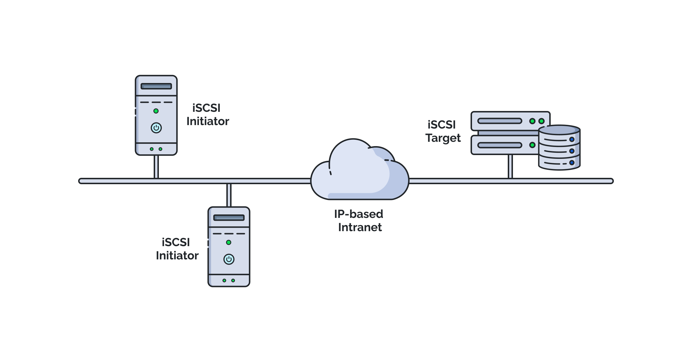

# Amazon Storage Gateway

## Perquisite - Internet Small Computer Systems Interface (ISCSI)

iSCSI is a transport layer protocol that works on top of the Transport Control Protocol (TCP).

- It enables block-level SCSI data transport between the iSCSI initiator and the storage target over TCP/IP networks.
- iSCSI is a block protocol that supports a single client for each volume on the sever.
- The target can be NAS, SAN, LUN, or a tape library backup

## What is Storage Gateway ?

Storage Gateway allows customers to connect their on-premises IT with AWS storage including S3, S3 Glacier (object based), and FSx (file-based) for file and/or block storage

- Storage Gateway comes in two flavors:

  1. **A virtual machine:** that you download from AWS and install in your virtualized environment on-premises (VMware ESXI, Microsoft Hyper-V, or KVM).
  1. **A physical appliance:** with the Storage Gateway preinstalled.
     - It exposes SMB, NFS, or iSCSI interface depending on the gateway configuration.
     - It uses HTTPS to encrypt data in-transit to S3 and Encrypts data at rest (SSE-S3) in S3
     - It only transfers changed data and uses data compression.

- Storage Gateway comes in several configurations:

  1. S3 File Gateway & FSx File Gateway
  1. Volume Gateway
  1. Tape Gateway

## S3 File Gateway

Presents an NFS or SMB interface to the clients.

- Can be used as a file share (file system) mount to store files to S3.
- Can be used by in-AWS or on-premises Windows and Linux clients.
- S3 Lifecyle policies, versioning, and CRR can be used for object transition.
- Low latency access through local caching of frequently accessed files.
- Data is encrypted in-transit and compressed.
- We can access the files in S3 from AWS applications through the S3 API.
- **Use cases:** Migrate file data, backup in S3, Cloud bursting.

## Volume Gateway

### Stored Volume

- Uses S3 as a backup location (DR or backup site).
- It provides block storage volumes and exposes iSCSI interface to servers.
- Virtual block storage volumes are stored on-premises on the customer’s storage.
- Volume snapshots are asynchronously backed up to S3.
- Can run on EC2 instances in AWS as a volume gateway.

### Cached Volume

- Uses S3 as a block storage with virtual volumes in S3.
- Frequently accessed data is cached locally on-premises.
- Can be a great way to migrate storage to S3 and avoid local storage costs.
- Can snapshot the virtual volumes.
- Can run on EC2 instances in AWS as a volume gateway.

## Tape Gateway

- It uses S3 as a cloud-backed virtual tape storage (backup solution).
- It presents an iSCSI interface to backup servers.
- Virtual Tape Libraries (VTLs) are saved in S3 while archives are saved to S3 Glacier as Virtual Tape Shelves (VTS).
- It can be installed on an EC2 instance to provide a tape gateway in AWS.
- Utilizes HTTPS and compression to transfer the data to S3.

## FSx File Gateway

- It provides on-premises clients with low latency, efficient access to FSx for Windows file server file shares in AWS.
- Requires a DX or a VPN connection to allow the communication to the file server and allow the file server to join the on-premises AD domain.
- It exposes an SMB interface to the on-premises clients.
- Frequently accessed data will be cached locally for better performance.
- Can be deployed on a storage gateway VM appliance or the hardware appliance versions
