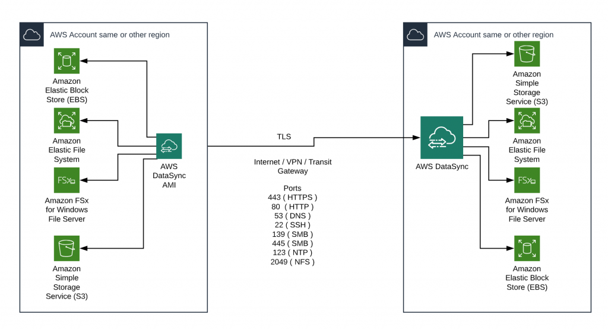

# 🔄 **AWS DataSync**

Migrating large amounts of data from traditional file server environments to AWS can be a challenge, especially when the transfer needs to be completed within a short timeframe. **AWS DataSync** offers a robust solution to automate, accelerate, and simplify this process.

    

---

## 🔍 **What is AWS DataSync**

**AWS DataSync** is a **secure, managed service** that automates and accelerates the movement of large amounts of data between on-premises storage and AWS Storage services. It is part of AWS’s suite of migration tools, which also includes **Server Migration Service (SMS)** and **Database Migration Service (DMS)**.

### **Key Features:**

- **Automation:** Simplifies the migration process by automating data transfer tasks.
- **Speed:** Transfers data up to **10x faster** than traditional tools.
- **Security:** Utilizes **TLS encryption** to secure data in transit.
- **Ease of Deployment:** Requires a **DataSync agent** installed on-premises as a VMware VM.
- **Flexibility:** Supports multiple storage protocols, including **NFS**, **SMB**, and integration with **AWS Snowcone**.

---

## 💼 **Use Cases**

AWS DataSync is versatile and can be deployed in various scenarios to address different data migration needs. Below are two common use cases:

### 1. 🏢 **Migrating File Server Data from an On-Premises Data Center to AWS**

    <h3>Scenario 1: On-Premises to AWS Migration</h3>
    

### 2. 🌐 **Data Migration Within an AWS Region or to Another AWS Region**

    <h3>Scenario 2: Intra-Region or Cross-Region Migration</h3>
    

---

## 🛠️ **How AWS DataSync Works**

Understanding the workflow of AWS DataSync can help you effectively utilize its capabilities for your data migration needs.

### **1. Setup DataSync Agent**

- **Deployment:** Install the **DataSync agent** as a VMware VM on your on-premises infrastructure.
- **Configuration:** Connect the agent to your on-premises storage systems (NFS, SMB, etc.).

### **2. Create a DataSync Task**

- **Define Source and Destination:**

  - **Source:** Your on-premises storage (e.g., NFS server, SMB file share).
  - **Destination:** AWS storage services (e.g., Amazon S3, Amazon EFS, Amazon FSx).

- **Task Configuration:**
  - **Bandwidth Throttling:** Control the amount of network bandwidth used.
  - **Scheduling:** Automate task execution at specified intervals.
  - **Data Filtering:** Include or exclude specific files and directories.

### **3. Execute Data Transfer**

- **Initiation:** Start the DataSync task manually or as per the defined schedule.
- **Monitoring:** Track the progress and performance of the data transfer through the AWS Management Console or APIs.

### **4. Data Validation and Completion**

- **Integrity Checks:** Ensure data consistency and integrity during the transfer.
- **Completion:** Verify the successful migration of data to the AWS destination.

### **5. Ongoing Synchronization (Optional)**

- **Incremental Transfers:** Perform subsequent data transfers to keep the source and destination synchronized.

---

## 💰 **Pricing Overview**

AWS DataSync pricing is based on the amount of data transferred and the duration of usage. Understanding the pricing model helps in optimizing costs for your specific migration needs.

### 💳 **Pricing Components**

1. **Data Transfer:**

   - **Per GB:** Charged based on the amount of data transferred.
   - **Pricing Tier:** Lower cost per GB as the volume increases.

2. **DataSync Agent:**

   - **No additional cost** for the DataSync agent itself; it's included in the service.

3. **Optional Features:**
   - **Bandwidth Throttling:** Manage costs by controlling the network bandwidth used for transfers.

### 💡 **Cost Optimization Tips**

- **Plan Your Migration:** Estimate the total data volume to leverage pricing tiers effectively.
- **Schedule Transfers During Off-Peak Hours:** Optimize bandwidth usage and potentially reduce costs.
- **Use Data Filtering:** Transfer only necessary data to minimize costs.
- **Monitor Usage:** Utilize AWS Cost Explorer to track and manage DataSync expenses.

🔑 **Key Takeaway:**

- **AWS DataSync** offers a **cost-effective** solution for large-scale data migrations with scalable pricing based on data volume.

---

## ⚖️ **AWS DataSync vs. Snow Family**

Choosing between **AWS DataSync** and the **Snow Family** depends on your specific data transfer requirements. Here’s a comparison to help you decide:

### **AWS DataSync:**

- **Type:** Online data transfer service.
- **Use Case:** Ideal for transferring data that changes frequently and requires continuous synchronization.
- **Speed:** Up to **10x faster** than traditional tools.
- **Connectivity:** Utilizes internet or **AWS Direct Connect** links.
- **Best For:** Data transfers within accessible network environments with sufficient bandwidth.

### **Snow Family:**

- **Type:** Offline data transfer solution.
- **Use Case:** Suitable for massive data transfers where network connectivity is limited or bandwidth is insufficient.
- **Scale:** Handles data sizes from terabytes to exabytes.
- **Connectivity:** Physical devices shipped to the customer’s location.
- **Best For:** Environments with high data volume and limited or unreliable network connections.

🔑 **Key Takeaway:**

- Use the **Snow Family** for **offline, large-scale** data transfers or when network limitations exist.
- Use **AWS DataSync** for **online, frequent** data transfers with adequate network connectivity.

---

## 🔄 **DataSync vs. Storage Gateway File Gateway**

While both **AWS DataSync** and **Storage Gateway File Gateway** facilitate data movement to AWS, they serve different purposes and use cases.

### **AWS DataSync**

- **Functionality:**

  - Acts as an **NFS or SMB client** connecting to existing file servers.
  - **Automates** and **accelerates** data transfers to AWS storage services.
  - **Transfers data to:** Amazon S3, Amazon EFS, or Amazon FSx for Windows File Server.
  - **Use Case:** Migrating existing data, synchronizing data between on-premises and AWS, and moving data between AWS storage services.

- **Key Points:**
  - **Does not provide access** to data; solely focuses on data movement.
  - Suitable for **bulk data transfers** and **migrations**.

### **Storage Gateway File Gateway**

- **Functionality:**

  - Serves as an **NFS/SMB server** that on-premises clients can mount.
  - **Provides low-latency access** to data stored in Amazon S3.
  - **Transfers data to:** Amazon S3 in real-time, supporting ongoing updates.

- **Use Case:**

  - **Continuous data access** and **real-time synchronization**.
  - Acts as a bridge for applications requiring **low-latency** access to cloud storage.

- **Key Points:**
  - **Provides access** to data, acting as a hybrid storage solution.
  - Ideal for **ongoing operations** and **active data management**.

🔑 **Key Takeaway:**

- Choose **AWS DataSync** for **automated, accelerated** data migrations and bulk transfers.
- Choose **Storage Gateway File Gateway** when you need **ongoing access** and **low-latency** integration with AWS storage.

---

## 🏁 **Conclusion**

**AWS DataSync** is a powerful, secure, and efficient service for automating and accelerating the migration of large volumes of data to and from AWS. Whether you’re migrating data from on-premises storage to AWS or transferring data between AWS regions, DataSync provides the tools and capabilities to ensure a smooth and reliable transfer process.

By leveraging **AWS DataSync**, organizations can:

- **Save Time:** Automate and accelerate data transfers up to **10x faster** than traditional methods.
- **Enhance Security:** Ensure data is protected during transit with **TLS encryption**.
- **Simplify Migration:** Reduce the complexity of large-scale data migrations with easy-to-configure tasks and robust management tools.
