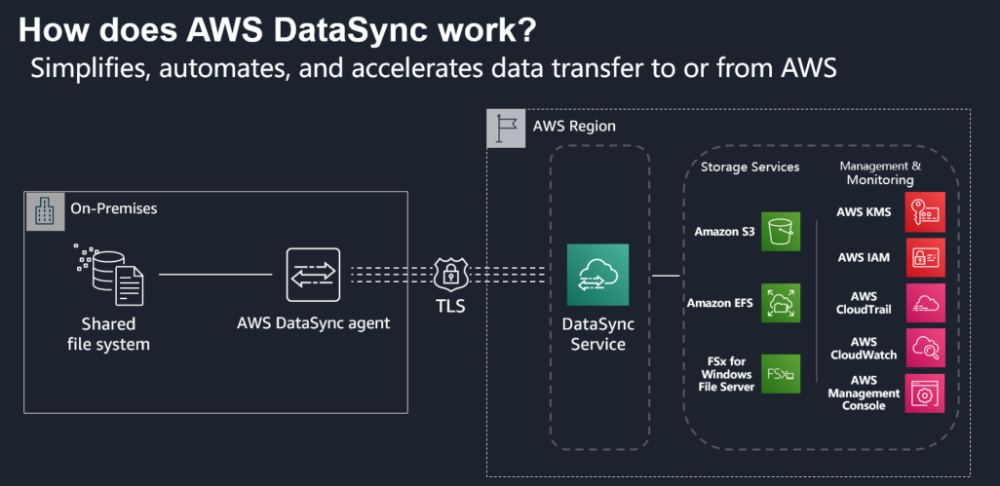
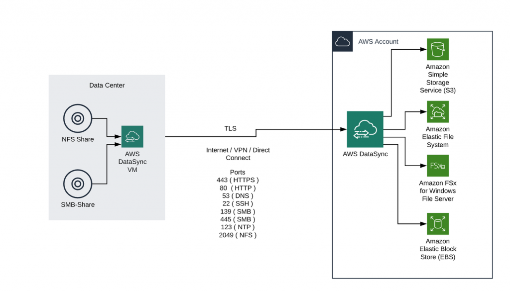

# AWS DataSync

Migrating large amounts of data from your traditional file server environments to AWS can be a challenge. Especially if the transfer has to be completed in a short time frame.

One possible solution can be the use of AWS DataSync. DataSync belongs to the family of existing AWS migration tools like Server Migration Service (SMS) and Database Migration Service (DMS).

The migration process is described via a so-called „tasks” within the DataSync service and each task defines a source and the corresponding target.

    

## What is AWS DataSync

DataSync is AWS secure, online service that automates and accelerates moving data between on premises and AWS Storage services.DataSync `automates`, `accelerates`, and `simplifies` copying large amounts of data between on-premises self-managed object-based, NFS, AWS Snowcone, or SMB based data storage systems, and AWS storage services over the internet or Direct Connect links.

- It can do this at speeds 10x faster than available tools.
- It requires a DataSync agent to be installed on-premises (VMware VM).
- It uses TLS to encrypt data in-transit.

## Use Case

The following section presents two scenarios in which AWS DataSync can successfully deployed:

    <h3>1. Migrating file server data from an on-premise data center to AWS</h3>
    

    <h3>2. Data migration within an AWS Region or migration to another AWS Region</h3>
    

  
## AWS DataSync vs. Snow Family

**The Snow Family:** is used for offline data transfer or edge computing/data transfer.Use the Snow Family when the communication link cannot serve due to high utilization or low bandwidth, or for massive data sizes.

**DataSync:** is used to transfer data online 10x faster than other tools, and with minimal overhead. Use DataSync for online transfer of data that changes frequently.

## DataSync vs. Storage Gateway File Gateway

### DataSync

- Behaves like an `NFS` or `SMB client` and connects to an existing SMB file server or NFS file system.
- We can use it to automate and accelerate online data transfers to S3, or to move data that existed before deploying storage gateway.
- Use it to transfer data to S3, EFS, or FSx for Windows File Server, and between in-cloud storage systems.
- `DataSync only moves/copies data but does not provide access to data.`

### Storage Gateway File Gateway

•Plays a `file system` or `file server` role (supports SMB and NFS interfaces) where servers and clients mount it.
•Storage gateway transfers data to S3 only.
•Use it as NFS/SMB server to transfer on-going updates and to provide `low latency` access to data in S3.
